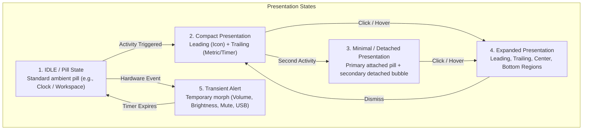

f
# Apple Dynamic Island Human Interface Guidelines (HIG) & Design Rules

> [!NOTE]
> This document synthesizes Apple's official **Human Interface Guidelines (HIG)** for the Dynamic Island, Live Activities, and ActivityKit frameworks, adapting these industry-standard principles into the `ogsShell-qs` Wayland desktop environment.

---

## 1. Core Philosophy and Purpose

Apple introduced the Dynamic Island to transform a physical hardware camera cutout into an organic, interactive UI surface. The design principles rely on three core pillars:

1. **Persistent Glanceability:** Presenting continuous, ambient information (e.g., timers, media playing, system load, active calls) without distracting the user from their primary workspace.
2. **Fluid Continuity:** The island never abruptly jumps in size. It stretches, morphs, squishes, and settles using **physics-based spring animations** that simulate natural inertia.
3. **Adaptive Multitasking:** Expanding or contracting gracefully between compact glanceable states and detailed interactive modals depending on user intent.

---

## 2. The Four Primary Presentation States

Apple's ActivityKit and HIG define four distinct presentation states:



### A. Compact Presentation
* **When Used:** When a single background Live Activity is active.
* **Layout Geometry:** Divided into two distinct segments:
  * **Leading:** Positioned on the left side of the sensor/center (e.g., app icon, waveform, lock icon).
  * **Trailing:** Positioned on the right side of the sensor/center (e.g., countdown timer, percentage, progress circle).
* **Design Rule:** Despite physical separation across the center, the leading and trailing views **must appear and feel as a single cohesive unit of information**.

### B. Minimal Presentation
* **When Used:** When two or more Live Activities are concurrently active.
* **Layout Geometry:**
  * **Attached View:** The primary activity shrinks to fit one side of the island.
  * **Detached View:** The secondary activity is displayed as a separate circular or pill-shaped bubble separated by an empty gap.
* **Design Rule:** Minimal views must use clear, iconic graphics (e.g., a mini circular progress bar or small glyph) so the user can identify the activity at a glance.

### C. Expanded Presentation
* **When Used:** Triggered when the user hovers, clicks, or long-presses a compact/minimal view to reveal controls and detailed telemetry.
* **Layout Segmentation (Four Standard Regions):**
  * `Leading Region`: Upper-left corner (typically app icon, title, or status badge).
  * `Trailing Region`: Upper-right corner (status badge, timestamp, or close button).
  * `Center Region`: Positioned directly below the top anchor (rendered first by the layout engine).
  * `Bottom Region`: Spans the full width beneath the other regions; ideal for audio progress sliders, scrubbers, interactive buttons, or detailed graphs.

```text
+-------------------------------------------------------+
|  [Leading Icon]      (Top Island Anchor)   [Trailing] |
|                                                       |
|                    [Center Content]                   |
|                                                       |
|  [Bottom Region: Full Width Sliders / Actions / Data] |
+-------------------------------------------------------+
```

### D. Transient Alerts (System Overlays)
* **When Used:** Sudden, time-limited notifications such as volume adjustments, microphone mute toggle, network connection status, or USB device attachments.
* **Behavior:** Ephemerally expands the island to display an icon and progress bar, then smoothly contracts back to the previous state after a short duration (typically 2000–3000ms).

---

## 3. Physical Geometry & Visual Ergonomics

| Property | Apple HIG Standard | `ogsShell-qs` Implementation (`[[Style-Design-Tokens]]`) |
| :--- | :--- | :--- |
| **Corner Radius** | Continuous squircle curve (Curvature continuous $G^2$) | `radiusFull: 18` (Pill radius `height / 2`) |
| **Background Color** | Pitch Black (`#000000`) with deep OLED blend | `bgPrimary: "#0d0e15"` (Catppuccin Deep Dark) |
| **Keyline Tint** | Subtle $0.5\text{px}-1\text{px}$ perimeter glow to separate from dark wallpaper | `border.color: Style.border` (`#313244`), `border.width: 1` |
| **Snug Content Alignment** | Content sits flush against the inner edges without excessive padding | Padding $8\text{px}-12\text{px}$, centered horizontally |
| **Typography** | High legibility, SF Pro Rounded, tabular digits for time/metrics | `font.weight: Font.DemiBold`, `font.pixelSize: 13` |

---

## 4. Spring Physics & Motion Dynamics

> [!IMPORTANT]
> Apple explicitly forbids linear animations or mechanical easing curves in the Dynamic Island. All transitions must be governed by **damped harmonic spring physics**.

### Key Advantages of Spring Physics
1. **Interruptibility:** If the user hovers or clicks while an animation is in mid-flight, spring physics preserves existing velocity ($v_0$) and smoothly redirects the shape without visual snapping or stutter.
2. **Natural Overshoot & Settle:** The island slightly overshoots its target dimension and organically settles, giving the sensation of physical mass and elasticity.

### Mathematical Motion Model

The displacement $x(t)$ of a damped harmonic oscillator is represented by:
$$m \frac{d^2x}{dt^2} + c \frac{dx}{dt} + k x = 0$$

Where:
* $k$ = Spring stiffness (responsiveness)
* $c$ = Damping coefficient (friction)
* $m$ = Virtual mass of the UI element
* Damping Ratio $\zeta = \frac{c}{2\sqrt{km}}$ (Underdamped when $\zeta < 1.0$)

### `ogsShell-qs` Spring Parameters
Configured in `[[Style-Design-Tokens]]` and utilized in `[[Dynamic-Island-Physics-State-Machine]]`:
* **Spring Stiffness:** `28.0`
* **Damping Ratio ($\zeta$):** `0.78` (Snappy, slight natural bounce, zero lingering wobble)
* **Epsilon (Convergence Threshold):** `0.01`

---

## 5. Content Design Guidelines & Best Practices

1. **Glanceable Over Cluttered:** Compact views must contain only 1–2 crucial data points (e.g., `Clock` + `CPU %`). Never put multi-line paragraphs in compact mode.
2. **Do Not Abuse Live Activities:** Live activities are strictly reserved for ongoing tasks with dynamic updates (e.g., music playback, download progress, system load monitor, timer). Do not use for static alerts.
3. **Region Priority Resolution:** When rendering the expanded state, prioritize the **Center** and **Bottom** regions for high-density information, allowing the leading/trailing anchors to maintain visual balance.
4. **Contrast Compliance:** All text and glyphs rendered inside the island must maintain a minimum contrast ratio of 4.5:1 against the dark background.
