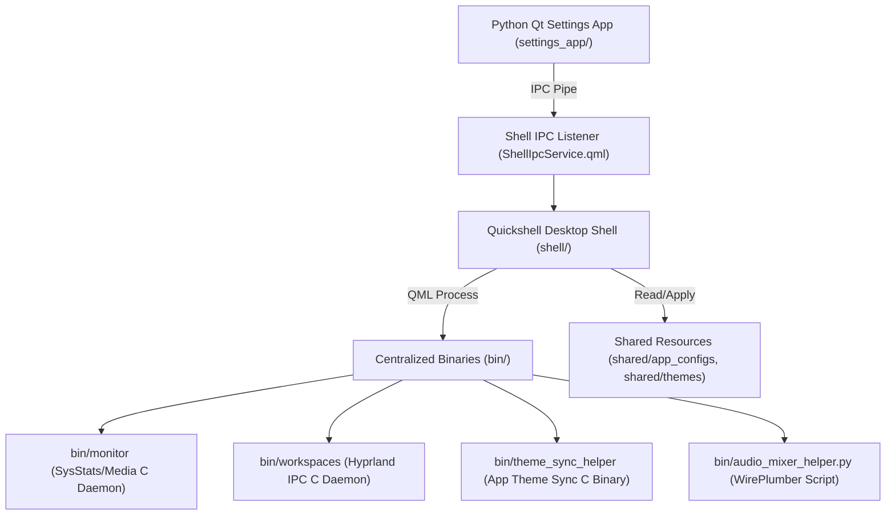

# Architecture Overview: OgsShell-qs Ecosystem

> [!NOTE]
> OgsShell-qs is a modular, high-performance Linux desktop environment shell ecosystem built with **Quickshell (QML/C)**, **Python Qt (PySide6)**, and native **C background daemons**.

## 4-Tier Ecosystem Structure

1. **Central Executables (`[[Proposal-Restructure-Binaries|bin/]]`):**
   - High-efficiency C daemons and Python scripts compiled into `./bin/`.
   - Native C daemons run asynchronously to prevent any main thread UI lag.
2. **Shared Resources (`shared/`):**
   - `shared/themes/themes.json`: Central color palette registry.
   - `shared/app_configs/`: App-specific color templates (GTK, Qt, Kitty, Zed, IntelliJ, Neovim, Tmux, Vesktop).
   - `shared/ipc/protocol.json`: IPC protocol schema specifications.
3. **Quickshell Desktop Shell (`shell/`):**
   - Implements the **Service-Window-Component** design pattern.
   - Services (`[[SystemStats-Service]]`, `[[Workspace-Service]]`, etc.) handle state and daemon processes.
   - Windows (`[[Shell-Bar-Components]]`, `[[ControlCenter-UI]]`) handle layer shell window bounds.
   - Components handle widgets and visual rendering.
4. **Standalone Settings Application (`[[Settings-App-UI|settings_app/]]`):**
   - Fully independent desktop configuration application written in **Qt for Python (PySide6 / PyQt)**.
   - Uses `[[IPC-Protocol-Spec|IPC]]` to communicate live settings to the shell without restarting.

## Related Documentation
- IPC Protocol: `[[IPC-Protocol-Spec]]`
- Theme System: `[[Theme-System-Spec]]`
- Development Rules: `[[Development-Rules]]`
- Binary Restructuring Proposal: `[[Proposal-Restructure-Binaries]]`
