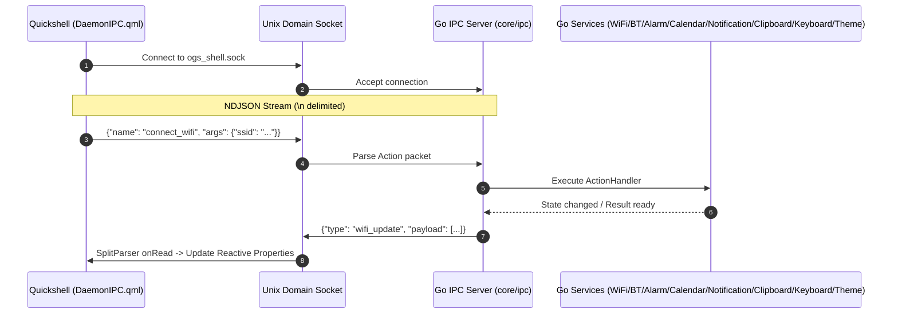

# Backend IPC Endpoints & Socket Protocol Reference

> [!NOTE]
> Bu doküman, Go arka plan servisi (`[[Go-Daemon-Core]]`) ile Quickshell QML arayüzü (`[[Daemon-IPC-Client]]`) arasındaki tüm Unix Domain Socket IPC erişim uçlarını, RPC komutlarını (Actions), yayınlanan olayları (Events) ve veri yapılarını (Payload Schemas) eksiksiz olarak tanımlar.

---

## 1. Taşıma Katmanı & Protokol Mimarisi

* **Soket Yolu:** `$XDG_RUNTIME_DIR/ogs_shell.sock` (Eğer ortam değişkeni tanımsız ise `/tmp/ogs_shell.sock`)
* **Format:** **NDJSON (Newline-Delimited JSON)** — Her JSON mesajı tek bir satırdan oluşur ve `\n` (`0x0A`) karakteri ile sonlandırılır.
* **Mesaj Tipleri:**
  1. **Frontend $\to$ Backend (RPC Action):** `{"name": "<action_name>", "args": { ... }}`
  2. **Backend $\to$ Frontend (Event Broadcast):** `{"type": "<event_type>", "payload": { ... }}`

Detaylı soket sunucusu mimarisi için `[[IPC-Server-Service]]` ve protokol detayları için `[[IPC-Socket-Schema]]` notlarına başvurabilirsiniz.



---

## 2. Hızlı Erişim Özet Tablosu (Endpoint & Event Cheat Sheet)

### A. İstemci Tarafından Gönderilen Komutlar (RPC Actions)

| Servis / Modül | Action İsmi | Parametreler (`args`) | Tetiklenen / Yanıt Event | İlgili Not |
| :--- | :--- | :--- | :--- | :--- |
| **Wi-Fi** | `scan_wifi` | `{}` | `wifi_scan_results` | `[[Wifi-Client-Service]]` |
| **Wi-Fi** | `get_saved_wifi_profiles` | `{}` | `saved_wifi_profiles` | `[[Wifi-Client-Service]]` |
| **Wi-Fi** | `get_wifi_secrets` | `{"ssid_or_uuid": "..."}` | `wifi_secrets` | `[[Wifi-Client-Service]]` |
| **Wi-Fi** | `connect_wifi` | `{"ssid": "...", "password": "...", "hidden": false}` | `wifi_update` | `[[Wifi-Client-Service]]` |
| **Wi-Fi** | `disconnect_wifi` | `{}` | `wifi_update` | `[[Wifi-Client-Service]]` |
| **Wi-Fi** | `update_wifi_secrets` | `{"ssid_or_uuid": "...", "password": "..."}` | `wifi_update` | `[[Wifi-Client-Service]]` |
| **Wi-Fi** | `delete_wifi_profile` / `forget_wifi` | `{"ssid_or_uuid": "..."}` | `saved_wifi_profiles` | `[[Wifi-Client-Service]]` |
| **Wi-Fi** | `set_wifi_enabled` | `{"enabled": true/false}` | `wifi_update` | `[[Wifi-Client-Service]]` |
| **Wi-Fi** | `get_active_wifi` | `{}` | `active_wifi_info` | `[[Wifi-Client-Service]]` |
| **Bluetooth** | `toggle_bluetooth` | `{"enabled": true/false}` *(opsiyonel)* | `bluetooth_update` | `[[Bluetooth-Service]]` |
| **Bluetooth** | `connect_bluetooth` | `{"mac": "XX:XX:XX:XX:XX:XX"}` | `bluetooth_update` | `[[Bluetooth-Service]]` |
| **Bluetooth** | `disconnect_bluetooth` | `{"mac": "XX:XX:XX:XX:XX:XX"}` | `bluetooth_update` | `[[Bluetooth-Service]]` |
| **Bluetooth** | `start_bluetooth_scan` | `{}` | `bluetooth_update` | `[[Bluetooth-Service]]` |
| **Bluetooth** | `stop_bluetooth_scan` | `{}` | `bluetooth_update` | `[[Bluetooth-Service]]` |
| **Bluetooth** | `get_bluetooth_state` | `{}` | `bluetooth_update` | `[[Bluetooth-Service]]` |
| **Alarm** | `add_alarm` | `{"time": "HH:MM", "days": [...], "label": "..."}` | `alarms_update` | `[[Alarm-Service]]` |
| **Alarm** | `delete_alarm` | `{"id": "alarm_..."}` | `alarms_update` | `[[Alarm-Service]]` |
| **Alarm** | `toggle_alarm` | `{"id": "alarm_...", "enabled": true/false}` | `alarms_update` | `[[Alarm-Service]]` |
| **Alarm** | `snooze_alarm` | `{"id": "alarm_...", "minutes": 5}` | `alarms_update` | `[[Alarm-Service]]` |
| **Alarm** | `dismiss_alarm` | `{"id": "alarm_..."}` | `alarms_update` | `[[Alarm-Service]]` |
| **Alarm** | `get_alarms` | `{}` | `alarms_update` | `[[Alarm-Service]]` |
| **Takvim** | `get_calendar_month` | `{"year": 2026, "month": 8}` | `calendar_month_data` | `[[Calendar-Service]]` |
| **Takvim** | `add_calendar_event` | `{"title": "...", "date": "YYYY-MM-DD", ...}` | `calendar_events_update` | `[[Calendar-Service]]` |
| **Takvim** | `update_calendar_event` | `{"id": "evt_...", "title": "...", ...}` | `calendar_events_update` | `[[Calendar-Service]]` |
| **Takvim** | `delete_calendar_event` | `{"id": "evt_..."}` | `calendar_events_update` | `[[Calendar-Service]]` |
| **Takvim** | `toggle_calendar_event` | `{"id": "evt_...", "completed": true/false}` | `calendar_events_update` | `[[Calendar-Service]]` |
| **Takvim** | `get_holidays` | `{"year": 2026}` | `holidays_data` | `[[Calendar-Service]]` |
| **Takvim** | `sync_holidays` | `{"year": 2026}` | `holidays_data` + `calendar_month_data` | `[[Calendar-Service]]` |
| **Bildirim** | `add_notification` | `{"app_name": "...", "summary": "...", ...}` | `notification_received` | `[[Notification-Service]]` |
| **Bildirim** | `get_notifications` | `{}` | `notifications_update` | `[[Notification-Service]]` |
| **Bildirim** | `delete_notification` | `{"id": "notif_..."}` | `notifications_update` | `[[Notification-Service]]` |
| **Bildirim** | `clear_notifications` | `{}` | `notifications_update` | `[[Notification-Service]]` |
| **Bildirim** | `mark_notification_read` | `{"id": "..."}` veya `{"all": true}` | `notifications_update` | `[[Notification-Service]]` |
| **Bildirim** | `toggle_dnd` | `{"enabled": true/false}` *(opsiyonel)* | `dnd_update` | `[[Notification-Service]]` |
| **Bildirim** | `get_dnd_state` | `{}` | `dnd_update` | `[[Notification-Service]]` |
| **Bildirim** | `set_notification_rule` | `{"app_name": "...", "mode": "..."}` | `notification_rules_update` | `[[Notification-Service]]` |
| **Bildirim** | `delete_notification_rule` | `{"app_name": "..."}` | `notification_rules_update` | `[[Notification-Service]]` |
| **Bildirim** | `get_notification_rules` | `{}` | `notification_rules_update` | `[[Notification-Service]]` |
| **Pano** | `get_clipboard_history` | `{"limit": 50, "query": "..."}` | `clipboard_update` | `[[Clipboard-Service]]` |
| **Pano** | `copy_clipboard_item` | `{"id": "..."}` veya `{"text": "..."}` | `clipboard_update` | `[[Clipboard-Service]]` |
| **Pano** | `get_clipboard_content` | `{"id": "..."}` | `clipboard_content_data` | `[[Clipboard-Service]]` |
| **Pano** | `delete_clipboard_item` | `{"id": "..."}` | `clipboard_update` | `[[Clipboard-Service]]` |
| **Pano** | `clear_clipboard_history` | `{}` | `clipboard_update` | `[[Clipboard-Service]]` |
| **Pano** | `pin_clipboard_item` | `{"id": "...", "label": "..."}` | `pinned_clipboard_update` | `[[Clipboard-Service]]` |
| **Pano** | `unpin_clipboard_item` | `{"id": "..."}` | `pinned_clipboard_update` | `[[Clipboard-Service]]` |
| **Pano** | `get_pinned_clipboard_items`| `{}` | `pinned_clipboard_update` | `[[Clipboard-Service]]` |
| **Klavye** | `get_keyboard_layout` | `{}` | `keyboard_layout_update` | `[[Keyboard-Service]]` |
| **Klavye** | `switch_keyboard_layout` | `{"target": "next/0/1"}` | `keyboard_layout_update` | `[[Keyboard-Service]]` |
| **Klavye** | `set_configured_layouts` | `{"layouts": ["tr", "us"]}` | `keyboard_layout_update` | `[[Keyboard-Service]]` |
| **Klavye** | `get_available_system_layouts` | `{}` | `available_layouts_data` | `[[Keyboard-Service]]` |
| **Tema** | `get_theme_state` | `{}` | `theme_update` | `[[Theme-Service]]` |
| **Tema** | `get_available_themes` | `{}` | `available_themes_data` | `[[Theme-Service]]` |
| **Tema** | `set_active_theme` | `{"theme_id": "tokyo-night"}` | `theme_update` | `[[Theme-Service]]` |
| **Tema** | `save_custom_theme` | `{"theme": {...}}` | `theme_update` | `[[Theme-Service]]` |
| **Tema** | `delete_custom_theme` | `{"theme_id": "..."}` | `theme_update` | `[[Theme-Service]]` |
| **Tema** | `toggle_theme_adapter` | `{"adapter_id": "kitty", "enabled": bool}` | `theme_update` | `[[Theme-Service]]` |

---

### B. Backend Tarafından Yayınlanan Olaylar (Broadcast Events)

| Olay Tipi (`type`) | Tetiklenme Kaynağı / Sıklık | Payload Tipi | İlgili Servis Notu |
| :--- | :--- | :--- | :--- |
| `sys_metrics` | 1 saniyede bir periyodik | `SystemMetricsPayload` | `[[SysMetrics-Service]]` |
| `wifi_update` | D-Bus sinyal odaklı (500ms debounce) | `[]AccessPoint` | `[[Wifi-Client-Service]]` |
| `wifi_scan_results` | `scan_wifi` RPC yanıtı | `[]AccessPoint` | `[[Wifi-Client-Service]]` |
| `saved_wifi_profiles` | Profil listeleme / silme | `[]WifiProfile` | `[[Wifi-Client-Service]]` |
| `wifi_secrets` | `get_wifi_secrets` RPC yanıtı | `WifiSecrets` | `[[Wifi-Client-Service]]` |
| `active_wifi_info` | `get_active_wifi` RPC yanıtı | `ActiveWifiInfo` | `[[Wifi-Client-Service]]` |
| `bluetooth_update` | D-Bus sinyal odaklı (500ms debounce) | `BluetoothState` | `[[Bluetooth-Service]]` |
| `alarms_update` | Alarm CRUD veya durum değişimleri | `[]Alarm` | `[[Alarm-Service]]` |
| `alarm_triggered` | Alarm çalma vakti geldiğinde | `AlarmTriggeredPayload` | `[[Alarm-Service]]` |
| `calendar_month_data` | `get_calendar_month` / `sync_holidays` | `MonthData` | `[[Calendar-Service]]` |
| `calendar_events_update` | Etkinlik CRUD işlemlerinde | `[]CalendarEvent` | `[[Calendar-Service]]` |
| `calendar_reminder_triggered` | Hatırlatma zamanı geldiğinde | `CalendarReminderTriggeredPayload` | `[[Calendar-Service]]` |
| `holidays_data` | `get_holidays` / `sync_holidays` | `[]Holiday` | `[[Calendar-Service]]` |
| `notifications_update` | Bildirim CRUD veya okundu işlemlerinde | `[]Notification` | `[[Notification-Service]]` |
| `notification_received` | Yeni bildirim geldiğinde | `NotificationReceivedPayload` | `[[Notification-Service]]` |
| `dnd_update` | DND modu değiştiğinde | `{"dnd_enabled": bool}` | `[[Notification-Service]]` |
| `notification_rules_update` | Kural eklendiğinde / silindiğinde | `[]NotificationRule` | `[[Notification-Service]]` |
| `clipboard_update` | Pano değiştiğinde veya işlem yapıldığında | `[]ClipboardItem` | `[[Clipboard-Service]]` |
| `clipboard_item_copied` | Yeni bir metin/öğe kopyalandığında | `ClipboardItemCopiedPayload` | `[[Clipboard-Service]]` |
| `pinned_clipboard_update` | Favori eklendiğinde / çıkarıldığında | `[]PinnedItem` | `[[Clipboard-Service]]` |
| `clipboard_content_data` | `get_clipboard_content` RPC yanıtı | `ItemContentResponse` | `[[Clipboard-Service]]` |
| `keyboard_layout_update` | Klavye düzeni değiştiğinde (fiziksel kısayol veya UI) | `KeyboardState` | `[[Keyboard-Service]]` |
| `available_layouts_data` | `get_available_system_layouts` yanıtı | `[]AvailableLayout` | `[[Keyboard-Service]]` |
| `theme_update` | Tema değiştiğinde veya adaptör güncellendiğinde | `ThemeState` | `[[Theme-Service]]` |
| `available_themes_data` | `get_available_themes` yanıtı | `[]ThemePalette` | `[[Theme-Service]]` |

---

## 3. Servis Şemaları ve Payload Tipleri

### 3.1. Sistem Metrikleri (`sys_metrics`)
Yayınlayan: `[[SysMetrics-Service]]` (`[[CPU-Monitor-Service]]`, `[[RAM-Monitor-Service]]`, `[[GPU-Monitor-Service]]`, `[[Network-Monitor-Service]]`)

```json
{
  "type": "sys_metrics",
  "payload": {
    "cpu": { "cpu_percent": 14.82, "cpu_temp": 48.5 },
    "ram": { "ram_used_mb": 4210, "ram_total_mb": 16032, "ram_percent": 26.25 },
    "gpu": { "gpu_temp": 51.0, "gpu_percent": 8.0 },
    "net": { "rx_bytes_sec": 128450.5, "tx_bytes_sec": 34200.0, "interface": "wlan0", "is_connected": true }
  }
}
```

### 3.2. Wi-Fi ve Ağ Yönetimi
Yayınlayan: `[[Wifi-Client-Service]]`

* `AccessPoint`: `{"ssid": "...", "bssid": "...", "signal": 85, "frequency": 5180, "band": "5GHz", "security": "WPA2-PSK", "is_saved": true, "is_active": true, "channel": 36}`
* `WifiProfile`: `{"uuid": "...", "name": "...", "ssid": "...", "security_type": "WPA2-PSK", "auto_connect": true, "last_used": 1723380000, "has_password": true}`
* `ActiveWifiInfo`: `{"ssid": "...", "bssid": "...", "device": "wlan0", "ip_address": "192.168.1.105", "gateway": "192.168.1.1", "dns": ["1.1.1.1"], "signal": 88, "frequency": 5180, "bitrate_kbps": 866000, "security": "WPA2-PSK"}`
* `WifiSecrets`: `{"ssid": "...", "uuid": "...", "password": "...", "key_mgmt": "wpa-psk"}`

### 3.3. Bluetooth Yönetimi
Yayınlayan: `[[Bluetooth-Service]]`

* `BluetoothState`:
```json
{
  "adapter_powered": true,
  "discovering": false,
  "devices": [
    {
      "mac": "38:18:4C:BE:11:92",
      "name": "Sony WH-1000XM4",
      "icon": "audio-headset",
      "connected": true,
      "paired": true,
      "rssi": -58
    }
  ]
}
```

### 3.4. Alarm ve Hatırlatıcı Servisi
Yayınlayan: `[[Alarm-Service]]`

* `Alarm`: `{"id": "alarm_123", "time": "07:30", "days": [1,2,3,4,5], "label": "İş Alarmı", "enabled": true, "sound_path": "", "snooze_count": 0}`
* `AlarmTriggeredPayload`: `{"id": "alarm_123", "label": "İş Alarmı", "time": "07:30"}`

### 3.5. Takvim ve Tatil Servisi
Yayınlayan: `[[Calendar-Service]]`

* `Holiday`: `{"date": "2026-10-29", "name": "Cumhuriyet Bayramı", "is_half_day": false, "type": "national"}`
* `CalendarEvent`: `{"id": "evt_1", "title": "Toplantı", "description": "", "date": "2026-08-15", "time": "14:30", "all_day": false, "color": "#89b4fa", "completed": false, "notify_before_minutes": 15, "notified": false}`
* `MonthData`: `{"year": 2026, "month": 8, "holidays": [...], "events": [...]}`
* `CalendarReminderTriggeredPayload`: `{"id": "evt_1", "title": "Toplantı", "date": "2026-08-15", "time": "14:30", "minutes_until": 15}`

---

## 4. Frontend Entegrasyonu (`[[Daemon-IPC-Client]]`)

Quickshell QML tarafında tüm erişim `shell/backend/DaemonIPC.qml` üzerinden yürütülür:
* Action göndermek için: `DaemonIPC.sendAction(name, args)`
* Olayları dinlemek için: `DaemonIPC.<property>` veya `Connections { target: DaemonIPC; function on...() {} }`

---

## 5. İlgili Bağlantılar ve Kaynaklar

* Mimari doküman: `[[System-Architecture]]`
* Soket şeması: `[[IPC-Socket-Schema]]`
* Go Daemon çekirdeği: `[[Go-Daemon-Core]]`
* Quickshell IPC istemcisi: `[[Daemon-IPC-Client]]`
* Ajan operasyonel kuralları: `[[Agent-Workflow-Directives]]`
