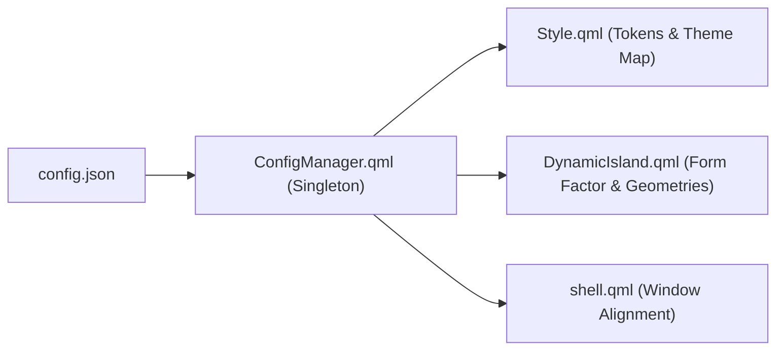

# Configuration System & JSON Schema Specification

> [!NOTE]
> `ogsShell-qs` configuration is centralized in `config.json`, allowing users and developers to switch between **Dynamic Island** and **Dynamic Notch** modes, configure geometry (idle/hover/transient/expanded height and width), choose themes, and adjust animation parameters without modifying QML code.

---

## 1. Configuration File Locations & Dual Reactive Synchronization

The configuration system continuously watches both locations:
1. **User Custom Config (Canonical):** `$XDG_CONFIG_HOME/ogsShell/config.json` (or `~/.config/ogsShell/config.json`)
2. **Project Workspace Config:** `shell/config.json`

* **Automatic Two-Way Sync:** Whenever `shell/config.json` or `~/.config/ogsShell/config.json` is modified, `Config.qml` immediately parses the updated payload, updates the reactive `configRevision` generation counter, and synchronizes the active config to `$XDG_CONFIG_HOME/ogsShell/config.json`.
* **Hot Reloading:** Window spacers (`reservedSpacerWindow`), input masks (`activeInputEnvelope`), and Dynamic Notch vector Bézier paths instantly resize upon saving without requiring a manual shell restart.

---

## 2. Complete JSON Schema Specification

```json
{
  "$schema": "https://json-schema.org/draft/2020-12/schema",
  "title": "OgsShell Configuration",
  "type": "object",
  "properties": {
    "form_factor": {
      "type": "string",
      "enum": ["island", "notch"],
      "default": "island",
      "description": "Visual presentation format: floating island or top-bezel notch."
    },
    "theme": {
      "type": "string",
      "enum": ["catppuccin", "nord", "tokyonight", "everforest", "gruvbox", "monochrome"],
      "default": "catppuccin",
      "description": "Active color scheme palette from shared/themes/themes.json."
    },
    "typography": {
      "type": "object",
      "properties": {
        "clock_idle_size": { "type": "integer", "default": 16 },
        "clock_hover_size": { "type": "integer", "default": 20 },
        "date_hover_size": { "type": "integer", "default": 13 },
        "media_title_size": { "type": "integer", "default": 12 },
        "media_artist_size": { "type": "integer", "default": 11 },
        "connectivity_text_size": { "type": "integer", "default": 11 },
        "connectivity_icon_size": { "type": "integer", "default": 14 },
        "notification_title_size": { "type": "integer", "default": 13 },
        "notification_body_size": { "type": "integer", "default": 11 },
        "pinned_metrics_size": { "type": "integer", "default": 11 },
        "pinned_metrics_icon_size": { "type": "integer", "default": 13 }
      }
    },
    "island": {
      "type": "object",
      "properties": {
        "top_margin": { "type": "integer", "default": 8 },
        "idle_width": { "type": "integer", "default": 180 },
        "idle_height": { "type": "integer", "default": 36 },
        "hover_width": { "type": "integer", "default": 220 },
        "hover_height": { "type": "integer", "default": 42 },
        "transient_width": { "type": "integer", "default": 340 },
        "transient_height": { "type": "integer", "default": 56 },
        "expanded_width": { "type": "integer", "default": 320 },
        "expanded_height": { "type": "integer", "default": 140 },
        "radius_full": { "type": "integer", "default": 18 },
        "radius_expanded": { "type": "integer", "default": 24 }
      }
    },
    "notch": {
      "type": "object",
      "properties": {
        "top_margin": { "type": "integer", "default": 0 },
        "idle_width": { "type": "integer", "default": 190 },
        "idle_height": { "type": "integer", "default": 34 },
        "hover_width": { "type": "integer", "default": 230 },
        "hover_height": { "type": "integer", "default": 40 },
        "transient_width": { "type": "integer", "default": 350 },
        "transient_height": { "type": "integer", "default": 58 },
        "expanded_width": { "type": "integer", "default": 330 },
        "expanded_height": { "type": "integer", "default": 150 },
        "bottom_radius": { "type": "integer", "default": 20 },
        "bottom_radius_expanded": { "type": "integer", "default": 26 }
      }
    },
    "notifications": {
      "type": "object",
      "properties": {
        "enabled": { "type": "bool", "default": true },
        "default_timeout_ms": { "type": "integer", "default": 3500 }
      }
    },
    "animation": {
      "type": "object",
      "properties": {
        "duration_compact": { "type": "integer", "default": 250 },
        "duration_transient": { "type": "integer", "default": 280 },
        "duration_expanded": { "type": "integer", "default": 320 },
        "overshoot_factor": { "type": "number", "default": 1.12 }
      }
    }
  }
}
```

---

## 3. QML Integration via `ConfigManager`



* **Singleton Access:** Accessed globally in any QML file via `Config.formFactor`, `Config.activeGeometry`, `Config.theme`.
* **Dynamic Property Resolution:**
  ```qml
  readonly property var activeGeometry: formFactor === "notch" ? configData.notch : configData.island
  ```

---

## 4. Related Links

* Dynamic Notch Spec: `[[Dynamic-Notch-Design-Specification]]`
* Themes Spec: `[[Configuration-Themes-Spec]]`
* Proposal Note: `[[Plan-Dual-Format-Island-And-Notch-Architecture]]`
