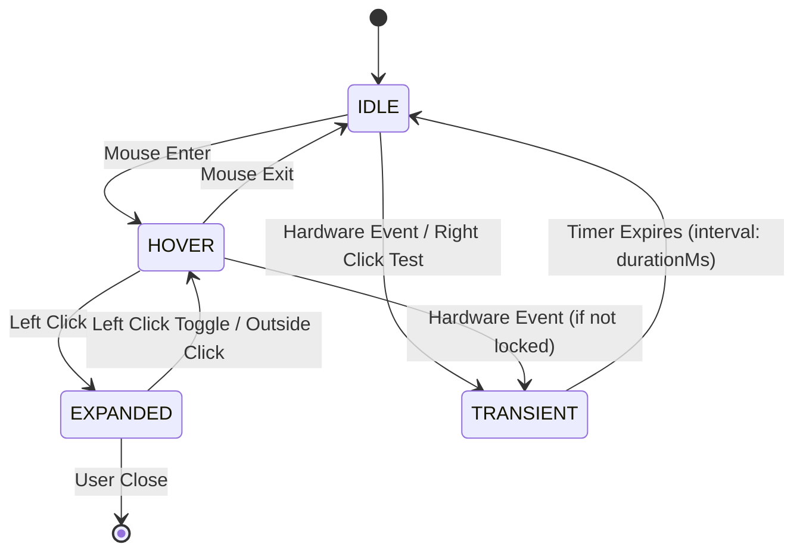
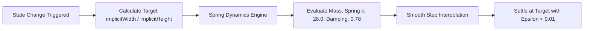

# Dynamic Island Physics & State Machine Specification

> [!NOTE]
> This document specifies the mathematical physics, state transitions, event priority matrix, and layout calculations for the Dynamic Island in `ogsShell-qs`.

---

## 1. State Priority Matrix

To prevent transient notifications from disrupting active user interactions (such as expanding an app menu or media player), all states are ranked according to a deterministic hierarchy:

$$\text{EXPANDED\_APP} > \text{TRANSIENT} > \text{HOVER} > \text{IDLE}$$



### State Definitions

| State Name | Trigger | Geometry Target (W x H) | Behavior & Visibility |
| :--- | :--- | :--- | :--- |
| `IDLE` | Default ambient resting state | `180px` $\times$ `36px` | Compact pill; displays `[[Clock-Widget]]`. |
| `HOVER` | Mouse cursor enters island bounding box | `220px` $\times$ `46px` | Subtle expansion inviting interaction. |
| `EXPANDED` | User left-clicks on island | `360px` $\times$ `180px` (or `activeContent.implicitWidth/Height`) | Detailed interactive modal; hides compact clock. |
| `TRANSIENT` | Hardware event (volume, net change) | Custom based on payload | Ephemeral morph; auto-reverts to previous state after timer expiry. |

---

## 2. Geometry Calculation Rules

The island's dimensions in `[[Dynamic-Island-Component]]` are derived reactively:

```qml
implicitWidth: {
    switch (stateMode) {
        case "HOVER"    : return Style.islandIdleWidth + 40
        case "EXPANDED" : return activeContent ? activeContent.implicitWidth : 360
        default         : return Style.islandIdleWidth
    }
}

implicitHeight: {
    switch (stateMode) {
        case "HOVER"    : return Style.islandIdleHeight + 10
        case "EXPANDED" : return activeContent ? activeContent.implicitHeight : 180
        default         : return Style.islandIdleHeight
    }
}
```

---

## 3. Spring Animation & Motion Physics

Following `[[Apple-Dynamic-Island-HIG]]`, the island utilizes physics-based interpolation to maintain continuous motion velocity during rapid state transitions.



### Recommended Quickshell Transition Config
For full Apple-grade spring physics in QML:

```qml
Behavior on implicitWidth {
    SpringAnimation {
        spring: 28.0
        damping: Style.springDamping // 0.78
        epsilon: Style.springEpsilon // 0.01
    }
}

Behavior on implicitHeight {
    SpringAnimation {
        spring: 28.0
        damping: Style.springDamping // 0.78
        epsilon: Style.springEpsilon // 0.01
    }
}
```

---

## 4. Transient State Handling and Recovery

When a transient event occurs (e.g. via `triggerTransient(contentComponent, durationMs)`):

1. **State Preservation:** The component saves `previousState = root.stateMode` before entering `TRANSIENT`.
2. **Timer Arming:** A dedicated `Timer` is armed with `interval: durationMs` (defaulting to 3000ms).
3. **Graceful Reversion:** Upon timer trigger, the island transitions smoothly back to `previousState` without snapping.

```qml
function triggerTransient(contentComponent, durationMs) {
    if (root.stateMode !== "TRANSIENT") {
        root.previousState = root.stateMode
    }
    root.activeContent = contentComponent
    root.stateMode = "TRANSIENT"

    transientTimer.interval = durationMs > 0 ? durationMs : 3000
    transientTimer.restart()
}
```

---

## 5. Wayland LayerShell Integration

* **Exclusion Mode:** The parent window in `[[Shell-Root-PanelWindow]]` sets `exclusionMode: ExclusionMode.Ignore`.
* **Non-Blocking Overlay:** The root window implicit canvas is sized to `island.implicitWidth + 40` by `400px`, allowing child animations to render smoothly outside the idle bounds while maintaining a transparent non-blocking footprint across the Hyprland workspace.
