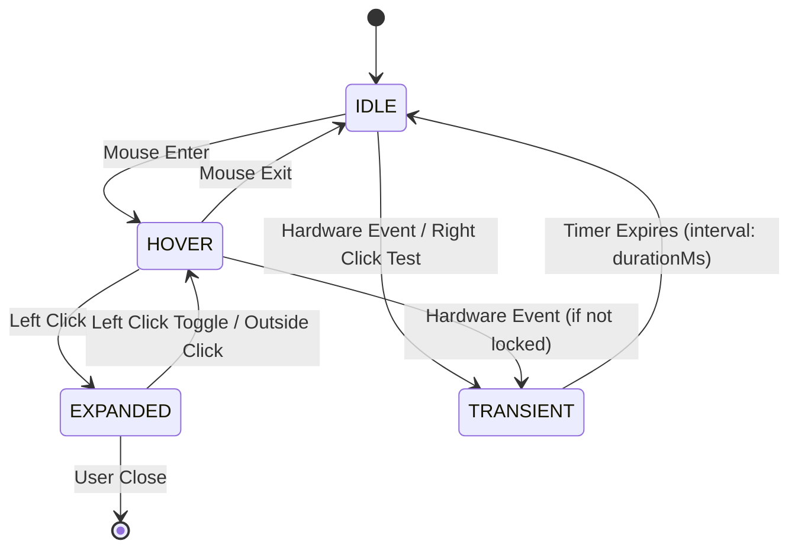
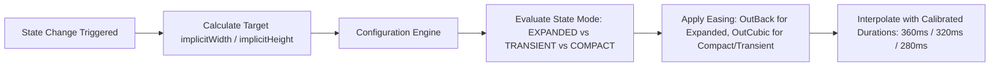

# Dynamic Island Physics & State Machine Specification

> [!NOTE]
> This document specifies the mathematical physics, state transitions, event priority matrix, and layout calculations for the Dynamic Island in `ogsShell-qs`.

---

## 1. State Priority Matrix

To prevent transient notifications from disrupting active user interactions (such as expanding an app menu or media player), all states are ranked according to a deterministic hierarchy:

$$\text{EXPANDED\_APP} > \text{TRANSIENT} > \text{HOVER} > \text{IDLE}$$



### State Definitions

| State Name | Trigger | Geometry Target (W x H) | Behavior & Visibility |
| :--- | :--- | :--- | :--- |
| `IDLE` | Default ambient resting state | `180px` $\times$ `36px` | Compact pill; displays `[[Clock-Widget]]`. |
| `HOVER` | Mouse cursor enters island bounding box | `220px` $\times$ `46px` | Subtle expansion inviting interaction. |
| `EXPANDED` | User left-clicks on island | `360px` $\times$ `180px` (or `activeContent.implicitWidth/Height`) | Detailed interactive modal; hides compact clock. |
| `TRANSIENT` | Hardware event (volume, net change) | Custom based on payload | Ephemeral morph; auto-reverts to previous state after timer expiry. |

---

## 2. Geometry Calculation Rules

The island's dimensions in `[[Dynamic-Island-Component]]` are derived reactively:

```qml
implicitWidth: {
    switch (stateMode) {
        case "HOVER"    : return Style.islandIdleWidth + 40
        case "EXPANDED" : return activeContent ? activeContent.implicitWidth : 360
        default         : return Style.islandIdleWidth
    }
}

implicitHeight: {
    switch (stateMode) {
        case "HOVER"    : return Style.islandIdleHeight + 10
        case "EXPANDED" : return activeContent ? activeContent.implicitHeight : 180
        default         : return Style.islandIdleHeight
    }
}
```

---

## 3. Motion Physics & Easing Curves

Following `[[Apple-Dynamic-Island-HIG]]`, the island utilizes GPU-accelerated interpolation with calibrated easing curves and subtle elastic overshoot to provide a smooth, natural, and fluid tactile feel during all state transitions:



### Quickshell Transition Configuration
Synchronized with `[[Configuration-System-Spec]]` (`Config.animation`):

```qml
Behavior on width {
  NumberAnimation {
    duration: root.stateMode === "EXPANDED" ? Config.animation.duration_expanded : (root.stateMode === "TRANSIENT" ? Config.animation.duration_transient : Config.animation.duration_compact)
    easing.type: root.stateMode === "EXPANDED" ? Easing.OutBack : Easing.OutCubic
    easing.overshoot: Config.animation.overshoot_factor
  }
}

Behavior on height {
  NumberAnimation {
    duration: root.stateMode === "EXPANDED" ? Config.animation.duration_expanded : (root.stateMode === "TRANSIENT" ? Config.animation.duration_transient : Config.animation.duration_compact)
    easing.type: root.stateMode === "EXPANDED" ? Easing.OutBack : Easing.OutCubic
    easing.overshoot: Config.animation.overshoot_factor
  }
}
```

* **EXPANDED (`360ms`):** Utilizes `Easing.OutBack` with subtle overshoot (`1.08`) for a gentle, luxurious expansion modal pop.
* **TRANSIENT (`320ms`):** Utilizes `Easing.OutCubic` for a smooth, non-intrusive notification glide.
* **COMPACT / HOVER / IDLE (`280ms`):** Utilizes `Easing.OutCubic` for responsive, buttery-smooth cursor hover expansion and collapse.
* **Synchronized Elements:** Corner radius (`activeRadius`), elevation shadows (`glowRadius`), and child layer crossfades (`opacity`) animate in exact lockstep to prevent shape deformation.

---

## 4. Transient State Handling and Recovery

When a transient event occurs (e.g. via `triggerTransient(contentComponent, durationMs)`):

1. **State Preservation:** The component saves `previousState = root.stateMode` before entering `TRANSIENT`.
2. **Timer Arming:** A dedicated `Timer` is armed with `interval: durationMs` (defaulting to 3000ms).
3. **Graceful Reversion:** Upon timer trigger, the island transitions smoothly back to `previousState` without snapping.

```qml
function triggerTransient(contentComponent, durationMs) {
    if (root.stateMode !== "TRANSIENT") {
        root.previousState = root.stateMode
    }
    root.activeContent = contentComponent
    root.stateMode = "TRANSIENT"

    transientTimer.interval = durationMs > 0 ? durationMs : 3000
    transientTimer.restart()
}
```

---

## 5. 3D Katmanlı Kart Destesi Fiziği (Cascading Notification Deck Physics)

Dynamic Island & Dynamic Notch form faktörlerinde peş peşe gelen bildirimlerin birbirini ezmesini önlemek için 3D fiziksel katmanlı kart destesi kullanılır:

1. **Katman Hiyerarşisi ve Geometrisi:**
   - **Katman 1 (Ön):** Genişlik `%100`, $Y = 0$, Opacity $1.0$, $Z = 3$. Aktif içerik ve `[+X Deste]` rozeti.
   - **Katman 2 (Orta):** Genişlik `%91`, Opacity $0.75$, $Z = 2$. Island modunda $+8\text{px}$, Notch modunda $+9\text{px}$ tavandan aşağı sarkar.
   - **Katman 3 (Dip):** Genişlik `%82`, Opacity $0.45$, $Z = 1$. Island modunda $+16\text{px}$, Notch modunda $+17\text{px}$ tavandan aşağı sarkar.
2. **Ascension Lifecycle (Yükselme Fiziği):**
   - Aktif kart kapandığında (`dismissFront()`), 2. katman anında `SpringAnimation` (`spring: 28.0`, `damping: 0.78`) ile hem genişlik hem yükseklik bakımından 1. katman formuna yaylanarak büyür.
3. **Aciliyet Önceliği (Critical Urgency Preemption):**
   - `urgency === "critical"` bildirimler kuyruğu atlayarak doğrudan dizinin başına yerleşir (`unshift`) ve anında ön plana çıkar.
4. **Wayland Giriş Maskesi Uyumu:**
   - `shell/shell.qml` içerisindeki `activeInputEnvelope` yüksekliği, sarkan katmanların $+18\text{px}$'lik taşmasını kapsayacak şekilde `island.extraStackHeight` ile dinamik hesaplanır.

---

## 6. Wayland LayerShell Integration

* **Exclusion Mode:** The parent window in `[[Shell-Root-PanelWindow]]` sets `exclusionMode: ExclusionMode.Ignore`.
* **Non-Blocking Overlay:** The root window implicit canvas is sized to `island.implicitWidth + 40` by `400px`, allowing child animations to render smoothly outside the idle bounds while maintaining a transparent non-blocking footprint across the Hyprland workspace.
