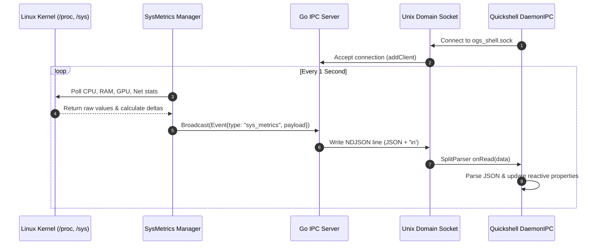

# IPC Socket Schema & Protocol Specification

> [!NOTE]
> All communication between the Go Daemon (`core/`) and Quickshell QML Frontend (`shell/`) occurs over a Unix Domain Socket using **Newline-Delimited JSON (NDJSON)**.

---

## 1. Transport Layer Specifications

* **Socket Path:** `$XDG_RUNTIME_DIR/ogs_shell.sock` (Defaults to `/tmp/ogs_shell.sock` if `$XDG_RUNTIME_DIR` is unset).
* **Framing Method:** Newline-delimited (`\n` / byte `0x0A`). Each JSON packet is serialized as a single line.
* **Concurrency:** 
  * Backend: Managed via `[[IPC-Server-Service]]` using Go goroutines and `sync.RWMutex`.
  * Frontend: Managed via `[[Daemon-IPC-Client]]` using `Quickshell.Io.Socket` and `SplitParser`.

---

## 2. Core Protocol Data Structures

In the Go backend (`core/ipc/protocol.go`), the protocol is divided into two primary types:

### A. Outbound Event (`Event`)
Broadcast from Go Daemon to connected QML frontends.

```go
type Event struct {
    Type    string          `json:"type"`
    Payload json.RawMessage `json:"payload"`
}
```

### B. Inbound Action (`Action`)
Sent from QML or external CLI tools to the Go Daemon.

```go
type Action struct {
    Name string          `json:"name"`
    Args json.RawMessage `json:"args"`
}
```

---

## 3. Message Schemas

### `sys_metrics` Event
Broadcast periodically (every 1 second) by `[[SysMetrics-Service]]`.

```json
{
  "type": "sys_metrics",
  "payload": {
    "cpu": {
      "cpu_percent": 14.82,
      "cpu_temp": 48.5
    },
    "ram": {
      "ram_used_mb": 4210,
      "ram_total_mb": 16032,
      "ram_percent": 26.25
    },
    "gpu": {
      "gpu_temp": 51.0,
      "gpu_percent": 8.0
    },
    "net": {
      "rx_bytes_sec": 128450.5,
      "tx_bytes_sec": 34200.0,
      "interface": "wlan0",
      "is_connected": true
    }
  }
}
```

#### Field Definitions
* `cpu.cpu_percent` (`float64`): Total CPU utilization across all cores (0.0 - 100.0). Source: `[[CPU-Monitor-Service]]`.
* `cpu.cpu_temp` (`float64`): Thermal sensor reading in Celsius (`-1.0` if unavailable).
* `ram.ram_used_mb` (`uint64`): Used physical memory in Megabytes. Source: `[[RAM-Monitor-Service]]`.
* `ram.ram_total_mb` (`uint64`): Total installed physical memory in Megabytes.
* `ram.ram_percent` (`float64`): Percentage of RAM currently occupied.
* `gpu.gpu_percent` (`float64`): GPU core engine load percentage (`-1.0` if unsupported). Source: `[[GPU-Monitor-Service]]`.
* `gpu.gpu_temp` (`float64`): GPU temperature in Celsius.
* `net.rx_bytes_sec` (`float64`): Download throughput in bytes per second. Source: `[[Network-Monitor-Service]]`.
* `net.tx_bytes_sec` (`float64`): Upload throughput in bytes per second.
* `net.interface` (`string`): Primary active interface with default route (e.g., `eth0`, `wlan0`, or `none`).
* `net.is_connected` (`bool`): Internet connectivity flag based on routing table detection.

### `bluetooth_update` Event
Broadcast on Bluetooth adapter property changes, device connection/pairing changes, or scan events by `[[Bluetooth-Service]]`.

```json
{
  "type": "bluetooth_update",
  "payload": {
    "adapter_powered": true,
    "discovering": false,
    "devices": [
      {
        "mac": "38:18:4C:BE:11:92",
        "name": "Sony WH-1000XM4",
        "icon": "audio-headset",
        "connected": true,
        "paired": true,
        "rssi": -58
      }
    ]
  }
}
```

#### Field Definitions
* `adapter_powered` (`bool`): Whether the primary Bluetooth controller (`hci0`) is active.
* `discovering` (`bool`): Whether an active device discovery/scan is underway.
* `devices` (`[]BluetoothDevice`): List of paired, connected, or discovered peripherals.
  * `mac` (`string`): Hardware MAC address.
  * `name` (`string`): Device display name or alias.
  * `icon` (`string`): Device icon identifier (`audio-headset`, `input-keyboard`, `input-mouse`, `input-gaming`, `phone`, `computer`, `bluetooth`).
  * `connected` (`bool`): Active connection state.
  * `paired` (`bool`): Whether the peripheral is paired.
  * `rssi` (`int16`): Received Signal Strength Indicator in dBm.

---

## 4. Bluetooth RPC Actions

| Action Name | Args Payload | Description |
| :--- | :--- | :--- |
| `toggle_bluetooth` | `{"enabled": true}` *(optional)* | Toggles or explicitly sets adapter power |
| `connect_bluetooth` | `{"mac": "XX:XX:XX:XX:XX:XX"}` | Initiates connection to device by MAC |
| `disconnect_bluetooth` | `{"mac": "XX:XX:XX:XX:XX:XX"}` | Disconnects device by MAC |
| `start_bluetooth_scan` | *(none)* | Initiates 15-second timed device discovery |
| `stop_bluetooth_scan` | *(none)* | Cancels active device discovery |
| `get_bluetooth_state` | *(none)* | Queries current adapter and device snapshot |

### `alarm_triggered` Event
Broadcast by `[[Alarm-Service]]` when an alarm matures:

```json
{
  "type": "alarm_triggered",
  "payload": {
    "id": "alarm_1786392495182",
    "label": "Sistem Toplantısı",
    "time": "07:30"
  }
}
```

### `alarms_update` Event
Broadcast whenever alarms are created, deleted, toggled, snoozed, or dismissed:

```json
{
  "type": "alarms_update",
  "payload": [
    {
      "id": "alarm_1786392495182",
      "time": "07:30",
      "days": [1, 2, 3, 4, 5],
      "label": "Hafta İçi Uyanma",
      "enabled": true,
      "sound_path": "",
      "snooze_count": 0
    }
  ]
}
```

---

## 5. Alarm RPC Actions

| Action Name | Args Payload | Description |
| :--- | :--- | :--- |
| `add_alarm` | `{"time": "07:30", "days": [1,2,3], "label": "Test"}` | Creates and persists a new alarm |
| `delete_alarm` | `{"id": "alarm_123"}` | Deletes an alarm and halts ringing |
| `toggle_alarm` | `{"id": "alarm_123", "enabled": true}` | Toggles or sets alarm enabled state |
| `snooze_alarm` | `{"id": "alarm_123", "minutes": 10}` | Snoozes ringing alarm for X minutes |
| `dismiss_alarm` | `{"id": "alarm_123"}` | Stops ringing audio and resets snooze |
| `get_alarms` | *(none)* | Queries full alarm list |

---

## 6. Calendar & Holiday RPC Actions & Events

### `calendar_reminder_triggered` Event
Broadcast by `[[Calendar-Service]]` when an event reminder fires:

```json
{
  "type": "calendar_reminder_triggered",
  "payload": {
    "id": "evt_1786395000",
    "title": "Mühendislik Sunumu",
    "date": "2026-08-15",
    "time": "14:30",
    "minutes_until": 15
  }
}
```

### `calendar_events_update` Event
Broadcast whenever events are added, edited, deleted, or marked completed.

### `calendar_month_data` Event
Response payload returning the matrix of days, holidays, and events for the requested month.

### Calendar RPC Actions

| Action Name | Args Payload | Description |
| :--- | :--- | :--- |
| `get_calendar_month` | `{"year": 2026, "month": 8}` | Queries month grid, holidays, and events |
| `add_calendar_event` | `{"title": "...", "date": "2026-08-15", "time": "14:00"}` | Adds, persists, and schedules reminder |
| `update_calendar_event` | `{"id": "evt_123", "title": "Yeni Başlık"}` | Updates existing event |
| `delete_calendar_event` | `{"id": "evt_123"}` | Removes event by ID |
| `toggle_calendar_event` | `{"id": "evt_123", "completed": true}` | Toggles completed state |
| `get_holidays` | `{"year": 2026}` | Queries national & religious holidays |
| `sync_holidays` | `{"year": 2026}` | Triggers async online holiday sync |

---

## 7. Sequence & Data Flow



---

## 5. Error Handling and Robustness

> [!WARNING]
> * **Dead Sockets:** When the Go daemon starts, it unlinks stale socket files using `os.Remove(s.socketPath)` to prevent `EADDRINUSE` errors.
> * **Broken Pipes:** In `[[IPC-Server-Service]]`, if `conn.Write()` encounters an error, the client is flagged and dropped from the active broadcast pool under lock safety.
> * **Malformed JSON in QML:** In `[[Daemon-IPC-Client]]`, the parser executes inside a `try/catch` block to protect the UI thread from crashing on partial frames.
