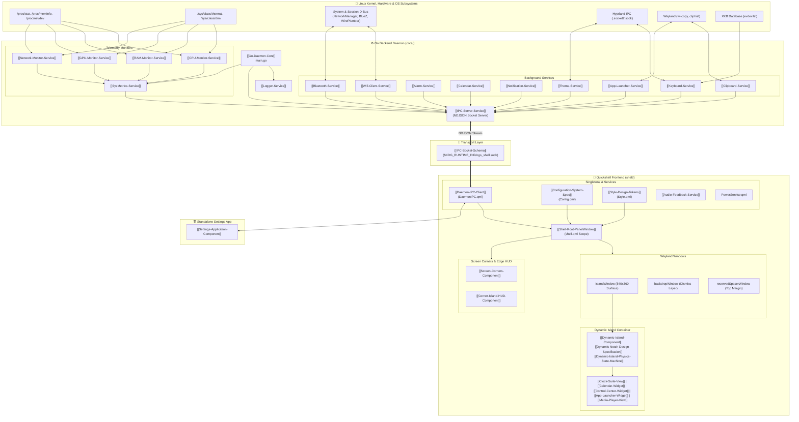
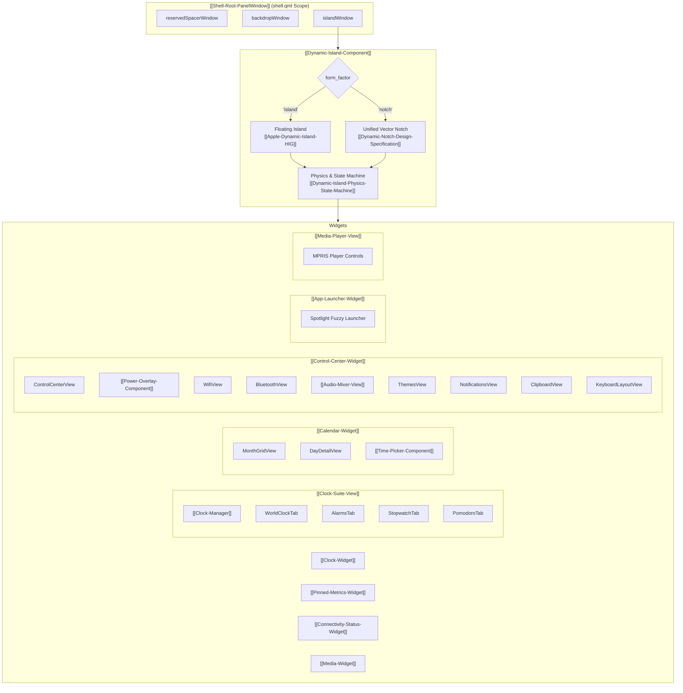

# OgsShell-qs Complete Project Structure & Mermaid.js Architecture

> [!NOTE]
> Bu doküman, `OgsShell-qs` sisteminin tüm alt servislerini, QML bileşenlerini, IPC veri hatlarını ve dosya ağacını görselleştiren Obsidian bilgi bankası mimari referansıdır. Proje kök dizinindeki [`PROJECT_STRUCTURE.md`](file:///home/excalibur/WorkSpace/projects/OgsShell-qs/PROJECT_STRUCTURE.md) dosyası ile eşzamanlıdır.

---

## 1. Genel Sistem Mimarisi (High-Level Architecture)

---

## 2. Frontend Bileşen Ağacı

---

## 3. İlgili Mimari ve Servis Notları

* Sistem Mimarisi Detayları: `[[System-Architecture]]`
* IPC API Uçları & JSON Şeması: `[[Backend-Endpoints-Reference]]` & `[[IPC-Socket-Schema]]`
* Go Daemon Çekirdeği: `[[Go-Daemon-Core]]`
* Konfigürasyon ve Canlı Yenileme: `[[Configuration-System-Spec]]`
* Tema Yönetimi & Adaptörler: `[[Configuration-Themes-Spec]]` & `[[Theme-Service]]`
