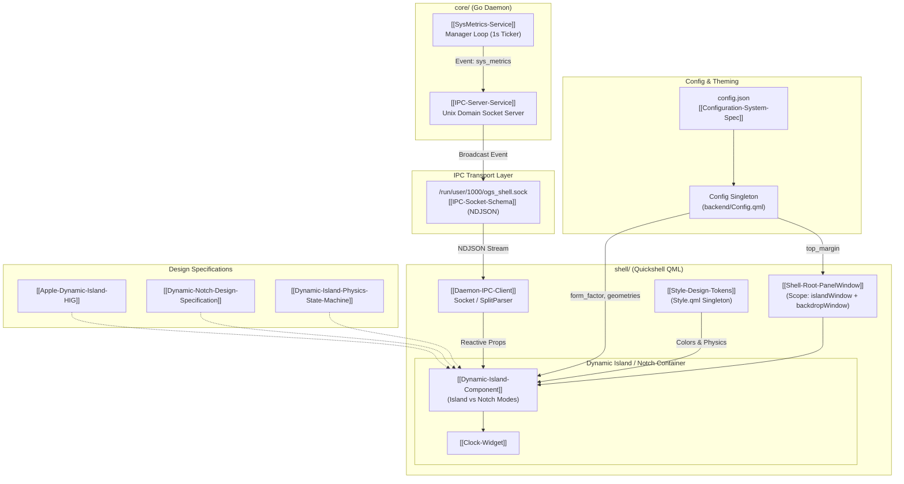

# OgsShell-qs System Architecture

> [!NOTE]
> `ogsShell-qs` is a modular, high-performance Wayland desktop shell environment optimized for Hyprland. It features dual presentation modes (**Dynamic Island** and **Dynamic Notch**) running on Quickshell QML, powered by an asynchronous low-overhead **Go daemon** backend over Unix Domain Sockets and configured dynamically via `config.json`.

---

## 1. High-Level Architectural Decomposition

The system is decoupled into two primary layers connected via an asynchronous Newline-Delimited JSON (NDJSON) Unix Domain Socket IPC:

1. **Backend Layer (`core/` - Go Daemon):**
   * Manages hardware polling, sysfs/procfs monitoring, D-Bus events, and system metrics aggregation.
   * Runs independently of the graphical session as a background daemon (`ogsshell-core`).
   * Broadcasts real-time events over `/run/user/1000/ogs_shell.sock` without blocking the main event loop.
2. **Frontend Layer (`shell/` - Quickshell QML):**
   * Implements a Wayland LayerShell overlay (`Scope` coordinating `islandWindow` and `backdropWindow`) configured with `ExclusionMode.Ignore`.
   * Houses the `DynamicIsland` container, handling fluid spring animations, state machines (`IDLE`, `HOVER`, `EXPANDED`, `TRANSIENT`), and dual form-factors (`"island"` vs `"notch"`).
   * Reads dynamic configuration from `config.json` via `Config.qml` singleton.
   * Listens to IPC socket streams reactively via `DaemonIPC.qml` and binds system telemetry to the UI.

---

## 2. Directory and Component Map

| Path                                   | Purpose                                  | Documentation Link                                                       |
| :------------------------------------- | :--------------------------------------- | :----------------------------------------------------------------------- |
| `shared/app_configs/shell/config.json` | Master JSON user configuration           | `[[Configuration-System-Spec]]`                                          |
| `shell/backend/Config.qml`             | Reactive config file reader singleton    | `[[Configuration-System-Spec]]`                                          |
| `shell/shell.qml`                      | Quickshell root Wayland LayerShell scope | `[[Shell-Root-PanelWindow]]`                                             |
| `shell/components/island/`             | Dual format (Island & Notch) container   | `[[Dynamic-Island-Component]]`, `[[Dynamic-Notch-Design-Specification]]` |
| `shell/components/widgets/`            | Pluggable island widgets                 | `[[Clock-Widget]]`                                                       |
| `shell/theme/`                         | Central QML style singleton              | `[[Style-Design-Tokens]]`                                                |
