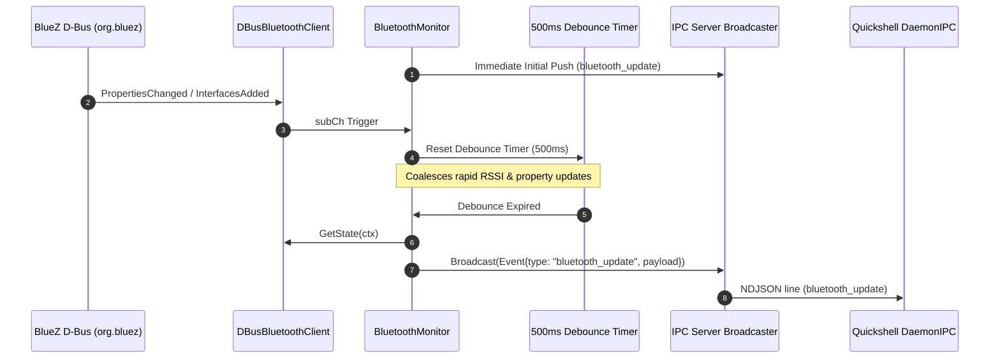

# Bluetooth Service (`core/services/bluetooth/`)

> [!NOTE]
> An interface-driven, event-based Go service providing BlueZ D-Bus integration (`org.bluez`), adapter power controls, peripheral state monitoring, background device scanning, and debounced IPC synchronization for the Quickshell frontend.

---

## 1. D-Bus Integration & Event Architecture

The service and its monitor (`BluetoothMonitor`) operate completely event-driven without periodic polling:
* **Bus Name:** `org.bluez`
* **Adapter Interface:** `org.bluez.Adapter1` (e.g. `/org/bluez/hci0`)
* **Device Interface:** `org.bluez.Device1` (e.g. `/org/bluez/hci0/dev_XX_XX_XX_XX_XX_XX`)
* **Object Manager:** `org.freedesktop.DBus.ObjectManager` on `/`
* **Signal Subscriptions:**
  * `org.freedesktop.DBus.ObjectManager.InterfacesAdded` (device discovery & pairing)
  * `org.freedesktop.DBus.ObjectManager.InterfacesRemoved` (device removal)
  * `org.freedesktop.DBus.Properties.PropertiesChanged` (`Connected`, `Powered`, `Discovering`, `RSSI`, etc.)
* **Debouncing Engine:** 500ms rate-limiting timer consolidates burst notifications (e.g. rapid RSSI changes) before dispatching IPC updates.



---

## 2. Component Modules

| File | Purpose |
| :--- | :--- |
| `types.go` | Canonical JSON-serializable data structs (`BluetoothDevice`, `BluetoothState`, RPC request payloads) |
| `manager.go` | `BluetoothManager` interface definition |
| `client_dbus.go` | Production BlueZ D-Bus client with D-Bus signal subscription (`PropertiesChanged`, `InterfacesAdded`, `InterfacesRemoved`) and clean match removal on exit |
| `client_mock.go` | In-memory mock client for development and fallback when BlueZ hardware is not present |
| `bluetooth_test.go` | Comprehensive unit tests for state updates and RPC operations |
| `core/monitors/bluetooth_mon.go` | Event-driven monitor with 500ms debouncing engine |
| `core/monitors/bluetooth_mon_test.go` | Broadcast and debounce burst unit tests |

---

## 3. IPC Socket Protocol

### A. Broadcast Event: `bluetooth_update`
Broadcast whenever adapter properties, device connection states, or scan states change:

```json
{
  "type": "bluetooth_update",
  "payload": {
    "adapter_powered": true,
    "discovering": false,
    "devices": [
      {
        "mac": "38:18:4C:BE:11:92",
        "name": "Sony WH-1000XM4",
        "icon": "audio-headset",
        "connected": true,
        "paired": true,
        "rssi": -58
      }
    ]
  }
}
```

### B. Inbound RPC Actions
* `toggle_bluetooth`: Toggles or sets the adapter power state.
* `connect_bluetooth`: Connects to a specific peripheral by its MAC address (`{"mac": "XX:XX:XX:XX:XX:XX"}`).
* `disconnect_bluetooth`: Disconnects a peripheral by MAC address (`{"mac": "XX:XX:XX:XX:XX:XX"}`).
* `start_bluetooth_scan`: Initiates adapter discovery for 15 seconds.
* `stop_bluetooth_scan`: Cancels active adapter discovery.
* `get_bluetooth_state`: Queries current adapter and device snapshot.

---

## 4. Related Links

* Daemon Architecture: `[[Go-Daemon-Core]]`
* IPC Protocol: `[[IPC-Socket-Schema]]`
* Proposal Note: `[[Plan-Modular-Bluetooth-Service-And-DBus-Monitor]]`
* Event-Driven Refactor: `[[Plan-Event-Driven-Bluetooth-Signal-Monitor]]`
