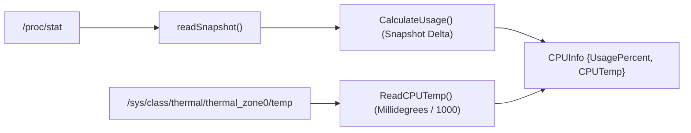

# CPU Monitor Subsystem Service

> [!NOTE]
> `CPUMonitor` (`core/monitors/cpu.go`) parses `/proc/stat` to calculate cumulative CPU usage percentage across sampling intervals and queries `/sys/class/thermal/thermal_zone0/temp` for CPU temperature.

---

## 1. Metric Calculation Mechanism

### Delta-Based Percentage Formula
CPU utilization cannot be determined from a single snapshot; it requires calculating the change in active ticks relative to total ticks between two time intervals:

$$\Delta\text{Total} = \text{Total}_{\text{curr}} - \text{Total}_{\text{prev}}$$
$$\Delta\text{Idle} = \text{Idle}_{\text{curr}} - \text{Idle}_{\text{prev}}$$
$$\text{Usage \%} = \left( \frac{\Delta\text{Total} - \Delta\text{Idle}}{\Delta\text{Total}} \right) \times 100.0$$

Where:
* $\text{Idle} = \text{idle} + \text{iowait}$
* $\text{Total} = \text{user} + \text{nice} + \text{system} + \text{idle} + \text{iowait} + \text{irq} + \text{softirq} + \text{steal}$



---

## 2. Source Code Implementation (`core/monitors/cpu.go`)

### Data Structures
```go
type CPUSnapshot struct {
    Idle  uint64
    Total uint64
}

type CPUMonitor struct {
    prevSnapshot CPUSnapshot
}

type CPUInfo struct {
    UsagePercent float64 `json:"cpu_percent"`
    CPUTemp      float64 `json:"cpu_temp"`
}
```

### Zero-Division Safety
```go
totalDelta := curr.Total - c.prevSnapshot.Total
idleDelta := curr.Idle - c.prevSnapshot.Idle

if totalDelta == 0 {
    return 0.0, nil
}
```

### Thermal Zone Parsing
Reads raw millidegree integers from sysfs and scales to Celsius:
```go
func ReadCPUTemp() (float64, error) {
    data, err := os.ReadFile("/sys/class/thermal/thermal_zone0/temp")
    if err != nil {
        return 0.0, fmt.Errorf("sıcaklık dosyası okunamadı: %w", err)
    }
    rawStr := strings.TrimSpace(string(data))
    rawMilli, err := strconv.ParseFloat(rawStr, 64)
    if err != nil {
        return 0.0, fmt.Errorf("geçersiz sıcaklık verisi: %w", err)
    }
    return rawMilli / 1000.0, nil
}
```

---

## 3. Related Links

* Aggregator Manager: `[[SysMetrics-Service]]`
* IPC Schema: `[[IPC-Socket-Schema]]`
* Frontend Socket Client: `[[Daemon-IPC-Client]]`
