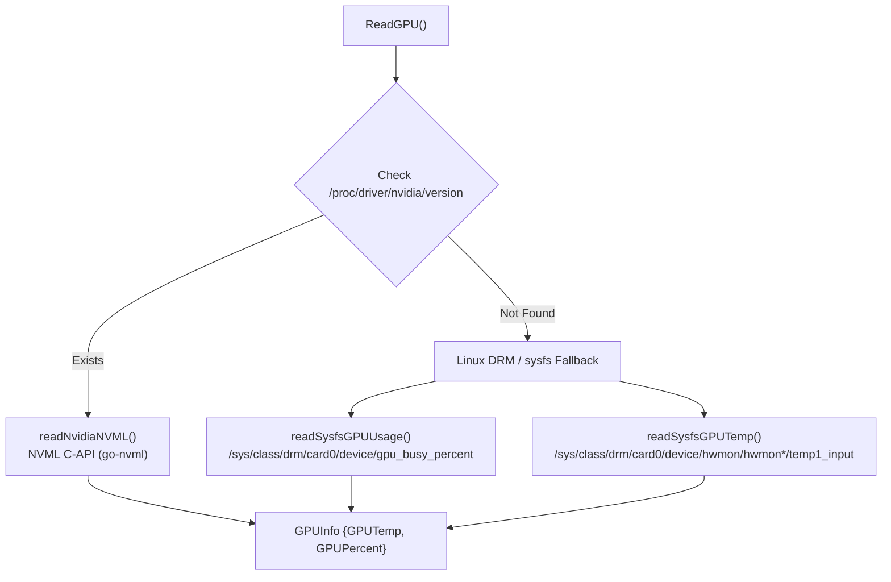

# GPU Monitor Subsystem Service

> [!NOTE]
> `ReadGPU()` (`core/monitors/gpu.go`) implements a dual-backend hardware collector supporting both NVIDIA GPUs (via native NVML C-bindings) and AMD/Intel GPUs (via Linux DRM sysfs and hwmon paths).

---

## 1. Dual-Driver Architecture



---

## 2. Implementation Details (`core/monitors/gpu.go`)

### Data Structure
```go
type GPUInfo struct {
    GPUTemp    float64 `json:"gpu_temp"`
    GPUPercent float64 `json:"gpu_percent"`
}
```

### NVIDIA NVML Binding
Uses `github.com/NVIDIA/go-nvml/pkg/nvml` to read hardware registers directly without running heavy CLI tools like `nvidia-smi`:
```go
func readNvidiaNVML() (GPUInfo, error) {
    ret := nvml.Init()
    if ret != nvml.SUCCESS {
        return GPUInfo{GPUTemp: -1.0, GPUPercent: -1.0}, fmt.Errorf("NVML başlatılamadı: %s", nvml.ErrorString(ret))
    }
    defer nvml.Shutdown()

    device, ret := nvml.DeviceGetHandleByIndex(0)
    if ret != nvml.SUCCESS {
        return GPUInfo{GPUTemp: -1.0, GPUPercent: -1.0}, fmt.Errorf("GPU 0 alınamadı: %s", nvml.ErrorString(ret))
    }

    gpuPercent := -1.0
    if utilization, ret := device.GetUtilizationRates(); ret == nvml.SUCCESS {
        gpuPercent = float64(utilization.Gpu)
    }

    gpuTemp := -1.0
    if temp, ret := device.GetTemperature(nvml.TEMPERATURE_GPU); ret == nvml.SUCCESS {
        gpuTemp = float64(temp)
    }

    return GPUInfo{GPUTemp: gpuTemp, GPUPercent: gpuPercent}, nil
}
```

### AMD / Intel DRM sysfs Fallback
* **Usage:** Read from `/sys/class/drm/card0/device/gpu_busy_percent`.
* **Temperature:** Glob-matches `/sys/class/drm/card0/device/hwmon/hwmon*/temp1_input` and divides millidegrees by 1000.

---

## 3. Related Links

* Aggregator Manager: `[[SysMetrics-Service]]`
* IPC Schema: `[[IPC-Socket-Schema]]`
* Frontend Socket Client: `[[Daemon-IPC-Client]]`
