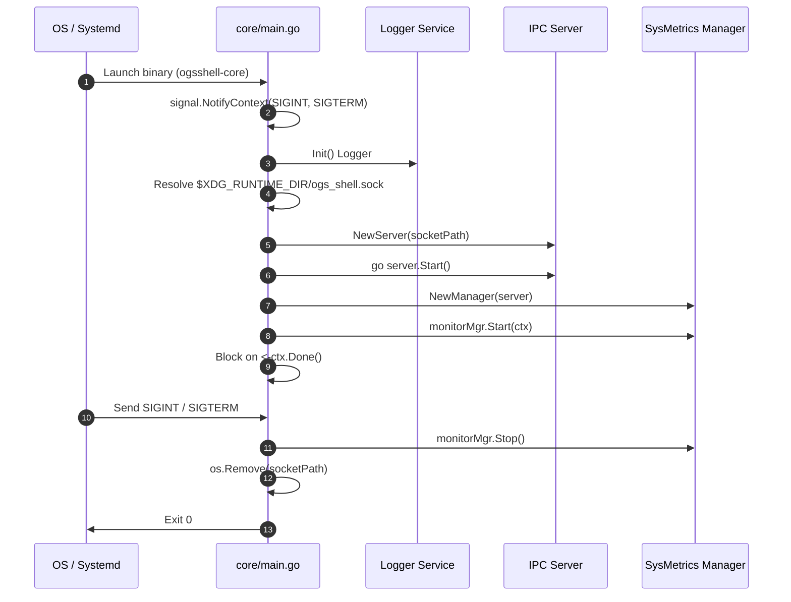

# Go Daemon Core Lifecycle & Supervisor

> [!NOTE]
> The Go Daemon entrypoint is located at `core/main.go`. It orchestrates logging, Unix Domain Socket creation, monitoring subsystems, and graceful shutdown on operating system signals.

---

## 1. Execution Model & Lifecycle



---

## 2. Source Code Breakdown (`core/main.go`)

### Context and Signal Trapping
```go
ctx, cancel := signal.NotifyContext(context.Background(), syscall.SIGINT, syscall.SIGTERM)
defer cancel()
```
Traps process interruption signals (`Ctrl+C`, `kill`) ensuring safe resource disposal.

### Socket Path Resolution
```go
runtimeDir := os.Getenv("XDG_RUNTIME_DIR")
if runtimeDir == "" {
    runtimeDir = os.TempDir()
}
socketPath := filepath.Join(runtimeDir, "ogs_shell.sock")
```

### Concurrent Server Execution
The socket listener runs in a separate goroutine so it does not block metric monitoring loops:
```go
server := ipc.NewServer(socketPath)
go func() {
    log.Info("IPC Sunucusu başlatılıyor... ", "socket", socketPath)
    if err := server.Start(); err != nil {
        log.Error("IPC Sunucusu hatası", "err", err)
    }
}()
```

### Subsystem Supervision
```go
monitorMgr := monitors.NewManager(server)
monitorMgr.Start(ctx)
defer monitorMgr.Stop()

<-ctx.Done()
log.Info("süreç durduruluyor... ")
_ = os.Remove(socketPath)
```

---

## 3. Related Services and References

* IPC Socket Broadcaster: `[[IPC-Server-Service]]`
* System Metric Manager: `[[SysMetrics-Service]]`
* Structured Logging: `[[Logger-Service]]`
* Go Coding Style: `[[Go-Coding-Style]]`
