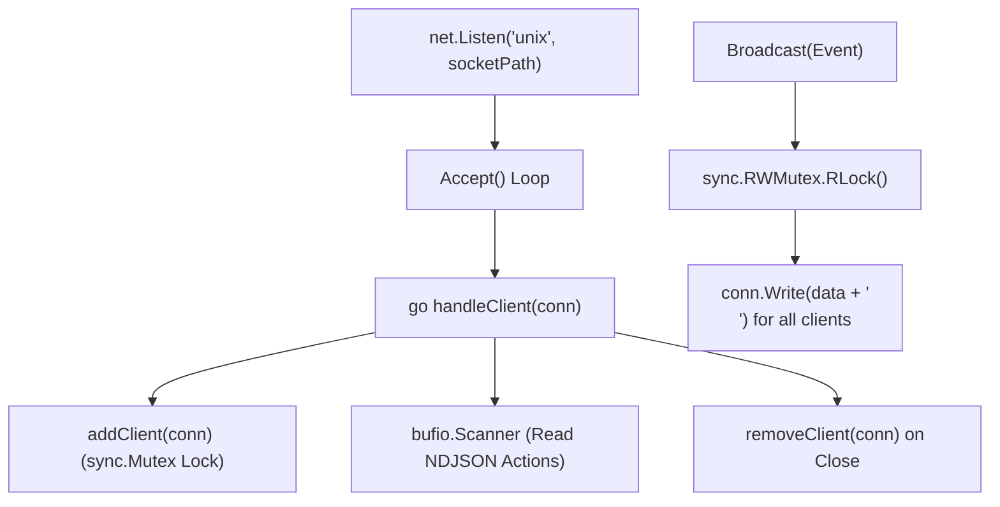

# Unix Domain Socket IPC Server Service

> [!NOTE]
> `ipc.Server` (`core/ipc/server.go`) hosts a concurrent Unix Domain Socket listener managing multiple client connections, NDJSON event broadcasts, and incoming action dispatch.

---

## 1. Concurrency Model & Architecture



---

## 2. Implementation Highlights (`core/ipc/server.go`)

### Server Struct
```go
type Server struct {
    socketPath string
    listener   net.Listener
    mu         sync.RWMutex
    clients    map[net.Conn]bool
    log        *slog.Logger
}
```

### Starting Listener & Cleaning Stale Sockets
```go
func (s *Server) Start() error {
    if err := os.Remove(s.socketPath); err != nil && !os.IsNotExist(err) {
        return fmt.Errorf("eski socket silinemedi: %w", err)
    }

    l, err := net.Listen("unix", s.socketPath)
    if err != nil {
        return fmt.Errorf("socket dinlenemedi: %w", err)
    }
    s.listener = l

    for {
        conn, err := s.listener.Accept()
        if err != nil {
            return err
        }
        go s.handleClient(conn)
    }
}
```

### Thread-Safe Event Fanout
```go
func (s *Server) Broadcast(event Event) error {
    data, err := json.Marshal(event)
    if err != nil {
        return fmt.Errorf("event marshal hatası : %w", err)
    }
    data = append(data, '\n')

    s.mu.RLock()
    defer s.mu.RUnlock()

    for conn := range s.clients {
        if _, err := conn.Write(data); err != nil {
            s.log.Warn("İstemciye yazma başarısız", "err", err)
        }
    }
    return nil
}
```

---

## 3. Related Links

* Protocol Schema: `[[IPC-Socket-Schema]]`
* Main Daemon Supervisor: `[[Go-Daemon-Core]]`
* Frontend Socket Client: `[[Daemon-IPC-Client]]`
