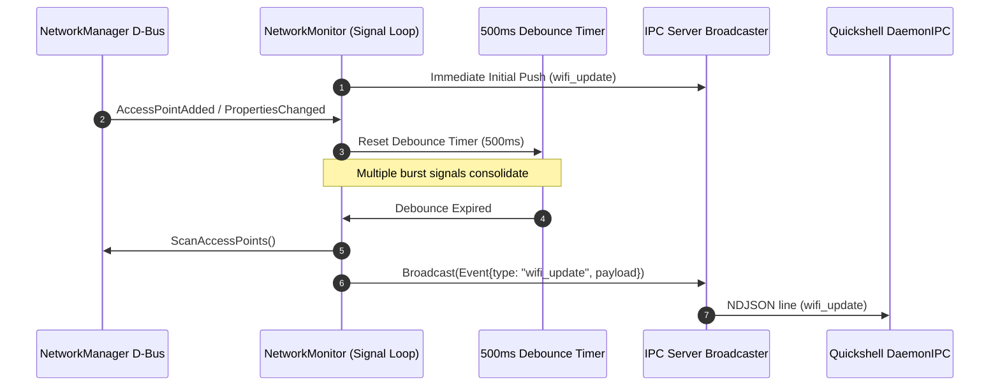
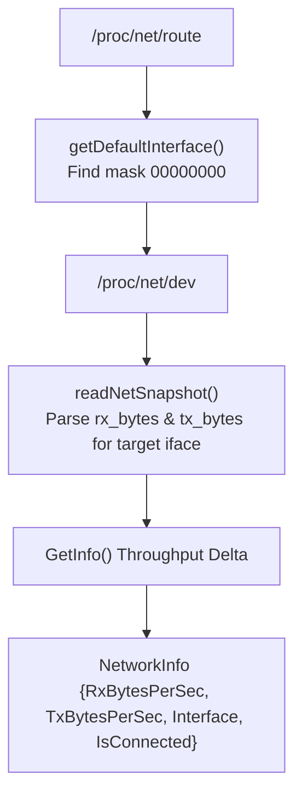

# Network Monitor Subsystem Service

> [!NOTE]
> Network monitoring is partitioned into two specialized monitors:
> 1. **`NetMonitor` (`core/monitors/net.go`):** Identifies the default gateway interface via `/proc/net/route` and calculates real-time bandwidth throughput (Rx/Tx bytes/sec) via `/proc/net/dev`.
> 2. **`NetworkMonitor` (`core/monitors/network_mon.go`):** An event-driven D-Bus signal listener that reacts instantly to NetworkManager Wi-Fi events (`AccessPointAdded`, `AccessPointRemoved`, `PropertiesChanged`) with a 500ms debouncing engine to broadcast `wifi_update` JSON events over IPC.

---

## 1. Event-Driven D-Bus Signal Architecture (`NetworkMonitor`)

Rather than inefficient 10-second polling, `NetworkMonitor` uses native D-Bus signal matches on NetworkManager:

### Signal Match Filters
* `org.freedesktop.NetworkManager.Device.Wireless.AccessPointAdded`
* `org.freedesktop.NetworkManager.Device.Wireless.AccessPointRemoved`
* `org.freedesktop.DBus.Properties.PropertiesChanged` (filtered for `/org/freedesktop/NetworkManager*` paths)

---

## 2. Bandwidth Throughput Calculation (`NetMonitor`)

### Rate of Transfer Formula
$$\Delta t = \text{now} - \text{timestamp}_{\text{prev}}$$
$$\text{Rx Speed} = \frac{\text{rx}_{\text{curr}} - \text{rx}_{\text{prev}}}{\Delta t} \quad (\text{bytes/sec})$$
$$\text{Tx Speed} = \frac{\text{tx}_{\text{curr}} - \text{tx}_{\text{prev}}}{\Delta t} \quad (\text{bytes/sec})$$

---

## 3. Related Links

* Aggregator Manager: `[[SysMetrics-Service]]`
* Wi-Fi Management Client: `[[Wifi-Client-Service]]`
* IPC Schema: `[[IPC-Socket-Schema]]`
* Frontend Socket Client: `[[Daemon-IPC-Client]]`
* Proposal Note: `[[Plan-Event-Driven-Wifi-Signal-Monitor]]`
