# Plan: GTK Live Theme Reload & xsettingsd Integration

Bu doküman, `ogsShell` tema yöneticisi üzerinden tema değiştirildiğinde GTK 3.0, GTK 4.0 / Libadwaita ve XWayland uygulamalarının yeniden başlatılmaya gerek kalmadan stili anında (canlı / hot-reload) güncellemesini sağlayan mimariyi ve uygulanan çözümü belgeler.

---

## 1. Problem Tanımı ve Kök Neden Analizi

Kullanıcı `ogsShell` arayüzünden temayı (örneğin `Catppuccin`'den `Nord`'a) değiştirdiğinde GTK uygulamaları (Nautilus, Pavucontrol vb.) yeni tema renklerini canlı olarak uygulamıyordu. Uygulamanın kapatılıp yeniden açılması gerekiyordu.

Yapılan canlı sistem testleri ve D-Bus incelemesi sonucunda iki temel kök neden saptandı:

### Kök Neden 1: GSettings / dconf Değer Eşitliği Filtrelemesi (No-Op Değişiklik)

* `ogsShell` GTK adaptörü (`core/services/theme/adapters/gtk.go`), yeni CSS'i `~/.config/gtk-3.0/gtk.css` ve `~/.config/gtk-4.0/gtk.css` dosyalarına yazar.
* Ardından `gsettings set org.gnome.desktop.interface gtk-theme adw-gtk3-dark` komutunu çalıştırır.
* Ancak `shared/app_configs/gtk/*.ini` şablonlarının tamamında `gtk-theme-name` zaten `"adw-gtk3-dark"` ve `color-scheme` zaten `"prefer-dark"` değerindedir.
* `dconf`, sisteme yazılan yeni değerin mevcut değerle aynı olduğunu gördüğünde D-Bus üzerinde hiçbir `PropertiesChanged` veya `SettingChanged` sinyali **yayınlamaz**.
* GTK3 ve GTK4 uygulamaları diskteki `gtk.css` dosyasını `inotify` ile izlemez. Yalnızca D-Bus üzerinden `gtk-theme` veya `color-scheme` değişim sinyali aldıklarında CSS motorunu geçersiz kılıp (invalidate) dosyayı yeniden okurlar.
* Sinyal hiç gelmediği için çalışan uygulamalar CSS'in değiştiğinden haberdar olamaz.

### Kök Neden 2: `xsettingsd` Eksikliği (XWayland & Portal Kullanmayan GTK Uygulamaları)

* Modern Wayland GTK uygulamaları `xdg-desktop-portal-gtk` üzerinden D-Bus ile haberleşirken; XWayland altındaki veya portal desteği olmayan klasik GTK/X11 uygulamaları (GIMP, Inkscape, Audacity, bazı Electron yazılımları) tema ayarlarını X11 `XSETTINGS` protokolünden (`_XSETTINGS_SETTINGS` root pencere özelliği) çeker.
* Hyprland dahili bir XSettings sunucusu barındırmadığından, bu uygulamalar için `xsettingsd` gereklidir.

---

### Kök Neden 3: `~/.config/gtk-3.0/gtk.css` Priority 800 (USER) Kilidi

* GTK 3 motorunda iki stil sağlayıcı katmanı bulunur:
  - **Theme Provider (Priority 600):** `~/.local/share/themes/<isim>` altından yüklenir ve `gtk-theme` değiştiğinde açık uygulamalarda canlı olarak güncellenir.
  - **User Stylesheet (Priority 800):** `~/.config/gtk-3.0/gtk.css` dosyasıdır; GTK bu dosyayı **yalnızca uygulama açılışında 1 kez okur** ve çalışma süresince diskten asla tekrar okumaz.
* `ogsShell` renkleri doğrudan `~/.config/gtk-3.0/gtk.css` içine yazdığında, açık uygulamalar bu renkleri belleğe kilitliyordu. Priority 800, Theme Provider'dan (600) yüksek olduğu için tema adı veya ayarları değişse bile bellekteki eski kullanıcı CSS'i yeni temayı eziyordu.

---

## 2. Uygulanan Çözüm Mimarisi

```mermaid
sequenceDiagram
    participant UI as ogsShell HUD
    participant Go as ThemeManager / GtkAdapter
    participant Themes as ~/.local/share/themes/ogsShell-<id>/
    participant Dconf as dconf / GSettings
    participant Xfconf as xfconf (Thunar/XFCE)
    participant Portal as xdg-desktop-portal-gtk
    participant GTK3 as Wayland GTK3 (Thunar, Pavucontrol)
    participant GTK4 as Libadwaita GTK4 (Nautilus)
    participant XSet as xsettingsd (XWayland)

    UI->>Go: set_active_theme("nord")
    Go->>Themes: Pre-deploy 7 Named Themes (gtk-3.0, gtk-4.0, index.theme)
    Go->>Go: Neutralize ~/.config/gtk-3.0/gtk.css (Priority 800 lock cleared)
    Go->>Go: Deploy ~/.config/gtk-4.0/gtk.css (Libadwaita override)
    Go->>Go: Deploy ~/.config/xsettingsd/xsettingsd.conf (Net/ThemeName: ogsShell-nord)

    rect rgb(30, 40, 60)
    Note over Go,Dconf: Dynamic gtk-theme Dispatch
    Go->>Dconf: set gtk-theme "ogsShell-nord"
    Go->>Xfconf: xfconf-query set /Net/ThemeName "ogsShell-nord"
    end

    Dconf->>Portal: SettingChanged Signal
    Portal->>GTK3: notify::gtk-theme-name ("ogsShell-nord")
    GTK3->>Themes: Unload old theme -> Load ogsShell-nord/gtk-3.0/gtk.css (0ms Hot-Reload)

    rect rgb(40, 50, 40)
    Note over Go,XSet: XWayland Canlı Güncelleme
    Go->>XSet: killall -HUP xsettingsd (veya spawn)
    XSet->>XSet: Broadcast _XSETTINGS_SETTINGS to X11 windows
    end
```

### 2.1. Adlandırılmış Temalar (`~/.local/share/themes/ogsShell-<id>/`)

Tıpkı Zed editöründe uygulandığı gibi, `ogsShell`'in 7 temel teması standart tema dizinine bağımsız birer tema olarak dağıtılır:
* `ogsShell-nord`
* `ogsShell-catppuccin`
* `ogsShell-everforest`
* `ogsShell-tokyonight`
* `ogsShell-gruvbox`
* `ogsShell-monochrome`
* `ogsShell-rosepine`

Her bir temanın `gtk-3.0/gtk.css` dosyası `@import url("/usr/share/themes/adw-gtk3-dark/gtk-3.0/gtk.css");` ile modern karanlık tabanı dahil eder ve ilgili paletin renklerini tanımlar. Ayrıca FreeDesktop standartlarına uyum için `index.theme` dosyaları üretilir.

### 2.2. Priority 800 Kilidinin Kaldırılması

* `~/.config/gtk-3.0/gtk.css` dosyasına yalnızca dinamik mod açıklaması yazılır (`/* ogsShell dynamic theme mode - Active: ogsShell-<id> */`).
* Böylece Priority 800 kullanıcı katmanı temiz kalır ve GTK 3 motoru 100% Theme Provider (`ogsShell-<id>`) üzerinden çalışarak canlı tema değişimini engelsiz uygular.

### 2.3. Çoklu Dağıtım ve Servis Entegrasyonu

1. **GSettings:** `org.gnome.desktop.interface gtk-theme ogsShell-<id>` ve `color-scheme prefer-dark`.
2. **xfconf-query:** XFCE ve Thunar gibi bileşenlerin anlık tema değişimi için `xfconf-query -c xsettings -p /Net/ThemeName -s ogsShell-<id>`.
3. **xsettingsd:** `~/.config/xsettingsd/xsettingsd.conf` içine `Net/ThemeName "ogsShell-<id>"` yazılarak `SIGHUP` gönderilir veya süreç arka planda başlatılır.

### 2.4. Tüm Temalarda Thunar & GTK Yumuşak (Ergonomik) Seçim/Vurgu Mimarisi

Karanlık masaüstü ortamlarında ve dosya yöneticilerinde (Thunar, Nautilus) dosyalar seçildiğinde parlak / sert doygunluktaki vurgu renklerinin (`#fabd2f` sarı, `#cba6f7` mor vb.) veya saf beyazın (`#ffffff`) göz yormasını önlemek amacıyla, tüm temaların GTK şablonlarına yumuşak (soft tone) seçim paleti uygulandı:

| Tema | Seçim Arka Planı (`theme_selected_bg_color`) | Metin Rengi (`theme_selected_fg_color`) | Pasif Arka Plan (`unfocused`) |
| :--- | :--- | :--- | :--- |
| **Monochrome** | `#484848` (Slate Gray) | `#ffffff` | `#333333` |
| **Catppuccin** | `#45475a` (Surface1) | `#cdd6f4` | `#313244` |
| **Everforest** | `#425047` (Forest Slate) | `#d3c6aa` | `#343f44` |
| **Gruvbox** | `#504945` (Gruvbox Bg2) | `#fbf1c7` | `#3c3836` |
| **Nord** | `#434c5e` (Nord2 Slate) | `#eceff4` | `#3b4252` |
| **Rosé Pine** | `#393552` (Highlight Med) | `#e0def4` | `#26233a` |
| **Tokyo Night** | `#283457` (Visual Slate) | `#c0caf5` | `#1f2335` |

* `.view:selected`, `iconview:selected`, `treeview.view:selected`, `.thunar .view:selected`, `.thunar .cell:selected` seçicileri ile hem Icon View hem Detailed List View için hem aktif hem de unfocused/backdrop durumları kusursuz kontrasta kavuşturuldu.

---

## 3. Doğrulama ve Testler

1. **Birim Testleri:** `core/services/theme/adapters/gtk_test.go` çalıştırılarak adlandırılmış temaların, `index.theme`, `gtk.css`, `settings.ini` ve `xsettingsd.conf` dosyalarının hatasız oluşturulduğu ve testlerin geçtiği teyit edildi (`go test -v ./services/theme/adapters -run TestGtkAdapter`).
2. **Canlı Ardışık Tema Değişimi Testi:** Python GTK3 penceresi üzerinde yapılan canlı testte, pencere hiç kapatılmadan `Catppuccin -> Nord -> Catppuccin` geçişlerinde arka plan (`rgb(36,39,58) -> rgb(46,52,64) -> rgb(36,39,58)`) ve vurgu renklerinin **0 milisaniyede kesintisiz değiştiği** kesin olarak kanıtlandı.
3. **`xsettingsd` Daemon Testi:** `pgrep xsettingsd` ve `kill -HUP` sinyallerinin süreci kesintisiz ayakta tuttuğu doğrulandı.
4. **Çoklu Tema Görsel Doğrulama:** Offscreen GTK3 penceresi üzerinde 7 temanın tamamı (Monochrome, Catppuccin, Everforest, Gruvbox, Nord, Rosé Pine, Tokyo Night) için IconView ve TreeView render edilerek (`scratch/all_themes_soft_preview.png`) seçilen öğelerin yumuşak, göz yormayan ve yüksek kontrastlı okunduğu kanıtlandı.

> [!TIP]
> Hyprland kullanıcıları için oturum açılışında `xsettingsd`'nin otomatik başlatılması amacıyla `~/.config/hypr/hyprland.conf` dosyasına `exec-once = xsettingsd` satırı eklenebilir; ancak `ogsShell` GTK adaptörü sürecin çalışmadığını algıladığında kendisi de otomatik olarak arka planda ayağa kaldırmaktadır.
