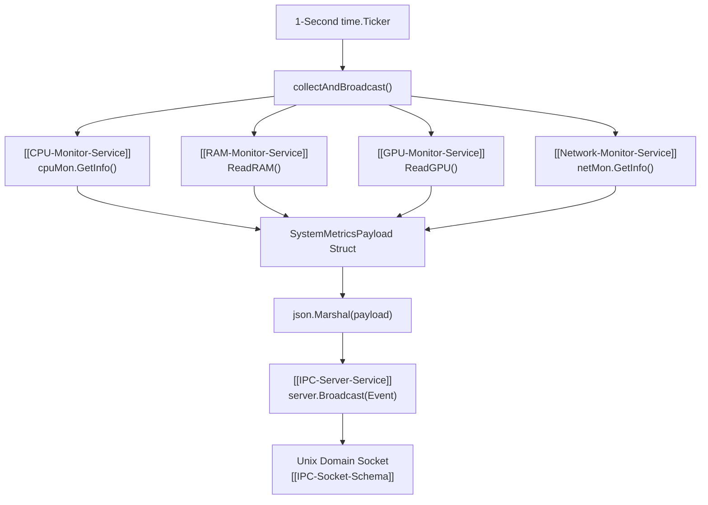

# SysMetrics Monitoring Manager Service

> [!NOTE]
> `monitors.Manager` (`core/monitors/manager.go`) coordinates background hardware collection across CPU, RAM, GPU, and Network subsystems on a 1-second ticker loop and broadcasts unified `sys_metrics` events.

---

## 1. Subsystem Architecture & Collection Loop



---

## 2. Payload Structure

Defined in `core/monitors/manager.go`:

```go
type SystemMetricsPayload struct {
    CPU CPUInfo     `json:"cpu"`
    RAM RAMInfo     `json:"ram"`
    GPU GPUInfo     `json:"gpu"`
    NET NetworkInfo `json:"net"`
}
```

---

## 3. Implementation Highlights (`core/monitors/manager.go`)

### Ticker Goroutine
```go
func (m *Manager) Start(parentCtx context.Context) {
    ctx, cancel := context.WithCancel(parentCtx)
    m.cancelFunc = cancel

    go func() {
        ticker := time.NewTicker(1 * time.Second)
        defer ticker.Stop()
        m.log.Info("Sistem izleyici başlatıldı (Periyot 1s)")
        
        for {
            select {
            case <-ctx.Done():
                m.log.Info("Sistem izleyici durduruldu")
                return
            case <-ticker.C:
                m.collectAndBroadcast()
            }
        }
    }()
}
```

### Resilient Polling
If any individual sensor fails (e.g. GPU unavailable or thermal zone unreadable), errors are logged via `slog.Warn` without crashing the daemon or interrupting the other metrics.

---

## 4. Cross References

* CPU Subsystem: `[[CPU-Monitor-Service]]`
* RAM Subsystem: `[[RAM-Monitor-Service]]`
* GPU Subsystem: `[[GPU-Monitor-Service]]`
* Network Subsystem: `[[Network-Monitor-Service]]`
* Frontend Socket Receiver: `[[Daemon-IPC-Client]]`
