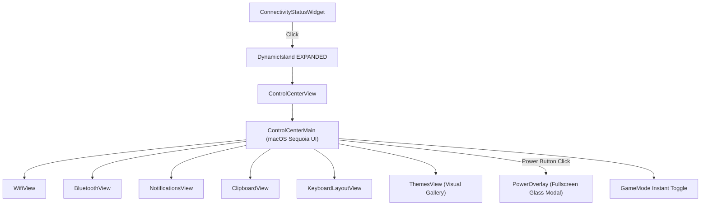

# Control Center UI Component Suite

> [!NOTE]
> `shell/components/widgets/controlcenter/` is a unified, Apple macOS/iOS inspired **Control Center** application running within the Dynamic Island in EXPANDED state mode.

---

## 1. Overview & Architecture

* **Design Inspiration:** Apple macOS Sequoia & iOS 18 minimalist control center. Zero emoji clutter, pure vector Nerd Font iconography, thick rounded capsule sliders, and grouped connectivity tiles.
* **Entry Point:** Clicking the right-slot `[[Connectivity-Status-Widget]]` pill during `HOVER` mode expands the island into `expandedActiveTab = "CONTROL_CENTER"`.
* **Sub-App Router (`ControlCenterView.qml`):**
  - Hosts `ControlCenterMain.qml` alongside dedicated sub-views.
  - **Auto-Reset to Main:** Ada kapandığında (`collapse()`), görünürlük değiştiğinde (`onVisibleChanged`) veya adadan bağlantı butonuna tıklandığında otomatik `resetToMain()` çağrılarak kullanıcının her zaman ana kontrol merkezi menüsünden (`MAIN`) başlaması garanti edilir.
  - Navigating into a sub-application dynamically adapts the island geometry via smooth spring animations.

---

## 2. Component Modules

1. **`ControlCenterMain.qml`:**
   * **Row 1 - Split Connectivity & Toggles:**
     * Left Column: Grouped Apple-style card for **Wi-Fi** and **Bluetooth** with circular status badges and navigation chevrons (`›`).
     * Right Column: 2x2 squircle quick action grid (**GameMode**, **Bildirimler**, **Tema**, **Pano**).
   * **Row 2 & 3 - Apple Capsule Sliders:**
     * **Ekran Parlaklığı (Brightness):** Thick, interactive rounded capsule slider with embedded glyph (`󰃟`) and percentage.
     * **Ses Seviyesi (Volume):** Thick, interactive rounded capsule slider with speaker glyph (`󰕾` / `󰖁`) and mute toggle.
   * **Row 4 - Status Footer:**
     * **Klavye Düzeni:** Clickable `[ 󰌌 TR ]` pill. Hem Go backend `switch_keyboard_layout` hem de `hyprctl switchxkblayout` fallback'i ile anında TR/US/DE/FR düzenleri arasında geçiş yapar.
     * **Minimalist Telemetri:** `CPU %12 • RAM %34 • GPU %0` (Go `sys_metrics` stream'inden reaktif okur).
     * **Güç Butonu (`󰐥`):** Tıklandığında adayı kapatıp tam ekran koyu cam blurlu `[[Power-Overlay-Component]]` menüsünü açar.

2. **Sub-Application Views (`views/`):**
   - **`WifiView.qml`:** Taranan Wi-Fi ağları ve bağlantı yönetimi.
   - **`BluetoothView.qml`:** Bluetooth cihazları ve eşleşme durumu.
   - **`NotificationsView.qml`:**
     - Bildirim kartları geçmişi, DND toggle ve tümünü temizleme aksiyonu.
     - **Sağ Tık (veya Sol Tık) Detay İnceleme:** Bildirimin üzerine sağ tıklandığında tam başlık, kaydırılabilir ve seçilebilir tam gövde metni, zaman damgası ve silme aksiyonu içeren dahili inceleme sayfası (`detailModal`) açılır.
   - **`ClipboardView.qml`:** Pano geçmişi ve favoriler.
   - **`KeyboardLayoutView.qml`:** Klavye düzeni seçimi.
   - **`ThemesView.qml`:** Tema galerisi ve duvar kağıdı yöneticisi.
   - **`PowerOverlay.qml`:** Bağımsız tam ekran oturum ve güç katmanı (`[[Power-Overlay-Component]]`).

---

## 3. Related Links

* Connectivity Pill: `[[Connectivity-Status-Widget]]`
* Dynamic Island: `[[Dynamic-Island-Component]]`
* Power Overlay: `[[Power-Overlay-Component]]`
* Daemon IPC: `[[Daemon-IPC-Client]]`
* Theme Service: `[[Theme-Service]]`
