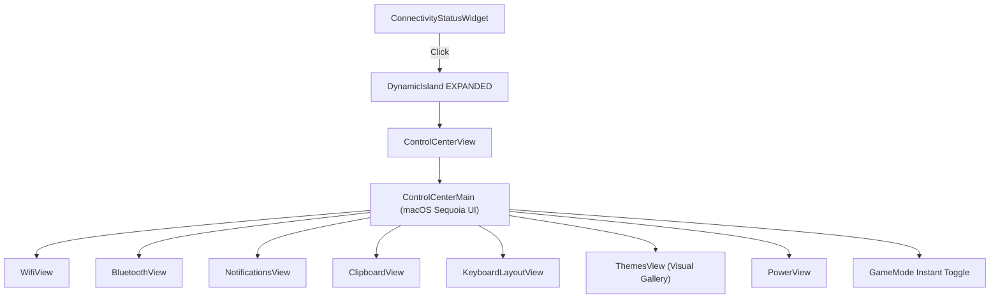

# Control Center UI Component Suite

> [!NOTE]
> `shell/components/widgets/controlcenter/` is a unified, Apple macOS/iOS inspired **Control Center** application running within the Dynamic Island in EXPANDED state mode.

---

## 1. Overview & Architecture

* **Design Inspiration:** Apple macOS Sequoia & iOS 18 minimalist control center. Zero emoji clutter, pure vector Nerd Font iconography, thick rounded capsule sliders, and grouped connectivity tiles.
* **Entry Point:** Clicking the right-slot `[[Connectivity-Status-Widget]]` pill during `HOVER` mode expands the island into `expandedActiveTab = "CONTROL_CENTER"`.
* **Sub-App Router (`ControlCenterView.qml`):**
  - Hosts `ControlCenterMain.qml` alongside 7 dedicated sub-views.
  - **Auto-Reset to Main:** Ada kapandığında (`collapse()`), görünürlük değiştiğinde (`onVisibleChanged`) veya adadan bağlantı butonuna tıklandığında otomatik `resetToMain()` çağrılarak kullanıcının her zaman ana kontrol merkezi menüsünden (`MAIN`) başlaması garanti edilir.
  - Navigating into a sub-application dynamically adapts the island geometry via smooth spring animations.

---

## 2. Component Modules

1. **`ControlCenterMain.qml`:**
   * **Row 1 - Split Connectivity & Toggles:**
     * Left Column: Grouped Apple-style card for **Wi-Fi** and **Bluetooth** with circular status badges and navigation chevrons (`›`).
     * Right Column: 2x2 squircle quick action grid (**GameMode**, **Bildirimler**, **Tema**, **Pano**).
   * **Row 2 & 3 - Apple Capsule Sliders:**
     * **Ekran Parlaklığı (Brightness):** Thick, interactive rounded capsule slider with embedded glyph (`󰃟`) and percentage.
     * **Ses Seviyesi (Volume):** Thick, interactive rounded capsule slider with speaker glyph (`󰕾` / `󰖁`) and mute toggle.
   * **Row 4 - Status Footer:**
     * **Klavye Düzeni:** Clickable `[ 󰌌 TR ]` pill. Hem Go backend `switch_keyboard_layout` hem de `hyprctl switchxkblayout` fallback'i ile anında TR/US/DE/FR düzenleri arasında geçiş yapar.
     * **Minimalist Telemetri:** `CPU %12 • RAM %34 • GPU %0` (Go `sys_metrics` stream'inden reaktif okur).
     * **Güç Butonu:** Circular power action trigger (`󰐥`).

2. **Sub-Application Views (`views/`):**
   - **`WifiView.qml`:**
     - Taranan erişim noktaları listesi (`scan_results` ve `access_points` modelleri).
     - Tamamen saf Go IPC (`scan_wifi` ve `get_active_wifi`) üzerinden çalışır.
     - Go backend'de NetworkManager `GetAllAccessPoints` D-Bus API'si ve sinyal gücüne göre SSID birleştirme/deduplication kullanılır.
     - Güvenlik rozeti (`WPA2`, `WPA3`, `Açık`), frekans bandı (`2.4/5GHz`) ve dinamik sinyal gücü göstergeleri.
   - **`BluetoothView.qml`:** Device list, pairing state, connect/disconnect actions, adapter toggle.
   - **`NotificationsView.qml`:** Notification cards, DND toggle, clear-all action.
   - **`ClipboardView.qml`:**
     - Genişletilmiş ve okunaklı kartlar (`48px` yükseklik, `11px` metin, karakter sayısı göstergesi).
     - **Sol Tık:** Panoya kopyalar ve ana ekrana döner.
     - **Sağ Tık (Right-Click):** Metnin tamamını scroll edilebilir, seçilebilir ve kopyalanabilir tam metin okuma penceresinde (`Flickable + TextEdit`) açar.
     - Favorilere sabitleme (★) ve silme (✕) aksiyonları.
   - **`KeyboardLayoutView.qml`:** Switch between TR, US, DE, FR layouts.
   - **`ThemesView.qml`:**
     - **Sekmeli Arayüz (Segmented Tabs):** `🎨 Temalar` ve `🖼️ Duvar Kağıtları` sekmeleri.
     - **Sekme 1 (Temalar):** 2 sütunlu görsel Tema Galerisi kartları. Her tema kartında gerçek tema renklerini sergileyen minyatür masaüstü/pencere UI önizlemesi, renk paleti şeridi ve aktifleşen `✓` rozeti.
     - **Sekme 2 (Duvar Kağıtları):** Sadece **aktif temaya ait** (`~/Pictures/Wallpapers/<ActiveTheme>/`) görsel havuzunu 16:9 asenkron önizleme kartları, aktif görsel onay rozeti ve "Sıradaki Duvar Kağıdı" döngü butonu ile sunar. Tıklandığında `awww` ile akıcı geçiş animasyonuyla duvar kağıdı anında uygulanır.
   - **`PowerView.qml`:** Lock, Suspend, Reboot, Poweroff, and Hyprland Exit triggers.

---

## 3. Related Links

* Connectivity Pill: `[[Connectivity-Status-Widget]]`
* Dynamic Island: `[[Dynamic-Island-Component]]`
* Daemon IPC: `[[Daemon-IPC-Client]]`
* Theme Service: `[[Theme-Service]]`
* Proposal Notes: `[[Plan-Unified-Control-Center-Suite]]`, `[[Plan-Theme-Selector-Gallery-Redesign]]`
