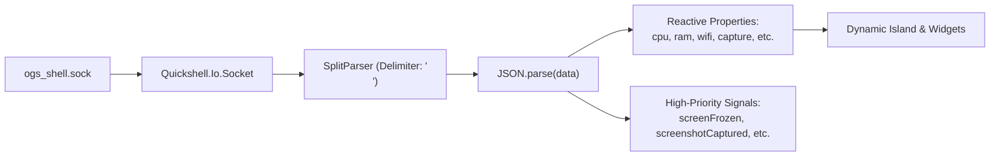

# Daemon IPC Client Component

> [!NOTE]
> `shell/backend/DaemonIPC.qml` connects to the Go daemon's Unix Domain Socket (`$XDG_RUNTIME_DIR/ogs_shell.sock`) via `Quickshell.Io.Socket` and parses incoming NDJSON metrics, state updates, and command responses into reactive QML properties and signals.

---

## 1. Data Flow Architecture



---

## 2. Capture, OCR & Screen Recording Subsystem

### A. Reactive State Properties
* `property bool isRecording: false`: Active recording state.
* `property int recordingDuration: 0`: Elapsed seconds of the current recording session.
* `property string lastScreenshotPath: ""`: Local filesystem path to the most recent screenshot.
* `property string lastOcrText: ""`: Raw text extracted from the latest OCR operation.
* `property string frozenScreenPath: ""`: Path to the full-screen frozen capture (`/tmp/ogs_freeze.png`).

### B. High-Priority Signals
* `signal screenFrozen(var payload)`: Emitted when `/tmp/ogs_freeze.png` is ready for the snipping overlay.
* `signal screenshotCaptured(var payload)`: Emitted with file path, geometry, and clipboard status.
* `signal ocrCompleted(var payload)`: Emitted with text, character count, and single-line preview.
* `signal recordingStateUpdated(var payload)`: Emitted on each 1-second progress tick.
* `signal recordingFinished(var payload)`: Emitted when the MP4 recording is safely saved and finalized.

### C. Helper RPC Methods
```qml
// Screen Capture, OCR & Recording Helpers
function freezeScreen() {
  sendAction("freeze_screen", {});
}

function captureScreenshot(geometry) {
  sendAction("capture_screenshot", { "geometry": geometry || "" });
}

function captureOCR(geometry) {
  sendAction("capture_ocr", { "geometry": geometry || "" });
}

function startRecording(geometry) {
  sendAction("start_recording", { "geometry": geometry || "" });
}

function stopRecording() {
  sendAction("stop_recording", {});
}

function openAnnotator(filePath) {
  sendAction("open_annotator", { "file_path": filePath || "" });
}
```

---

## 3. Key Design Choices

1. **`SplitParser` Stream Handling:** Buffers and separates incoming bytes by newline characters, guaranteeing that `JSON.parse` is only fed complete JSON objects.
2. **Defensive Parsing:** Wraps JSON parsing in `try/catch` and performs null-safety checks on all payload properties to isolate network glitches from crashing QML render passes.
3. **Reactive Property Expositions:** Widgets can simply bind to `DaemonIPC.isRecording`, `DaemonIPC.recordingDuration`, or `DaemonIPC.lastScreenshotPath` and update automatically.

---

## 4. Related Links

* Capture Service: `[[Capture-Service]]`
* Socket Protocol: `[[IPC-Socket-Schema]]`
* Backend Socket Server: `[[IPC-Server-Service]]`
* Root Window: `[[Shell-Root-PanelWindow]]`
