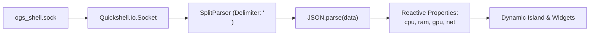

# Daemon IPC Client Component

> [!NOTE]
> `shell/backend/DaemonIPC.qml` connects to the Go daemon's Unix Domain Socket via `Quickshell.Io.Socket` and parses incoming NDJSON metrics into reactive QML properties.

---

## 1. Data Flow Architecture



---

## 2. Source Code Breakdown (`shell/backend/DaemonIPC.qml`)

```qml
import QtQuick
import Quickshell
import Quickshell.Io

Item {
  id: root

  property var cpu: ({ "cpu_percent":   0, "cpu_temp":      0 })
  property var ram: ({ "ram_used_mb":   0, "ram_total_mb":  0, "ram_percent": 0 })
  property var gpu: ({ "gpu_temp":      0, "gpu_percent":   0 })
  property var net: ({ "rx_bytes_sec":  0, "tx_bytes_sec":  0, "interface":   "", "is_connected": false})

  Socket {
    id: socket
    path: Quickshell.env("XDG_RUNTIME_DIR") + "/ogs_shell.sock"

    parser: SplitParser {
      onRead: data => {
        try {
          let msg = JSON.parse(data);
          if (msg.type === "sys_metrics") {
            root.cpu  = msg.payload.cpu;
            root.ram  = msg.payload.ram;
            root.gpu  = msg.payload.gpu;
            root.net  = msg.payload.net;
          }
        } catch (e) {
          console.warn("[DaemonIPC] JSON parse hatası: ", e)
        }
      }
    }
  }
}
```

---

## 3. Key Design Choices

1. **`SplitParser` Stream Handling:** Buffers and separates incoming bytes by newline characters, guaranteeing that `JSON.parse` is only fed complete JSON objects.
2. **Defensive Parsing:** Wraps JSON parsing in `try/catch` to isolate network glitches from crashing QML render passes.
3. **Reactive Property Expositions:** Widgets can simply bind to `ipc.cpu.cpu_percent` or `ipc.ram.ram_percent` and update automatically whenever a new tick arrives.

---

## 4. Related Links

* Socket Protocol: `[[IPC-Socket-Schema]]`
* Backend Socket Server: `[[IPC-Server-Service]]`
* Root Window: `[[Shell-Root-PanelWindow]]`
