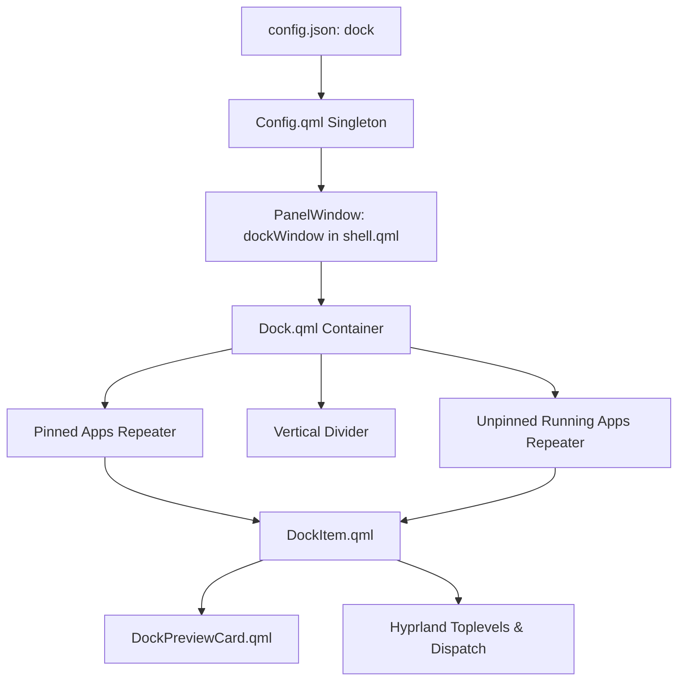

# Modern Wayland Dock Component (Removed / Deprecated)

> [!WARNING]
> **Bileşen Kaldırıldı (Deprecated):** Kullanıcı talebi doğrultusunda, minimalist kabuk felsefesine ve Dynamic Island konseptine sadık kalmak amacıyla Dock bileşeni ve `dockWindow` katmanı projeden tamamen kaldırılmıştır. Detaylar için: `[[Plan-Remove-Dock-Component]]`.

---

## 1. Mimari Yapı ve Katman Yerleşimi

* **Bağımsız PanelWindow (`dockWindow`):** `[[Shell-Root-PanelWindow]]` içerisinde ekranın en altına (`anchors.bottom: true`) sabitlenmiş bağımsız bir Wayland LayerShell penceresidir.
* **Katman:** `WlrLayershell.layer: WlrLayer.Top`
* **Pencereleri Asla Kaydırmayan Overlay (`ExclusionMode.Ignore`):** Dock açıldığında veya kapandığında Hyprland pencerelerini asla yukarı itmez (`ExclusionMode.Ignore`); doğrudan pencerelerin üzerine biner.
* **Uygulama Duyarlı Akıllı Gizleme (Smart Autohide):** Monitörün aktif çalışma alanında açık bir pencere varsa (`hasTilingWindows`), Dock otomatik olarak küçülerek (`scale: 0.88`, `opacity: 0.0`) ekranın altına kaybolur. Boş masaüstünde görünür kalır.
* **Ekran Altı 1-2px Hotspot Tetikleyici:** Ekranın en alt sınırına 4px yüksekliğinde ince bir `bottomHotspotMouseArea` yerleştirilmiştir; fare en alta çarptığı an Dock akıcı yaylanma ile derhal açılır.
* **Kesintisiz Hover Kilidi (`dockOverallHoverArea`):** Ekranın altından Dock'un ve açılan önizleme kartının en tepe noktasına kadar uzanan şeffaf bir fare kapsama zarfı bulunur. Fare alta çarptıktan sonra Dock üzerinde gezindiği sürece `dockIsHoveredOverall` sürekli `TRUE` kalır, Dock asla erken kapanmaz.
* **Zero Click-Blocking (Dinamik Input Mask):**
  - Dock gizliyken girdi maskesi sadece en alttaki 4px tetikleyiciyi kapsar; arkadaki uygulamanın tıklanmasını asla engellemez.
  - Dock açıldığında girdi maskesi yukarı genişleyerek Dock ve açılan önizleme kartlarını kapsar.
* **Debounce Dismiss (350ms):** Fare Dock zarfından ayrılıp uygulamanın içine geçtiğinde 350ms gecikme ile pürüzsüzce küçülüp yeniden kaybolur. Detaylar: `[[Plan-Dock-Smart-Autohide-And-Edge-Trigger]]` ve `[[Plan-Dock-Icon-Resolution-And-Hover-Lock]]`.



---

## 2. Bileşen Hiyerarşisi (`shell/components/dock/`)

### 1. `Dock.qml` (Ana Kapsayıcı)
* **OLED Glass Arka Plan:** `[[Style-Design-Tokens]]` üzerinden `Style.surface` ve `Style.border` ile uyumlu şeffaf yuvarlatılmış hap (pill) kapsayıcı (`radius: dockHeight / 2`).
* **Akıllı Pencere Eşleme:** `Hyprland.toplevels` üzerinden sabitlenmiş uygulamalar ile açık pencereleri (`class`, `initialClass`, `appId`, `title`) otomatik eşleştirir.
* **Açık Uygulama Keşfi:** Sabitlenmemiş ama o an açık olan pencereleri gruplayarak sağ bölüme ekler ve araya zarif bir dikey ayraç çizer.

### 2. `DockItem.qml` (Tekil Uygulama İkonu)
* **İkon Çözümleme:** `Quickshell.iconPath(icon)` ve `image://icon/<name>` ile sistem tema ikonlarını çeker.
* **Apple HIG Hover Magnification:** Fare ikonun üzerine geldiğinde `scale: 1.25` büyütme animasyonu (`NumberAnimation` easing).
* **Aktiflik / Çalışma Göstergesi:**
  - Uygulama çalışıyorsa ikonun altında yatay gösterge noktası/çubuğu belirir.
  - Aktif odaklı pencerede `Style.accent` renginde geniş hap (`width: 14`), arka planda ikincil nokta (`width: 5`).
  - Birden fazla pencere açıksa sağ üst köşede pencere sayısı rozeti (`windowCount > 1`).
* **Etkileşim:**
  - Kapalıysa: `Quickshell.execDetached(["sh", "-c", execCmd])` ile uygulamayı başlatır.
  - Açıksa: `Hyprland.dispatch("focuswindow address:" + primaryWindow.address)` ile ilgili pencereye odaklanır.

### 3. `DockPreviewCard.qml` (Hover Önizleme Kartı)
* İkonun üzerine gelindiğinde 180ms gecikmeyle yukarı doğru açılan süzülen önizleme kartı.
* **Başlık Alanı:** İkon, **Kalın Uygulama İsmi** ve Çalışma Alanı Rozeti (`WS 2`).
* **Alt Başlık:** Açık pencerenin başlığı (Window Title).
* **Canlı Önizleme:** `ScreencopyView` ile pencerenin canlı görüntüsü veya şık aktif pencere kartı.

---

## 3. Konfigürasyon Şeması (`config.json`)

```json
"dock": {
  "enabled": true,
  "height": 56,
  "icon_size": 38,
  "bottom_margin": 10,
  "autohide": false,
  "show_running_apps": true,
  "pinned_apps": [
    {
      "name": "Terminal",
      "icon": "kitty",
      "exec": "kitty",
      "class": "kitty"
    },
    {
      "name": "Zen Browser",
      "icon": "zen",
      "exec": "zen-browser",
      "class": "zen"
    },
    {
      "name": "Dosyalar",
      "icon": "org.kde.dolphin",
      "exec": "dolphin",
      "class": "org.kde.dolphin"
    },
    {
      "name": "Zed",
      "icon": "zed",
      "exec": "zed",
      "class": "dev.zed.Zed"
    },
    {
      "name": "Discord",
      "icon": "vesktop",
      "exec": "vesktop",
      "class": "vesktop"
    }
  ]
}
```

---

## 4. İlgili Bağlantılar

* PanelWindow Kök Mimarisi: `[[Shell-Root-PanelWindow]]`
* Dynamic Island: `[[Dynamic-Island-Component]]`
* Tasarım Belirteçleri: `[[Style-Design-Tokens]]`
* Konfigürasyon Spesifikasyonu: `[[Configuration-System-Spec]]`
* Geliştirme Planı: `[[Plan-Dock-Component]]`
