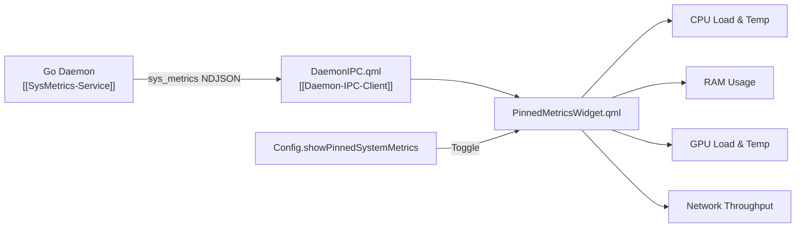

# Pinned Metrics Widget Component

> [!NOTE]
> `shell/components/widgets/PinnedMetricsWidget.qml` is a transparent, zero-click-blocking status HUD pinned directly beside the Dynamic Island when enabled by the user via Control Center.

---

## 1. Overview & Architecture

* **Purpose:** Provides unobtrusive, high-visibility desktop hardware telemetry (CPU, RAM, GPU, and Network throughput) directly on the top panel overlay layer.
* **Toggle Trigger:** Can be enabled/disabled by clicking the telemetry pill inside the Control Center (`ControlCenterMain.qml`), persisting via `Config.showPinnedSystemMetrics`.
* **State Adaptation:**
  - **IDLE / HOVER:** Visible and dynamically animated to follow Island / Notch geometry.
  - **EXPANDED:** Fades out (`opacity: 0.0`) to avoid visual overlap when Dynamic Island expands into applications.
  - **Focus Mode:** Automatically hides and reveals alongside the Dynamic Island via `screenScope.isRevealed`.

---

## 2. Rendered Telemetry Metrics

1. **CPU:**
   - Glyph: `󰻠` (Color: `Style.accentCyan`)
   - Value: `CPU %<percent> [<temp>°C]`
2. **RAM:**
   - Glyph: `󰍛` (Color: `Style.accentGreen`)
   - Value: `RAM %<percent>`
3. **GPU:**
   - Glyph: `󰢮` (Color: `Style.accentOrange`)
   - Value: `GPU %<percent> [<temp>°C]`
4. **Network:**
   - Glyph: `󰛳` (Color: `Style.accentSecondary`)
   - Value: `NET <throughput>` (e.g. `NET 1.2 MB/s`, `NET 450 KB/s`, `NET 0 B/s`)

---

## 3. Related Links

* Control Center: `[[Control-Center-Widget]]`
* Dynamic Island: `[[Dynamic-Island-Component]]`
* SysMetrics Service: `[[SysMetrics-Service]]`
* Network Monitor Service: `[[Network-Monitor-Service]]`
* Design Tokens: `[[Style-Design-Tokens]]`
