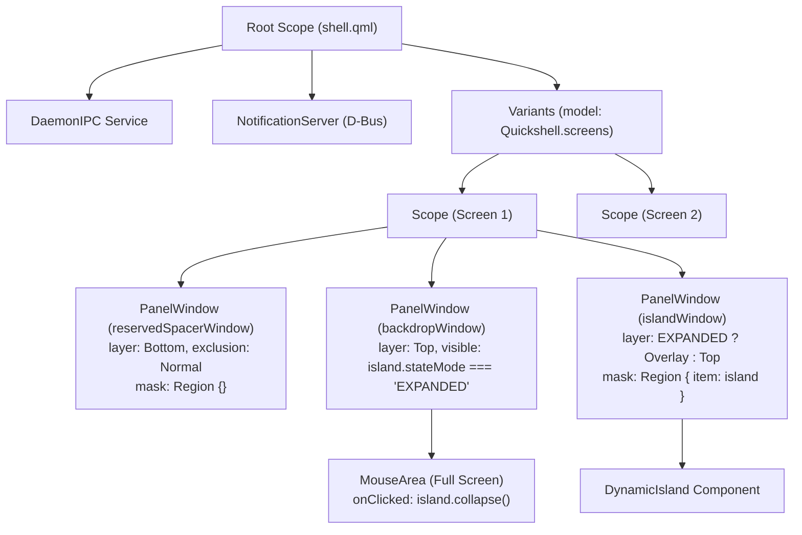

# Shell Root Scope & Multi-Window Architecture

> [!NOTE]
> `shell/shell.qml` utilizes Quickshell's `Scope` and `Variants` components to coordinate three distinct Wayland `PanelWindow` surfaces per connected monitor (`Quickshell.screens`): a reserved spacer window for automatic tiling clearance, a dynamically sized overlay canvas for the `DynamicIsland`, and a full-screen backdrop window that captures clicks outside the island when `EXPANDED`.

---

## 1. Window Structure & Layer-Shell Architecture

1. **`reservedSpacerWindow` (Görünmez Tiling Boşluk Katmanı):**
   * **Katman:** `WlrLayershell.layer: WlrLayer.Bottom`
   * **Exclusion Mode:** `ExclusionMode.Normal`
   * **Yükseklik:** `Config.isNotch ? Config.notch.idle_height : (Config.island.idle_height + Config.island.top_margin)`
   * **Girdi:** `mask: Region {}` (Boş maske sayesinde fare tıklamalarını kesinlikle engellemez, tamamen şeffaftır).
   * Hyprland/Wayland kompozitörüne adanın idle yüksekliği kadar boşluk rezerve ettirerek pencerelerin ada altına girmesini engeller.

2. **`backdropWindow` (Arka Plan Kapanış Katmanı):**
   * **Katman:** `WlrLayershell.layer: WlrLayer.Top`
   * **Exclusion Mode:** `ExclusionMode.Ignore`
   * Yalnızca `stateMode === "EXPANDED"` iken açılır ve ada dışına tıklandığında `island.collapse()` tetikler.

3. **`islandWindow` (Dynamic Island Yüzeyi):**
   * **Dinamik Katman:** `WlrLayershell.layer: island.stateMode === "EXPANDED" ? WlrLayer.Overlay : WlrLayer.Top`
     * `IDLE`/`HOVER` durumlarında `Top` katmanında kalarak tam ekran uygulamaların (oyun, video) altında otomatik gizlenir.
     * `EXPANDED` durumunda `Overlay` katmanına çıkarak `backdropWindow`'un (`Top`) üzerinde yer alır; açık uygulamanın tüm interaktif kontrolleri sorunsuz tıklanabilir.
   * **Exclusion Mode:** `ExclusionMode.Ignore` (Ada genişlediğinde pencereleri aşağı itip titretmez).
   * **Canvas:** Sabit `540x360` GPU yüzeyi.
   * **Girdi:** `mask: Region { item: island }` ile piksel düzeyinde girdi maskesi.

4. **`powerOverlayWindow` (Tam Ekran Güç Menüsü):**
   * **Katman:** `WlrLayershell.layer: WlrLayer.Overlay`
   * **Odak:** `WlrKeyboardFocus.Exclusive`
   * Klavye ve fare odaklı OLED cam oturum modalı.

---

## 2. Multi-Monitor Capabilities

1. **Automatic Display Detection (`Quickshell.screens`):**
   * Using Quickshell's `Variants { model: Quickshell.screens }`, every connected monitor automatically spawns its own top overlay island, reserved spacer, and full-screen backdrop.
   * Hotplugging displays dynamically adds or cleans up island surfaces on Wayland without restarting the shell daemon.

2. **Decoupled Outside Click Backdrop:**
   * Each monitor's `backdropWindow` is a separate full-screen `PanelWindow` bound to `screen: screenScope.modelData`.
   * When `island.stateMode === "EXPANDED"`, clicking anywhere on that screen smoothly collapses that screen's island without affecting other monitors.

3. **Synchronized Global Events & Autonomous State:**
   * Alarms, Pomodoro milestones, and Freedesktop/D-Bus notifications broadcast via `DaemonIPC` trigger animations across all active display islands simultaneously.
   * Mouse hover and expanded app interactions remain independent per monitor.

4. **Monitöre Özel Bağımsız Odak Modu (Per-Monitor Focus Mode Autohide):**
   * Her ekran örneği (`screenScope`), `Hyprland.monitorFor(screenScope.modelData)` üzerinden kendi fiziksel monitörünün `activeWorkspace` nesnesini bağımsız olarak çözümler.
   * `hasTilingWindows` sorgusu sadece ilgili ekranın aktif çalışma alanındaki pencereleri denetler.
   * Bir monitörde tiling uygulama açıkken adası otomatik olarak yukarı gizlenir; uygulamanın olmadığı (boş masaüstü) monitörde ise ada görünmeye devam eder. Detaylar için: `[[Plan-Per-Monitor-Focus-Mode-Autohide]]`.
