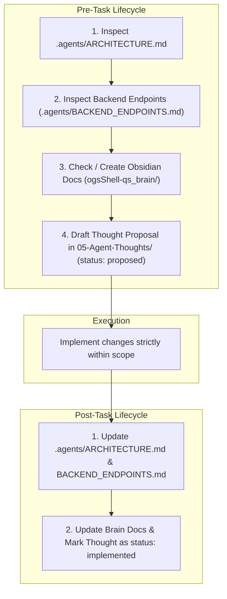

# Agent Workflow Directives & Operational Rules

> [!NOTE]
> This document formalizes the mandatory operational directives, pre/post task lifecycles, and vault maintenance obligations set forth in `.agents/AGENTS.md`.

---

## 1. Strict Scope & Boundaries

* **Frontend Scope (`shell/`):** The agent may freely modify, refactor, and create Quickshell QML components, styles, and island widgets.
* **Backend Immutability (`core/`):** Go daemon services in `core/` are read-only and immutable unless explicitly requested by the user.
* **Settings Application (`settings_app/`):** Python/PySide6 files are touched only upon explicit instruction.

---

## 2. Pre- & Post-Task Lifecycle

---

## 3. Obsidian Knowledge Graph Integrity

1. **Strict Directory Placement:**
   * `01-Architecture/`: High-level architecture, IPC schemas, HIG rules.
   * `02-Services/`: Go daemon subsystems.
   * `03-UI-Components/`: Quickshell QML components & widgets.
   * `04-Agent-Rules/`: Style and workflow guidelines.
   * `05-Agent-Thoughts/`: Reasoning logs and execution plans.
2. **Mandatory Wikilinking:** Every note must include YAML frontmatter, callout blocks, and bi-directional `[[Note-Name]]` links. Orphan notes are strictly forbidden.

---

## 4. Related Links

* Backend Endpoints Reference: `[[Backend-Endpoints-Reference]]`
* IPC Socket Specification: `[[IPC-Socket-Schema]]`
* Go Guidelines: `[[Go-Coding-Style]]`
* QML Guidelines: `[[QML-Best-Practices]]`
* High-Level Architecture: `[[System-Architecture]]`
