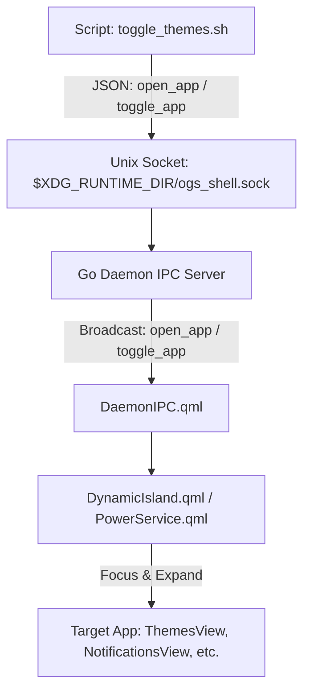

# Plan: App Trigger Scripts and Unified IPC Action Dispatcher

> [!IDEA]
> Shell içerisindeki tüm uygulamaların (Tema Ayarları, Bildirim Merkezi, Kontrol Merkezi, Güç Menüsü, Medya Oynatıcı, Takvim, Pano Geçmişi, Saat/Kronometre, Wi-Fi ve Bluetooth) harici scriptler ve Hyprland klavye kısayolları (`bind`) üzerinden anında açılıp kapatılabilmesini (toggle) sağlayan genel ve modüler bir IPC mekanizması ve çalıştırma scriptleri oluşturmak.

## User Request & Overview

Kullanıcı, shell içindeki uygulamaları harici scriptler ile açabilmek istiyor:
- **Tema Uygulaması:** `toggle_themes.sh`
- **Bildirim Uygulaması:** `toggle_notifications.sh`
- **Kontrol Merkezi:** `toggle_control_center.sh`
- **Güç Menüsü:** `toggle_power_menu.sh`
- **Medya Oynatıcısı:** `toggle_media_player.sh`
- **Takvim:** `toggle_calendar.sh`
- **Pano Geçmişi:** `toggle_clipboard.sh`
- **Saat / Pomodoro / Alarm:** `toggle_clock.sh`
- **Wi-Fi Yöneticisi:** `toggle_wifi.sh`
- **Bluetooth Yöneticisi:** `toggle_bluetooth.sh`
- **Genel Script:** `open_shell_app.sh <app_name>`

## Technical Architecture & Flow

### 1. Go Backend IPC (`core/main.go`):
- `open_app` ve `toggle_app` aksiyonları eklendi.
- Doğrudan eşleşen kısayol aksiyonları (`toggle_control_center`, `toggle_themes`, `toggle_notifications`, `toggle_power_menu`, `toggle_media_player`, `toggle_calendar`, `toggle_clipboard`, `toggle_clock`, `toggle_wifi_view`, `toggle_bluetooth_view`) desteklendi.

### 2. Quickshell IPC Katmanı (`shell/backend/DaemonIPC.qml`):
- `appToggleRequested(payload)`, `appOpenRequested(payload)`, `appCloseRequested(payload)` sinyalleri tanımlandı ve soket mesajları bağlandı.

### 3. Dinamik Ada ve Uygulama Yönlendiricisi (`shell/components/island/DynamicIsland.qml`):
- `toggleApp(appName, subview)` ve `openApp(appName, subview)` yönlendirme metotları tanımlandı.
- Alt görünümler için `ControlCenterView.setView()` entegre edildi.

### 4. CLI Script Seti (`scripts/`):
- `scripts/open_shell_app.sh`
- `scripts/toggle_control_center.sh`
- `scripts/toggle_themes.sh`
- `scripts/toggle_notifications.sh`
- `scripts/toggle_power_menu.sh`
- `scripts/toggle_media_player.sh`
- `scripts/toggle_calendar.sh`
- `scripts/toggle_clipboard.sh`
- `scripts/toggle_clock.sh`
- `scripts/toggle_wifi.sh`
- `scripts/toggle_bluetooth.sh`

## Verification & Test Results

- Backend ve Shell derlendi ve yeniden başlatıldı.
- Tüm `toggle_*.sh` scriptleri ve `open_shell_app.sh` terminalden canlı olarak test edildi; Dynamic Island'ın ilgili alt görünümleri anında ve akıcı bir şekilde açıp kapattığı doğrulandı.
