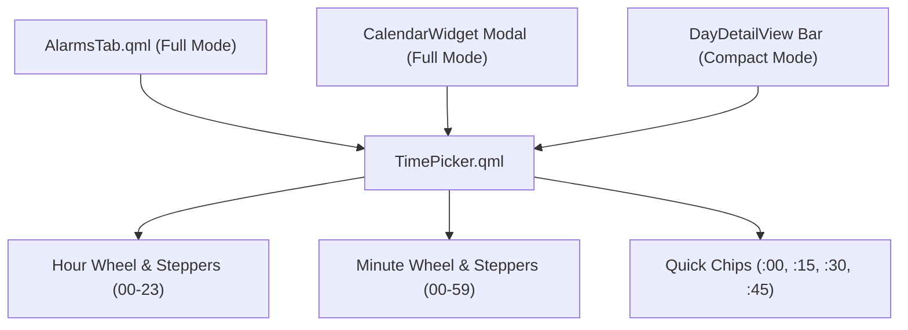

# Proposal: Apple HIG Modern Time Picker Component

> [!IDEA]
> Replace raw text masking (`99:99`) and single-step arithmetic buttons with a dedicated, touch- and mouse-wheel-enabled **Apple HIG TimePicker** component featuring segmented `[HH] : [MM]` digital tiles, mouse scroll adjustment, rapid 15-minute preset chips (`:00`, `:15`, `:30`, `:45`), and a compact popover mode for tight toolbars.

## Problem Statement
Currently, setting alarm times in `[[Clock-Suite-View]]` (`AlarmsTab.qml`) and calendar event times in `[[Calendar-Widget]]` relies on raw keyboard `TextInput` fields with `inputMask: "99:99"` or primitive `+` / `−` buttons. This creates a clunky, desktop-unfriendly experience prone to formatting glitches and tedious clicks.

## Proposed Solution: `TimePicker.qml`

1. **Dual Segmented Digital Tiles:**
   - **Hour Tile `[ 08 ]`:** Smooth wheel scroll (up/down loops 00–23) + direct step buttons.
   - **Colon Divider `[ : ]`**
   - **Minute Tile `[ 30 ]`:** Smooth wheel scroll (loops 00–59) + 5-minute snapping when held.
2. **Rapid Quick-Preset Chips:**
   - Immediate one-click chips for common minute boundaries: `:00`, `:15`, `:30`, `:45`.
3. **Compact Mode with Popover:**
   - In tight spaces (such as the quick event addition bar in `DayDetailView.qml`), displays a sleek pill badge (`[ 12:00 ]`). Clicking the pill reveals a floating Apple-style time picker overlay.
4. **Haptic & Visual Feedback:**
   - Pure black/surface active highlight, high contrast typography, spring animations on changes.

## Affected Files
- `shell/components/widgets/TimePicker.qml` - New reusable component.
- `shell/components/widgets/clock/AlarmsTab.qml` - Replace text input with `TimePicker`.
- `shell/components/widgets/calendar/CalendarWidget.qml` - Replace text input in modal with `TimePicker`.
- `shell/components/widgets/calendar/DayDetailView.qml` - Replace text input in bottom bar with compact `TimePicker`.
- `ogsShell-qs_brain/03-UI-Components/Time-Picker-Component.md` - New documentation note.
