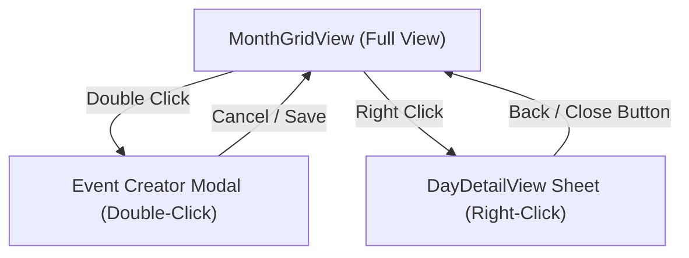

# Proposal: Calendar Right-Click Day Events Interaction

> [!IDEA]
> Remove the top two-tab segmented control ("Aylık Takvim" / "Günlük Etkinlikler") from `[[Calendar-Widget]]` to maximize month grid screen real-estate. Instead, bind right-clicking on any calendar day cell to instantly open that day's events sheet/overlay (`DayDetailView`), keeping single-click for selection and double-click for quick event creation.

## Problem Statement
The two-tab segmented control at the top of the calendar consumes precious vertical height in the Dynamic Island's expanded state (`340px`). Users often want to see the whole month at a glance and only inspect a specific day's agenda on demand.

## Proposed Interaction Model
1. **Remove Tab Bar:** Eliminate the segmented control header in `CalendarWidget.qml`, allowing the `MonthGridView` to take full container height.
2. **Right-Click Interaction:** In `MonthGridView.qml`, configure `MouseArea` to accept `Qt.LeftButton | Qt.RightButton`.
   * **Left Click:** Select day (`selectedDateStr`).
   * **Right Click:** Select day and open the `DayDetailView` overlay with smooth transition.
   * **Double Click:** Open the quick event creation modal.
3. **Day Detail Overlay / Modal:** When active, `DayDetailView` displays the date, official holidays, events list with completion toggle and deletion, a quick-add input bar, and a back/close button to return to the month grid.

## Affected Components
- `shell/components/widgets/calendar/CalendarWidget.qml` - Remove tabs and manage day detail overlay state.
- `shell/components/widgets/calendar/MonthGridView.qml` - Add `dayRightClicked(string dateStr)` signal and right-click handler in day cells.
- `shell/components/widgets/calendar/DayDetailView.qml` - Add back/close action and optimize layout.
- `ogsShell-qs_brain/03-UI-Components/Calendar-Widget.md` - Update documentation.
