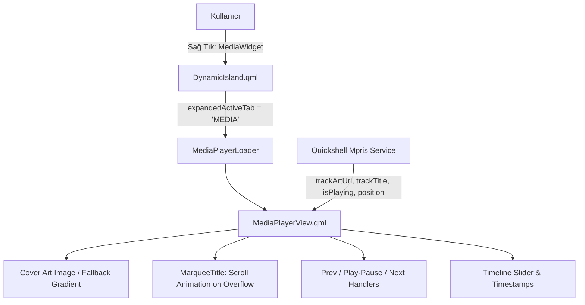

# Plan: Dynamic Island Media Player Application & Marquee Engine

> [!IDEA]
> Hover durumundaki medya widget'ına sağ tıklandığında (veya tıklandığında) Dynamic Island içerisinde açılan, Apple HIG ve Google Material You tasarım dillerini harmanlayan, albüm kapağı görseli, taşan uzun şarkı isimlerinde sağdan sola kayan (marquee) animasyonlu başlık, sanatçı bilgisi, oynatma/durdurma, ileri/geri kontrolleri ve ilerleme çubuğu barındıran zengin bir `MediaPlayerView` bileşeni geliştirmek.

## User Requirements & Feature Specification

1. **Tetikleme (Trigger):**
   - Dynamic Island `HOVER` durumundayken sol tarafta beliren `MediaWidget.qml` bileşenine **sağ tıklandığında** Dynamic Island `EXPANDED` durumuna geçecek ve `expandedActiveTab = "MEDIA"` ile medya oynatıcı uygulaması açılacaktır.
2. **Kapak Fotoğrafı / Görsel (Cover Art):**
   - `MprisPlayer.trackArtUrl` (veya `artUrl`) üzerinden albüm kapağı yüklenir.
   - Yuvarlatılmış köşeli (`radius: 14`) 84x84px şık görsel alanı; görsel yüklenemediğinde veya kapak olmadığında zarif degrade zemin üzerinde müzik ikonu (`󰝚`) gösterilir.
3. **Kayan Şarkı İsmi (Marquee Scrolling Engine):**
   - Şarkı ismi tahsis edilen alana sığmıyorsa (`implicitWidth > availableWidth`) ve medya oynatılıyorsa (`isPlaying`), metin sağdan sola doğru yumuşakça kayarak (`Marquee Text`) başa dönecektir.
   - Duraklatıldığında veya başlık sığıyorsa sabit kalacaktır.
   - Metin kenarlarında pürüzsüz görünüm için görsel maske / sınırlandırma (`clip: true`) uygulanacaktır.
4. **Oynatma Kontrolleri (Playback Controls):**
   - Geri (`󰒮` - `previous()`)
   - Oynat / Duraklat (`󰐊` / `󰏤` - `togglePlaying()`) — 38x38px vurgulu dairesel buton.
   - İleri (`󰒭` - `next()`)
   - İlerleme Çubuğu (Progress Bar) ve zaman göstergesi (`01:24 / 03:45`).
5. **Tasarım Dili (Apple HIG + Material You Fusion):**
   - Saf siyah OLED zemin (`Style.bgSecondary`), ince cam kenarlık (`Style.border`), reaktif tema vurgu renkleri (`Style.accent`).
   - Yaylanma fiziği (`SpringAnimation`) ile pürüzsüz geçişler.

## Technical Design & Architecture

### Component Hierarchy

1. **`shell/components/widgets/media/MediaPlayerView.qml` (Yeni Bileşen):**
   - Ada Genişliği: `390px`, Ada Yüksekliği: `170px`.
   - Sol Blok: 84x84px `Image` + Fallback Icon.
   - Sağ Blok:
     - Başlık + Kayan Marquee Metin (`MarqueeText`).
     - Sanatçı / Albüm / Çalar Kimliği (örn. Spotify, Firefox).
     - Zaman Çubuğu (`ProgressBar`) + Geçen/Kalan Süre.
     - Kontrol Butonları (`RowLayout`).
2. **`shell/components/widgets/MediaWidget.qml` (Güncelleme):**
   - `TapHandler { acceptedButtons: Qt.RightButton }` eklenerek `mediaRightClicked()` sinyali yayıldı.
3. **`shell/components/island/DynamicIsland.qml` (Güncelleme):**
   - `expandedActiveTab === "MEDIA"` geometrisi (genişlik: `390`, yükseklik: `170`) tanımlandı.
   - `mediaPlayerLoader` eklendi.
   - `mediaWidget.onMediaRightClicked` dinleyicisi bağlandı.

## Implementation Summary & Verification

- **Yeni Bileşen Eklendi:** [`MediaPlayerView.qml`](file:///home/excalibur/WorkSpace/projects/OgsShell-qs/shell/components/widgets/media/MediaPlayerView.qml) dosyası oluşturuldu. Albüm kapağı, kayan şarkı başlığı (`SequentialAnimation`), oynatma çubuğu ve kontrol butonları entegre edildi.
- **Sağ Tık Entegrasyonu:** [`MediaWidget.qml`](file:///home/excalibur/WorkSpace/projects/OgsShell-qs/shell/components/widgets/MediaWidget.qml) ve [`DynamicIsland.qml`](file:///home/excalibur/WorkSpace/projects/OgsShell-qs/shell/components/island/DynamicIsland.qml) güncellendi.
- **Doğrulama:** `qmllint` ile sözdizimi kontrol edildi; Quickshell yeniden başlatıldı ve canlı olarak doğrulandı.
- **Dokümantasyon:** `[[Media-Player-View]]`, `[[Media-Widget]]`, `.agents/ARCHITECTURE.md` güncellendi.
