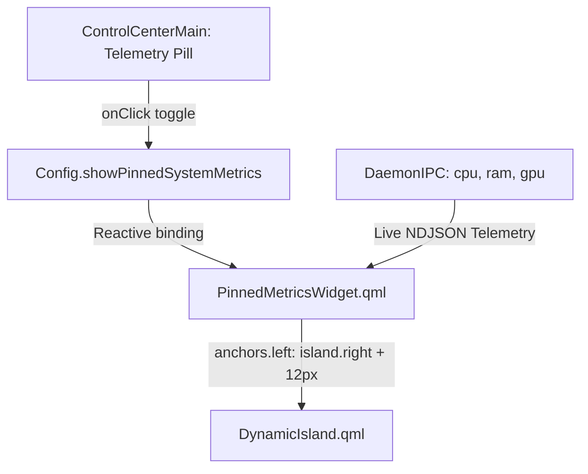

# Plan: Dynamic Island Transparent System Metrics Pinning

> [!NOTE]
> Allows users to click the telemetry bar in Control Center to pin/unpin live system hardware metrics (CPU, RAM, GPU) beside the Dynamic Island. The side widget features a 100% transparent background with high-contrast outlined typography and smooth kinetic tracking of the island's expanding width.

## Problem Statement & Feature Goal

1. **User Interaction in Control Center:** Previously, the system metrics pill in `[[Control-Center-Widget]]` (`ControlCenterMain.qml`) was static. Clicking on it now toggles the pinned visibility of system metrics next to the Dynamic Island.
2. **Transparent Silhouette with Maximum Legibility:** The pinned telemetry widget has a 100% transparent background (`color: "transparent"`), while maintaining crisp readability across varying wallpapers and underlying windows using high-contrast text outlines and semantic color-coding.
3. **Kinetic Anchoring to Dynamic Island:** The pinned telemetry HUD adapts its position smoothly to the Dynamic Island's morphing geometry (`IDLE` $\leftrightarrow$ `HOVER` $\leftrightarrow$ `EXPANDED`).

## Architecture & Implementation

## Implemented Components

- `shell/components/widgets/controlcenter/ControlCenterMain.qml` - Added clickable toggle handler, hover state, and active pinning indicator.
- `shell/backend/Config.qml` - Added `showPinnedSystemMetrics` reactive property and config persistence.
- `shell/components/widgets/PinnedMetricsWidget.qml` - [NEW] Lightweight, transparent widget with high-contrast text rendering (`Text.Outline` with 90% black outline).
- `shell/shell.qml` - Expanded canvas and wired the side widget adjacent to the island with Wayland region input masking.
