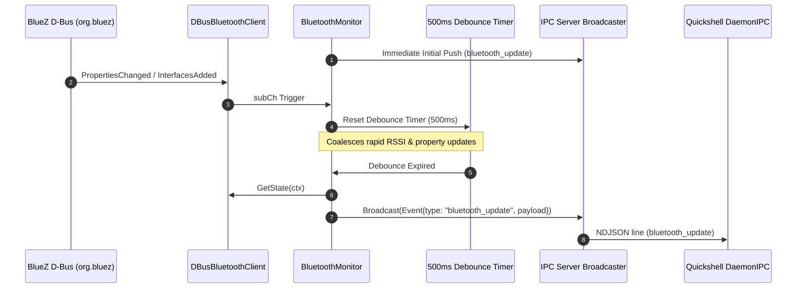

# Proposal: D-Bus Signal-Driven Event Architecture for BluetoothMonitor

> [!IDEA]
> Eliminating the fallback 10-second ticker in `BluetoothMonitor` (`core/monitors/bluetooth_mon.go`) and introducing a 500ms debouncing engine for BlueZ D-Bus signals (`InterfacesAdded`, `InterfacesRemoved`, `PropertiesChanged`) provides ultra-responsive, zero-polling Bluetooth peripheral synchronization over IPC.

## 1. Problem Statement
Previously, `BluetoothMonitor` contained a 10-second ticker alongside the subscription channel. Furthermore, rapid RSSI signal updates and property fluctuations triggered immediate unthrottled JSON broadcasts.
We need:
1. Complete removal of `time.Ticker` in `BluetoothMonitor`.
2. A 500ms debouncing/rate-limiting mechanism on incoming D-Bus notifications (`subCh`).
3. Guaranteed initial state broadcast on startup.
4. Clean goroutine and context cancellation teardown.

## 2. Proposed Architecture & Design

### A. BlueZ D-Bus Signal Pipeline
- `DBusBluetoothClient` maintains active signal matches for `org.bluez`:
  - `org.freedesktop.DBus.ObjectManager.InterfacesAdded` (newly discovered/paired devices).
  - `org.freedesktop.DBus.ObjectManager.InterfacesRemoved` (unpaired/removed devices).
  - `org.freedesktop.DBus.Properties.PropertiesChanged` (`Powered`, `Discovering`, `Connected`, `RSSI`, etc.).
- Internal notifications are pushed to subscriber channels non-blockingly.

### B. Debouncing Engine in `BluetoothMonitor` (500ms)
- On startup, execute an immediate `broadcastBluetoothState(ctx)`.
- When an event arrives from `subCh`:
  - If a debounce timer is active, cancel/stop it.
  - Reset a 500ms `time.Timer`.
- When the timer fires, execute `broadcastBluetoothState(ctx)`.
- When `ctx.Done()` fires, stop any active timer and terminate gracefully.

### C. Clean Teardown
- `DBusBluetoothClient.Close()` properly unregisters D-Bus signal matches and signal channels.

## 3. Data Flow Diagram

## 4. Affected Components
- `core/monitors/bluetooth_mon.go` - Event-driven debounce loop without periodic ticker.
- `core/services/bluetooth/client_dbus.go` - Match removal on close.
- `ogsShell-qs_brain/02-Services/Bluetooth-Service.md` - Updated documentation.
- `[[IPC-Socket-Schema]]` - Preserved event schema.
