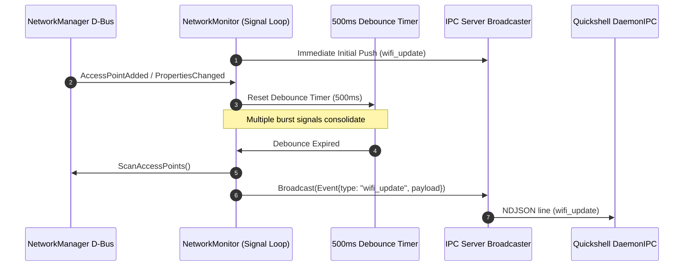

# Proposal: D-Bus Signal-Driven Event Architecture for NetworkMonitor

> [!IDEA]
> Replacing the 10-second polling loop in `NetworkMonitor` (`core/monitors/network_mon.go`) with an event-driven D-Bus signal subscription (`AccessPointAdded`, `AccessPointRemoved`, `PropertiesChanged`) paired with an intelligent 500ms debouncing engine eliminates CPU wakeups and enables instantaneous UI reactivity.

## 1. Problem Statement
Previously, `NetworkMonitor` relied on a `time.NewTicker(10 * time.Second)` loop to scan access points and broadcast `wifi_update` JSON events over IPC. Polling causes:
- Unnecessary CPU wakeups when the wireless environment is static.
- Latency (up to 10 seconds) when new networks appear or connection status changes.
- Inefficiency compared to the rest of the event-driven shell architecture.

## 2. Proposed Architecture & Design

### A. D-Bus Match Rules (`godbus/dbus/v5`)
Subscribe to NetworkManager signals:
1. `org.freedesktop.NetworkManager.Device.Wireless.AccessPointAdded` on the wireless device path.
2. `org.freedesktop.NetworkManager.Device.Wireless.AccessPointRemoved` on the wireless device path.
3. `org.freedesktop.DBus.Properties.PropertiesChanged` from `org.freedesktop.NetworkManager`.

### B. Debouncing & Rate Limiting (500ms)
Rapid bursts of signals (e.g. RSSI fluctuations or multiple APs discovered simultaneously) are debounced:
- Incoming signal restarts a 500ms `time.Timer`.
- When the timer fires after a period of quiet, `broadcastWifiState()` is invoked.
- Initial broadcast is performed immediately upon startup.

### C. Clean Teardown & Context Cancellation
- When `ctx.Done()` is received:
  - Signal listener channel is unregistered via `conn.RemoveSignal`.
  - Match rules are removed via `conn.RemoveMatchSignal`.
  - Debounce timer is stopped.
  - Goroutine exits without resource or goroutine leaks.

## 3. Data Flow & Signal Pipeline

## 4. Affected Components
- `core/services/network.go` - Expose accessors / helpers for D-Bus connection & wireless device path.
- `core/monitors/network_mon.go` - Event-driven signal listener with 500ms debouncing and graceful shutdown.
- `ogsShell-qs_brain/02-Services/Network-Monitor-Service.md` - Updated architecture documentation.
- `[[IPC-Socket-Schema]]` - Confirmed preservation of `wifi_update` payload.
