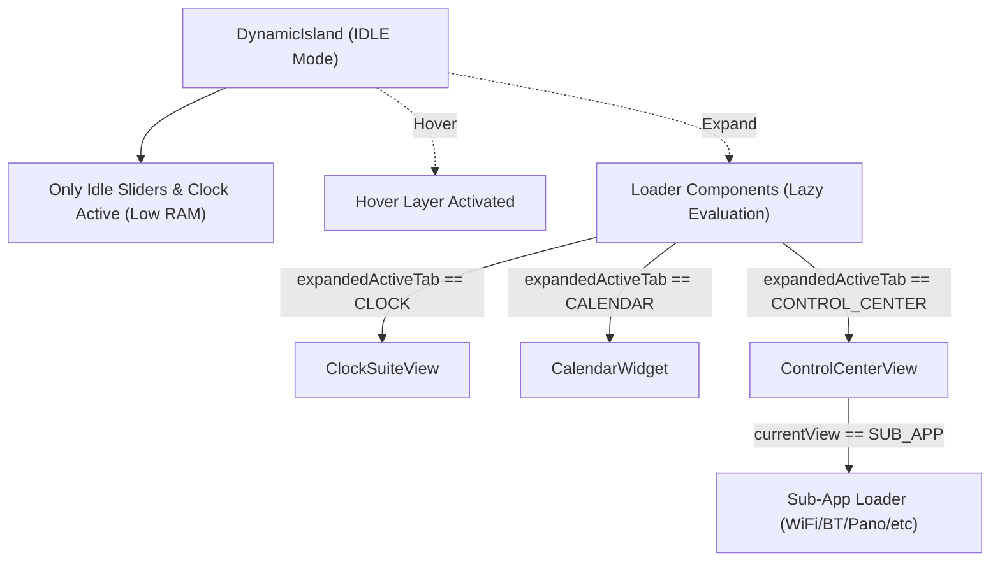

# Plan: Frontend Memory & RAM Optimization

## 1. Problem & Memory Audit Findings

* **Eager Instantiation Overhead:** In `DynamicIsland.qml`, all 3 master applications (`[[Clock-Suite-View]]`, `[[Calendar-Widget]]`, `[[Control-Center-Widget]]`) and all their sub-modules (8 sub-apps in Control Center, 5 tabs in Clock, 3 views in Calendar) are instantiated simultaneously upon shell startup.
* **Multi-Monitor Multiplication:** Because `shell.qml` uses `Variants { model: Quickshell.screens }`, every single connected monitor instantiates the entire 16-app tree, multiplying RAM usage by 2x or 3x.
* **Continuous Background Animations:** `[[Media-Widget]]` equalizer animations run indefinitely even when the island is collapsed in `IDLE`.
* **High MSAA Buffer Overhead:** `layer.samples: 8` creates heavy GPU/RAM framebuffer allocations on every screen.

---

## 2. Proposed Architecture & Solutions

1. **Lazy Loading via `Loader`:**
   - Replace static app instantiations in `DynamicIsland.qml` with `Loader` items configured with `active: root.stateMode === "EXPANDED" && root.expandedActiveTab === "..."`.
   - In `ControlCenterView.qml`, replace static sub-views with dynamic Loaders (`active: currentView === "VIEW_NAME"`).
2. **Animation Throttling:**
   - Pause `MediaWidget` equalizer when `stateMode !== "HOVER"`.
3. **ListView Object Recycling:**
   - Enable `reuseItems: true` and set `cacheBuffer: 50` on all list views.
4. **MSAA Optimization:**
   - Adjust `layer.samples` to 4 for balanced crispness and reduced VRAM footprint.
