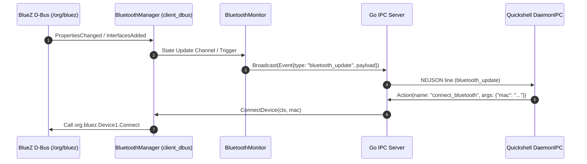

# Proposal: Modular BlueZ D-Bus Bluetooth Service and Monitor in Go

> [!IDEA]
> Implementing a dedicated, interface-driven BlueZ D-Bus Bluetooth management service (`core/services/bluetooth/`) and asynchronous event monitor (`core/monitors/bluetooth_mon.go`) in the Go daemon will provide real-time device discovery, state synchronization, and reliable RPC action controls for the Quickshell Dynamic Island frontend.

## 1. Problem Statement & Motivation
Currently, `ogsShell` provides hardware monitoring (CPU, RAM, GPU, Net) and Wi-Fi management via NetworkManager D-Bus. However, Bluetooth connectivity and peripheral status (headsets, keyboards, mice, controllers) are not integrated into the daemon. Quickshell requires real-time Bluetooth adapter state, pairing/connection status, RSSI, and device control RPC actions (`toggle_bluetooth`, `connect_bluetooth`, `disconnect_bluetooth`, `start_bluetooth_scan`).

## 2. Proposed Architecture & Design

### A. Modular Service Layer (`core/services/bluetooth/`)
1. **Interface Definition (`manager.go`):**
   - `BluetoothManager` interface with methods: `GetState`, `TogglePower`, `SetPowered`, `ConnectDevice`, `DisconnectDevice`, `StartDiscovery`, `StopDiscovery`, `WatchChanges`, `Close`.
2. **Data Structures (`types.go`):**
   - `BluetoothDevice` (`MAC`, `Name`, `Icon`, `Connected`, `Paired`, `RSSI`).
   - `BluetoothState` / `BluetoothUpdatePayload` (`AdapterPowered`, `Discovering`, `Devices`).
   - RPC request payload structures (`ConnectBluetoothPayload`, `ToggleBluetoothPayload`, etc.).
3. **D-Bus Client Implementation (`client_dbus.go`):**
   - Direct integration with `org.bluez` over system D-Bus (`godbus/dbus/v5`).
   - Resolves adapter path (defaulting to `/org/bluez/hci0` or auto-discovering the first `org.bluez.Adapter1`).
   - Uses `org.freedesktop.DBus.ObjectManager.GetManagedObjects` for device and adapter enumeration.
   - Listens to `org.freedesktop.DBus.Properties.PropertiesChanged` and `org.freedesktop.DBus.ObjectManager.InterfacesAdded`/`InterfacesRemoved` signals for real-time reactivity.
   - Thread-safe device map synchronization using `sync.RWMutex`.
4. **Mock Client (`client_mock.go`):**
   - In-memory mock implementation for testing environments and fallback when Bluetooth hardware is absent.
5. **Unit Tests (`bluetooth_test.go`):**
   - Comprehensive unit tests verifying state transitions, MAC address resolution to D-Bus object paths, and RPC handling.

### B. Asynchronous Monitor (`core/monitors/bluetooth_mon.go`)
- Background goroutine managing event dispatching to `ipc.Server`.
- Immediate broadcast on startup and upon BlueZ signal notifications.
- Polling/reconciliation fallback ticker (e.g. 5-10s) ensuring consistent state if D-Bus signals are dropped.

### C. IPC Actions & RPC Registration (`core/main.go`)
- `toggle_bluetooth`: Toggle or set adapter power (`org.bluez.Adapter1` `Powered`).
- `connect_bluetooth`: Connect to target device by MAC address (`org.bluez.Device1.Connect`).
- `disconnect_bluetooth`: Disconnect target device by MAC address (`org.bluez.Device1.Disconnect`).
- `start_bluetooth_scan`: Start discovery with automatic timeout cancellation after 15 seconds.

## 3. Data Flow & Sequence Diagram

## 4. Affected Components
- `[[Bluetooth-Service]]` - New service documentation in `ogsShell-qs_brain/02-Services/`
- `[[IPC-Socket-Schema]]` - Updated with `bluetooth_update` event and RPC actions
- `[[System-Architecture]]` - Updated architecture diagram
- `core/services/bluetooth/` - New package
- `core/monitors/bluetooth_mon.go` - New monitor
- `core/monitors/manager.go` - Monitor manager integration
- `core/main.go` - RPC action handlers and service lifecycle
