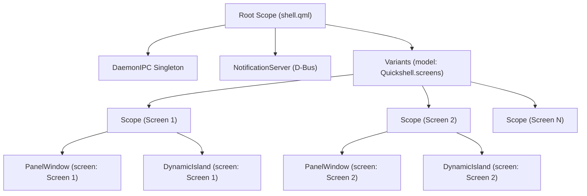

# Proposal: Multi-Monitor Support for Dynamic Island

> [!IDEA]
> Utilizing Quickshell's `Variants` component with `model: Quickshell.screens`, each physical/virtual connected display will spawn an isolated `Scope` containing its own `PanelWindow` (backdrop and island) while sharing the singleton `DaemonIPC` instance and `ClockManager` state.

## Problem Statement

Currently, in `shell/shell.qml`, `PanelWindow` instances for `backdropWindow` and `islandWindow` are declared directly at the top-level without binding to individual screens (`screen: ...`). Under Wayland/Hyprland, this causes Quickshell to display the Dynamic Island only on the primary or first detected monitor.

## Proposed Architecture

1. **Quickshell Variants Component:**
   * Wrap per-screen windows inside `Variants { model: Quickshell.screens }`.
   * Each variant receives `required property var modelData` (representing `QsScreen`).
   * Bind `screen: screenScope.modelData` on both `backdropWindow` and `islandWindow`.

2. **Decentralized Notification Dispatch:**
   * Move notification popup handling directly into `DynamicIsland.qml` via its existing `ipc` connection (`onNotificationReceived`) so all islands on all screens trigger simultaneously upon incoming notifications.

3. **Multi-Window Isolation:**
   * Each screen manages its own `island.stateMode` (hovering or expanding the island on Monitor 1 does not force expand Monitor 2).
   * Backdrop window clicks on a specific monitor collapse only that monitor's island.

## Affected Files
- `shell/shell.qml` - Refactor root windows into `Variants` over `Quickshell.screens`.
- `shell/components/island/DynamicIsland.qml` - Add `onNotificationReceived` listener to `Connections { target: root.ipc }`.
- `ogsShell-qs_brain/03-UI-Components/Shell-Root-PanelWindow.md` - Update architecture documentation.
