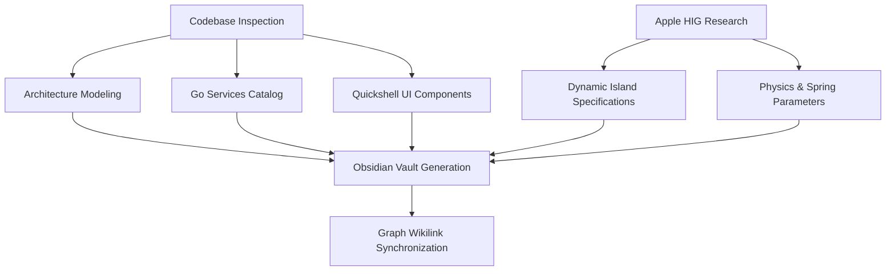

# Comprehensive Project Audit & Apple Dynamic Island HIG Integration Plan

> [!NOTE]
> This agent thought note captures the structural audit of `ogsShell-qs`, the integration of Apple's Human Interface Guidelines (HIG) for Dynamic Island, and the complete synchronization of the Obsidian knowledge vault (`ogsShell-qs_brain/`).

## 1. Executive Summary & Objective

The objective of this task is two-fold:
1. Conduct a deep architectural inspection of the `ogsShell-qs` codebase, covering both the Go backend daemon (`core/`) and the Quickshell QML frontend (`shell/`), alongside shared assets (`shared/`).
2. Synthesize official **Apple Human Interface Guidelines (HIG)** for the Dynamic Island (Live Activities, presentation states, physics, spring curves, priority matrices, visual continuity) and establish a complete, highly interconnected Obsidian knowledge base in `ogsShell-qs_brain/`.

---

## 2. Codebase Audit Observations

### Backend (`core/`)
* **Entry Point (`core/main.go`):** Initializes structured `slog` logger, resolves `$XDG_RUNTIME_DIR/ogs_shell.sock`, starts `ipc.Server` in a dedicated goroutine, creates and starts `monitors.Manager`, and hooks into OS signals (`SIGINT`, `SIGTERM`) for graceful teardown and socket cleanup.
* **IPC Protocol (`core/ipc/`):** Implements `Event` (`type`, `payload`) and `Action` (`name`, `args`) structures using Newline-Delimited JSON (NDJSON) over Unix Domain Sockets with thread-safe client broadcasting.
* **Monitors (`core/monitors/`):** 
  * `cpu.go`: Reads `/proc/stat` for usage delta and `/sys/class/thermal/thermal_zone0/temp` for temperature.
  * `ram.go`: Reads `/proc/meminfo` for total, available, and used memory.
  * `gpu.go`: Employs NVML C-API (`github.com/NVIDIA/go-nvml/pkg/nvml`) for NVIDIA GPUs, with sysfs fallback (`gpu_busy_percent`, `hwmon*/temp1_input`) for Intel/AMD.
  * `net.go`: Parses `/proc/net/route` to locate the default gateway interface and computes throughput deltas from `/proc/net/dev`.
  * `manager.go`: Orchestrates a 1-second ticker loop collecting all metrics into a `sys_metrics` event payload.
* **Logger (`core/logger/`):** Custom ANSI color-coded handler built on Go's standard `log/slog`.

### Frontend (`shell/`)
* **Root Canvas (`shell/shell.qml`):** Quickshell `PanelWindow` anchored to top, configured with `exclusionMode: ExclusionMode.Ignore` so it acts as an overlay without pushing Hyprland tiling windows.
* **IPC Client (`shell/backend/DaemonIPC.qml`):** Connects to `ogs_shell.sock` via `Quickshell.Io.Socket` and parses incoming NDJSON frames with `SplitParser`.
* **Island Container (`shell/components/island/DynamicIsland.qml`):** Reactive `implicitWidth` and `implicitHeight`, state machine supporting `IDLE`, `HOVER`, `EXPANDED`, and `TRANSIENT` states with smooth animation transitions.
* **Widgets (`shell/components/widgets/ClockWidget.qml`):** Modular clock display with 1-second update interval.
* **Styling (`shell/theme/Style.qml`):** Singleton providing Catppuccin-inspired dark palette and animation parameters.

---

## 3. Apple Dynamic Island HIG Research & Adaptation

From Apple's HIG and ActivityKit specifications:
1. **Four Key Presentation States:**
   * **Compact Leading & Trailing:** Dual-pill glanceable layout framing the cutout.
   * **Minimal:** Detached bubble for secondary concurrent activities.
   * **Expanded:** Multi-region interactive modal (Leading, Trailing, Center, Bottom) triggered by user focus/tap.
   * **Transient Alerts:** Ephemeral state expansions (e.g., volume/brightness changes, connection status) that auto-dismiss after a brief delay.
2. **Physics & Motion Dynamics:**
   * Animations MUST utilize non-linear spring dynamics (`damping: 0.78`, `spring: 28.0`, `epsilon: 0.01`) to emulate natural inertia, overshoot, and continuous curvature.
3. **State Priority Matrix:**
   $$\text{EXPANDED\_APP} > \text{TRANSIENT} > \text{HOVER} > \text{IDLE}$$

---

## 4. Execution Plan for Obsidian Brain Synchronization

1. **`01-Architecture/`**:
   * `[[System-Architecture]]`
   * `[[IPC-Socket-Schema]]`
   * `[[Apple-Dynamic-Island-HIG]]`
   * `[[Dynamic-Island-Physics-State-Machine]]`
   * `[[Configuration-Themes-Spec]]`
2. **`02-Services/`**:
   * `[[Go-Daemon-Core]]`
   * `[[SysMetrics-Service]]`
   * `[[CPU-Monitor-Service]]`
   * `[[RAM-Monitor-Service]]`
   * `[[GPU-Monitor-Service]]`
   * `[[Network-Monitor-Service]]`
   * `[[Logger-Service]]`
   * `[[IPC-Server-Service]]`
3. **`03-UI-Components/`**:
   * `[[Shell-Root-PanelWindow]]`
   * `[[Dynamic-Island-Component]]`
   * `[[Clock-Widget]]`
   * `[[Style-Design-Tokens]]`
   * `[[Daemon-IPC-Client]]`
4. **`04-Agent-Rules/`**:
   * `[[Go-Coding-Style]]`
   * `[[QML-Best-Practices]]`
   * `[[Agent-Workflow-Directives]]`
5. **Architectural Root Documents**:
   * `.agents/ARCHITECTURE.md`
   * `.agents/ARCHITECHTURE.md`

All notes will strictly feature frontmatter metadata, Obsidian callouts, Mermaid diagrams, and bi-directional wikilinks.
