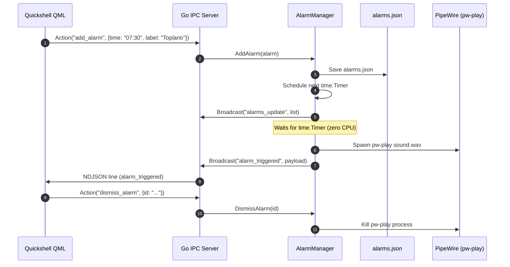

# Proposal: Persistent Alarm Service and Event Scheduler in Go

> [!IDEA]
> Creating a dedicated, low-overhead Alarm Service (`core/services/alarm/`) with JSON persistence (`~/.config/ogsShell/alarms.json`), single-timer event scheduling (no busy loops), audio execution control (`pw-play` / `paplay`), and IPC RPC endpoints provides reliable alarm notifications and control for the Quickshell frontend.

## 1. Problem Statement
The shell requires an alarm system that:
- Persists user alarms across shell reloads and system reboots.
- Accurately triggers alarms at specified times (one-shot or recurring days of the week).
- Operates with minimal CPU overhead by calculating the next event and waiting via `time.Timer`.
- Plays audio through PipeWire/PulseAudio with killable process handles for snooze/dismiss.
- Broadcasts `alarm_triggered` and `alarms_update` events over the Unix domain socket.

## 2. Proposed Architecture & Design

### A. Data Models (`core/services/alarm/types.go`)
- `Alarm` struct:
  - `ID`: Unique string identifier.
  - `Time`: `"HH:MM"` (24-hour format).
  - `Days`: `[]int` (1=Mon ... 7=Sun or 0=Sun; empty for one-shot).
  - `Label`: User-defined title.
  - `Enabled`: Boolean flag.
  - `SoundPath`: Path to custom `.wav`/`.ogg` file.
  - `SnoozeCount`: Erteleme sayısı.
- RPC Payload structs (`AddAlarmPayload`, `DeleteAlarmPayload`, `ToggleAlarmPayload`, `SnoozeAlarmPayload`, `DismissAlarmPayload`, `AlarmTriggeredPayload`).

### B. Persistence (`core/services/alarm/storage.go`)
- Storage location: `$XDG_CONFIG_HOME/ogsShell/alarms.json` (fallback `~/.config/ogsShell/alarms.json`).
- Thread-safe atomic file writing with mutex synchronization.

### C. Timer Engine & Audio Controller (`core/services/alarm/manager.go`)
- `AlarmManager` interface:
  - `AddAlarm(alarm Alarm) (*Alarm, error)`
  - `DeleteAlarm(id string) error`
  - `ToggleAlarm(id string, enabled *bool) (*Alarm, error)`
  - `SnoozeAlarm(id string, minutes int) (*Alarm, error)`
  - `DismissAlarm(id string) error`
  - `GetAlarms() []Alarm`
  - `Close() error`
- Scheduling algorithm calculates `nextTriggerTime` across all active alarms and configures a single `time.Timer`.
- Audio playback spawns `pw-play` (or `paplay`) in background, retaining `*exec.Cmd` to allow instant cancellation on dismiss/snooze.

## 3. Data Flow Diagram

## 4. Affected Components
- `core/services/alarm/` - New alarm package (types, storage, manager, audio)
- `core/main.go` - ActionHandler RPC integration
- `ogsShell-qs_brain/02-Services/Alarm-Service.md` - Service documentation
- `ogsShell-qs_brain/01-Architecture/IPC-Socket-Schema.md` - Socket protocol documentation
- `.agents/ARCHITECTURE.md` - Architectural map
