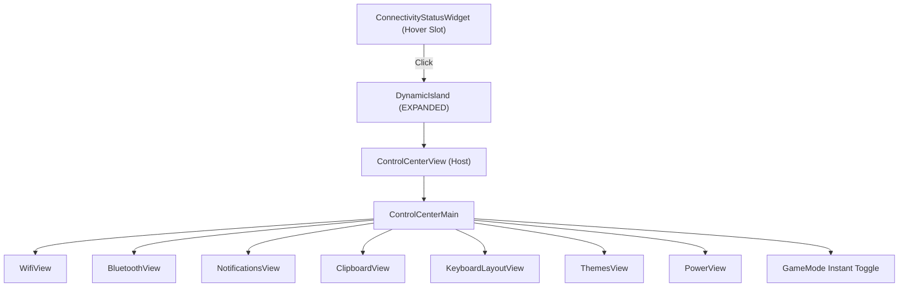

# Proposal: Unified Control Center Suite & Modular Sub-App Host

> [!IDEA]
> Create a comprehensive, Apple macOS/iOS inspired **Control Center** application inside the Dynamic Island. When clicking the Connectivity Status pill in HOVER mode, the island expands into the Control Center, presenting real-time clock/date, live system telemetry metrics, quick toggle grid (Wi-Fi, Bluetooth, Notifications, Clipboard, Keyboard, Theme, Gamemode, Power), and smooth interactive volume/brightness sliders. Each button (except GameMode toggle) smoothly routes to an internal sub-application view with animated island geometry adaptation.

## Problem Statement
Previously, clicking the connectivity status pill had no dedicated full control dashboard. Users needed a centralized place to monitor CPU/RAM/GPU, adjust volume & brightness, toggle game mode, switch keyboard layouts, manage themes, inspect clipboard history, and connect to Wi-Fi / Bluetooth devices seamlessly without opening external heavy apps.

## Proposed Architecture

1. **Top Header & Telemetry:**
   - Real-time Clock (`HH:MM:SS`) & Date localized banner.
   - 4-column compact telemetry pills: CPU %, RAM %, GPU %, Net speed.
2. **Action Button Grid (8 Tiles):**
   - **Wi-Fi Tile:** Active SSID / Signal, opens `WifiView.qml`.
   - **Bluetooth Tile:** Connected devices count / Power state, opens `BluetoothView.qml`.
   - **Bildirimler Tile:** Unread count / DND state, opens `NotificationsView.qml`.
   - **Pano Tile:** Clipboard manager, opens `ClipboardView.qml`.
   - **Klavye Tile:** Current shortcode (`TR`/`US`), opens `KeyboardLayoutView.qml`.
   - **Tema Tile:** Current active theme name, opens `ThemesView.qml`.
   - **GameMode Tile:** Direct instantaneous toggle (disables Hyprland blur/animations for max FPS).
   - **Güç Tile:** Session management, opens `PowerView.qml`.
3. **Sliders:**
   - **Ses Seviyesi (Volume):** Interactive horizontal slider (`pamixer` / `wpctl`).
   - **Parlaklık (Brightness):** Interactive horizontal slider (`brightnessctl`).
4. **Sub-App Routing & Island Geometry Adaptation:**
   - Router inside `ControlCenterView.qml` switches smoothly between `"MAIN"` and subviews with back navigation `[‹ Geri]`.

## Affected Components
- `shell/components/widgets/controlcenter/ControlCenterView.qml`
- `shell/components/widgets/controlcenter/ControlCenterMain.qml`
- `shell/components/widgets/controlcenter/views/*.qml`
- `shell/components/widgets/ConnectivityStatusWidget.qml`
- `shell/components/island/DynamicIsland.qml`
- `ogsShell-qs_brain/03-UI-Components/Control-Center-Widget.md`
