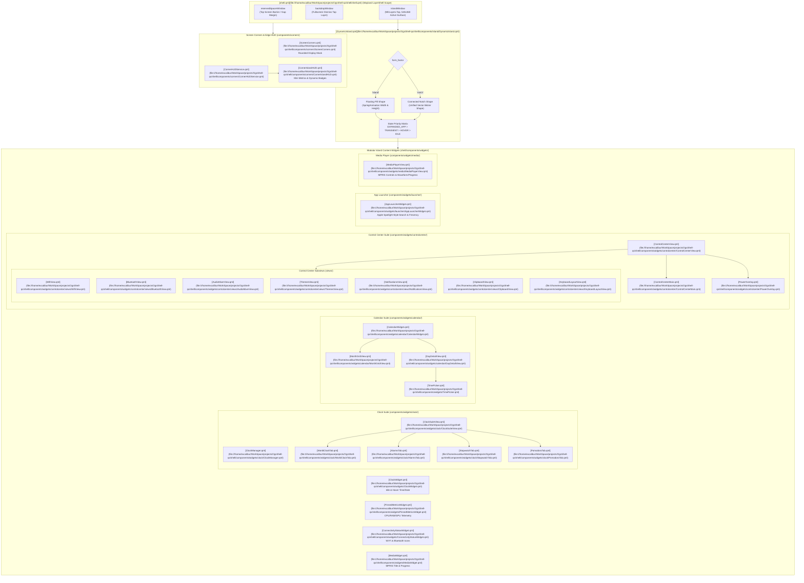
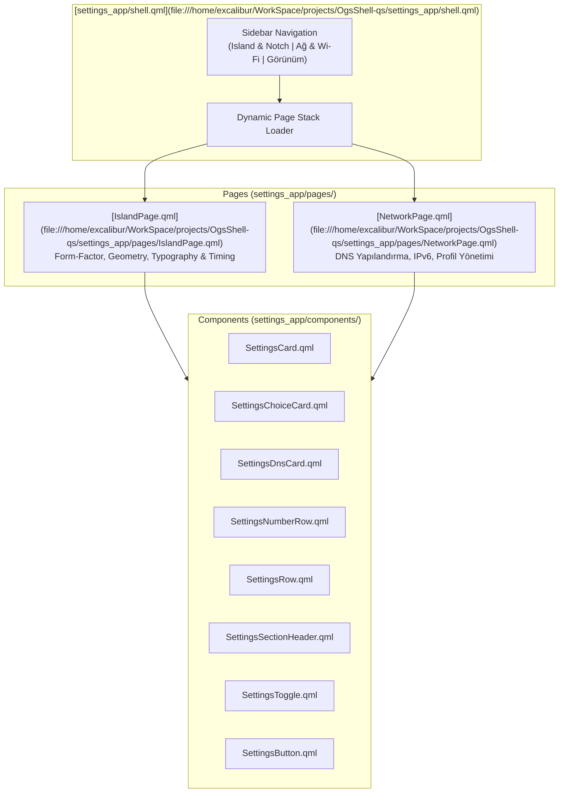
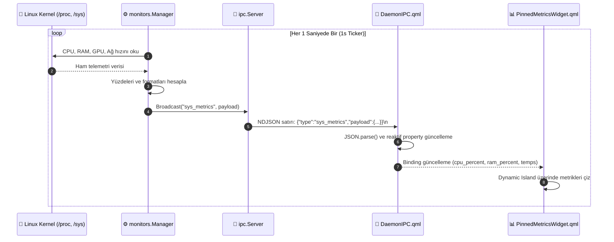
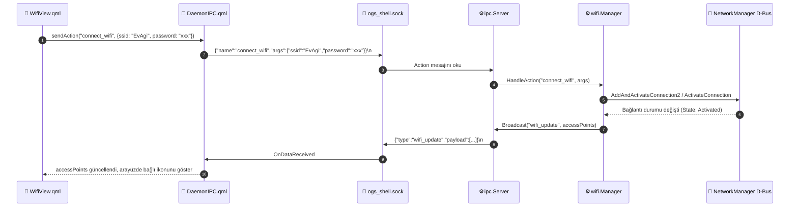
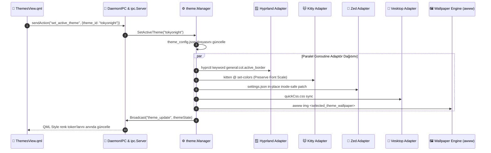
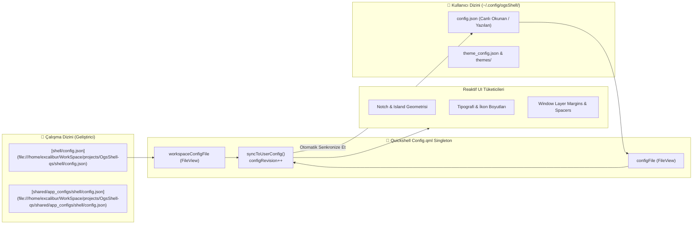

# 🏛️ OgsShell-qs Complete Project Structure & Mermaid.js Architecture

Bu doküman, `OgsShell-qs` projesinin tüm mimari katmanlarını, Go daemon alt servislerini, Quickshell QML arayüz bileşenlerini, Unix Domain Socket IPC veri akışını, konfigürasyon motorunu ve dosya/klasör hiyerarşisini **Mermaid.js** diyagramlarıyla eksiksiz olarak ortaya koyar.

---

## 📑 İçindekiler
1. [Genel Sistem Mimarisi (High-Level Architecture)](#1-genel-sistem-mimarisi-high-level-architecture)
2. [Go Backend Daemon Mimarisi (`core/`)](#2-go-backend-daemon-mimarisi-core)
3. [Quickshell Frontend Katmanı Mimarisi (`shell/`)](#3-quickshell-frontend-katmanı-mimarisi-shell)
4. [Bağımsız Ayarlar Uygulaması (`settings_app/`)](#4-bağımsız-ayarlar-uygulaması-settings_app)
5. [IPC Veri Akışı ve İletişim Sekansları](#5-ipc-veri-akışı-ve-iletişim-sekansları)
6. [Kanonik Konfigürasyon ve Tema Senkronizasyonu Motoru](#6-kanonik-konfigürasyon-ve-tema-senkronizasyonu-motoru)
7. [Tam Proje Dosya ve Klasör Ağacı](#7-tam-proje-dosya-ve-klasör-ağacı)

---

## 1. Genel Sistem Mimarisi (High-Level Architecture)

`OgsShell-qs`, Linux Wayland masaüstü ortamı (Hyprland) için tasarlanmış modüler, yüksek performanslı ve çift form faktörlü (**Dynamic Island** & **Dynamic Notch**) bir kabuk (shell) sistemidir.

```mermaid
graph TB
    %% ==========================================
    %% LINUX SUBSYSTEMS & HARDWARE
    %% ==========================================
    subgraph Subsystems ["🐧 Linux Kernel, Hardware & OS Subsystems"]
        PROC["/proc/stat, /proc/meminfo, /proc/net/dev"]
        THERMAL["/sys/class/thermal, /sys/class/drm (NVML/GPU)"]
        SYS_DBUS["System & Session D-Bus<br/>(org.freedesktop.NetworkManager, org.bluez, WirePlumber)"]
        HYPR_SOCK["Hyprland IPC<br/>($XDG_RUNTIME_DIR/hypr/.../.socket2.sock)"]
        WAYLAND_ENV["Wayland Compositor<br/>(wlr-layer-shell-unstable-v1, wl-copy, cliphist)"]
        XKB_DB["XKB Database<br/>(/usr/share/X11/xkb/rules/evdev.lst)"]
    end

    %% ==========================================
    %% GO BACKEND DAEMON
    %% ==========================================
    subgraph Core_Daemon ["⚙️ Go Backend Daemon (core/)"]
        MAIN["[main.go](file:///home/excalibur/WorkSpace/projects/OgsShell-qs/core/main.go)<br/>Lifecycle & Signal Handler"]
        LOGGER["[logger/](file:///home/excalibur/WorkSpace/projects/OgsShell-qs/core/logger/logger.go)<br/>ANSI Structured slog Handler"]
        
        subgraph Core_Monitors ["Telemetry Monitors (core/monitors/)"]
            MON_MGR["[monitors.Manager](file:///home/excalibur/WorkSpace/projects/OgsShell-qs/core/monitors/manager.go)"]
            MON_CPU["CPU Monitor<br/>([cpu.go](file:///home/excalibur/WorkSpace/projects/OgsShell-qs/core/monitors/cpu.go))"]
            MON_RAM["RAM Monitor<br/>([ram.go](file:///home/excalibur/WorkSpace/projects/OgsShell-qs/core/monitors/ram.go))"]
            MON_GPU["GPU Monitor<br/>([gpu.go](file:///home/excalibur/WorkSpace/projects/OgsShell-qs/core/monitors/gpu.go))"]
            MON_NET["Network Monitor<br/>([net.go](file:///home/excalibur/WorkSpace/projects/OgsShell-qs/core/monitors/net.go))"]
        end

        subgraph Core_Services ["Background Services (core/services/)"]
            SRV_WIFI["[wifi.Manager](file:///home/excalibur/WorkSpace/projects/OgsShell-qs/core/services/wifi/manager.go)<br/>SecretAgent & D-Bus"]
            SRV_BT["[bluetooth.Manager](file:///home/excalibur/WorkSpace/projects/OgsShell-qs/core/services/bluetooth/manager.go)<br/>BlueZ D-Bus Listener"]
            SRV_ALARM["[alarm.Manager](file:///home/excalibur/WorkSpace/projects/OgsShell-qs/core/services/alarm/manager.go)<br/>Scheduler & pw-play"]
            SRV_CAL["[calendar.Manager](file:///home/excalibur/WorkSpace/projects/OgsShell-qs/core/services/calendar/manager.go)<br/>Events & TR Holidays"]
            SRV_NOTIF["[notifications.Manager](file:///home/excalibur/WorkSpace/projects/OgsShell-qs/core/services/notifications/manager.go)<br/>DND & App Rules Engine"]
            SRV_CLIP["[clipboard.Manager](file:///home/excalibur/WorkSpace/projects/OgsShell-qs/core/services/clipboard/manager.go)<br/>Cliphist & Pinned Items"]
            SRV_KB["[keyboard.Manager](file:///home/excalibur/WorkSpace/projects/OgsShell-qs/core/services/keyboard/manager.go)<br/>XKB & Socket2 Listener"]
            SRV_THEME["[theme.Manager](file:///home/excalibur/WorkSpace/projects/OgsShell-qs/core/services/theme/manager.go)<br/>Multi-App Dispatcher"]
            SRV_LAUNCH["[launcher.Manager](file:///home/excalibur/WorkSpace/projects/OgsShell-qs/core/services/launcher/manager.go)<br/>Fuzzy Spotlight Engine"]
        end

        IPC_SERVER["[ipc.Server](file:///home/excalibur/WorkSpace/projects/OgsShell-qs/core/ipc/server.go)<br/>Unix Domain Socket Server (NDJSON)"]
    end

    %% ==========================================
    %% IPC TRANSPORT LAYER
    %% ==========================================
    subgraph IPC_Transport ["🔌 Transport Layer"]
        UDS_SOCKET["$XDG_RUNTIME_DIR/ogs_shell.sock<br/>(Newline-Delimited JSON Stream)"]
    end

    %% ==========================================
    %% FRONTEND QUICKSHELL
    %% ==========================================
    subgraph Frontend_Shell ["🎨 Quickshell QML Frontend (shell/)"]
        SHELL_ROOT["[shell.qml](file:///home/excalibur/WorkSpace/projects/OgsShell-qs/shell/shell.qml)<br/>Wayland LayerShell Root Scope"]
        
        subgraph Window_Layers ["Wayland Window Surfaces"]
            WIN_ISLAND["islandWindow<br/>(540x360 Fixed Anchor Surface)"]
            WIN_BACKDROP["backdropWindow<br/>(Fullscreen Click-Outside Dismiss)"]
            WIN_SPACER["reservedSpacerWindow<br/>(Exclusive Top Spacer)"]
        end

        subgraph Singletons ["Global Backend & Theme Singletons"]
            IPC_CLIENT["[DaemonIPC.qml](file:///home/excalibur/WorkSpace/projects/OgsShell-qs/shell/backend/DaemonIPC.qml)<br/>Socket & SplitParser"]
            CONFIG_CLIENT["[Config.qml](file:///home/excalibur/WorkSpace/projects/OgsShell-qs/shell/backend/Config.qml)<br/>Dual FileView Watcher"]
            STYLE_CLIENT["[Style.qml](file:///home/excalibur/WorkSpace/projects/OgsShell-qs/shell/theme/Style.qml)<br/>Design Tokens & Physics"]
            AUDIO_FEEDBACK["[AudioFeedbackService.qml](file:///home/excalibur/WorkSpace/projects/OgsShell-qs/shell/backend/AudioFeedbackService.qml)"]
            POWER_SERVICE["[PowerService.qml](file:///home/excalibur/WorkSpace/projects/OgsShell-qs/shell/backend/PowerService.qml)"]
        end

        subgraph Dynamic_Container ["Dynamic Island Container"]
            ISLAND_MAIN["[DynamicIsland.qml](file:///home/excalibur/WorkSpace/projects/OgsShell-qs/shell/components/island/DynamicIsland.qml)<br/>Physics State Machine: IDLE | HOVER | EXPANDED | TRANSIENT"]
            WIDGET_SUITE["Widgets: ClockSuite, Calendar, ControlCenter, Launcher, Media, PinnedMetrics"]
        end

        subgraph Corner_HUD ["Screen Corners & Edge HUD"]
            SCREEN_CORNERS["[ScreenCorners.qml](file:///home/excalibur/WorkSpace/projects/OgsShell-qs/shell/components/corners/ScreenCorners.qml)"]
            CORNER_HUD["[CornerIslandHUD.qml](file:///home/excalibur/WorkSpace/projects/OgsShell-qs/shell/components/corners/CornerIslandHUD.qml)"]
        end
    end

    %% ==========================================
    %% SETTINGS APPLICATION
    %% ==========================================
    subgraph Settings_App ["🛠️ Standalone Settings App (settings_app/)"]
        SET_ROOT["[settings_app/shell.qml](file:///home/excalibur/WorkSpace/projects/OgsShell-qs/settings_app/shell.qml)"]
        SET_PAGES["Pages: IslandPage, NetworkPage"]
    end

    %% ==========================================
    %% STORAGE & USER CONFIG
    %% ==========================================
    subgraph Config_Storage ["📁 Canonical User Storage (~/.config/ogsShell/)"]
        JSON_CFG["config.json"]
        JSON_THEME["theme_config.json"]
        JSON_ALARM["alarms.json"]
        JSON_CAL["calendar_events.json"]
        JSON_NOTIF["notifications.json & rules"]
        JSON_KB["keyboard_config.json"]
        JSON_CLIP["clipboard_pinned.json"]
    end

    %% Data Connections
    PROC & THERMAL --> MON_CPU & MON_RAM & MON_GPU & MON_NET
    MON_CPU & MON_RAM & MON_GPU & MON_NET --> MON_MGR
    SYS_DBUS <--> SRV_WIFI & SRV_BT
    HYPR_SOCK <--> SRV_KB & SRV_THEME
    WAYLAND_ENV <--> SRV_CLIP & SRV_LAUNCH
    XKB_DB --> SRV_KB

    MAIN --> LOGGER & IPC_SERVER & MON_MGR
    MON_MGR & SRV_WIFI & SRV_BT & SRV_ALARM & SRV_CAL & SRV_NOTIF & SRV_CLIP & SRV_KB & SRV_THEME & SRV_LAUNCH --> IPC_SERVER

    Config_Storage <--> Core_Services
    Config_Storage <--> CONFIG_CLIENT

    IPC_SERVER <==>|NDJSON Stream| UDS_SOCKET
    UDS_SOCKET <==> IPC_CLIENT

    IPC_CLIENT & CONFIG_CLIENT & STYLE_CLIENT --> SHELL_ROOT
    SHELL_ROOT --> Window_Layers
    WIN_ISLAND --> ISLAND_MAIN --> WIDGET_SUITE
    SHELL_ROOT --> Corner_HUD
    IPC_CLIENT <--> SET_ROOT --> SET_PAGES
```



---

## 2. Go Backend Daemon Mimarisi (`core/`)

Go daemon (`ogsshell-core`), asenkron goroutine'ler, D-Bus sinyal dinleyicileri ve düşük gecikmeli IPC yayınlayıcıları üzerine kuruludur.

```mermaid
classDiagram
    %% Core Main & IPC
    class Main {
        +main()
        +setupSignals()
        +runDaemon()
    }

    class IPCServer {
        -net.Listener listener
        -sync.RWMutex clientsMu
        -map[net.Conn]bool clients
        -ActionHandler actionHandler
        +Start(socketPath string) error
        +Broadcast(eventType string, payload interface{})
        +SetActionHandler(handler ActionHandler)
        +Stop()
    }

    class MonitorManager {
        -time.Ticker ticker (1s)
        -IPCServer broadcaster
        -CPUMonitor cpu
        -RAMMonitor ram
        -GPUMonitor gpu
        -NetMonitor net
        +Start(ctx Context)
        +Collect() SystemMetricsPayload
    }

    %% Core Services
    class WifiManager {
        -WifiClient client (DBus / Mock)
        -SecretAgent secretAgent
        +Scan() []AccessPoint
        +GetSavedProfiles() []WifiProfile
        +GetSecrets(ssid string) WifiSecrets
        +Connect(ssid, password string) error
        +Disconnect() error
        +SetEnabled(enabled bool) error
    }

    class BluetoothManager {
        -BluetoothClient client (BlueZ DBus / Mock)
        +GetState() BluetoothState
        +TogglePower(enabled bool) error
        +StartScan() error
        +StopScan() error
        +ConnectDevice(mac string) error
        +DisconnectDevice(mac string) error
    }

    class AlarmManager {
        -AlarmStorage storage
        -exec.Cmd activePlayerCmd
        -time.Timer nextTimer
        +AddAlarm(alarm Alarm) error
        +DeleteAlarm(id string) error
        +ToggleAlarm(id string, enabled bool) error
        +SnoozeAlarm(id string, minutes int) error
        +DismissAlarm(id string) error
        +GetAlarms() []Alarm
    }

    class CalendarManager {
        -CalendarStorage storage
        -HolidayEngine holidayEngine
        +GetMonthData(year, month int) MonthData
        +AddEvent(event CalendarEvent) error
        +UpdateEvent(event CalendarEvent) error
        +DeleteEvent(id string) error
        +GetHolidays(year int) []Holiday
    }

    class NotificationManager {
        -NotificationStorage storage
        -bool dndEnabled
        -map[string]NotificationRule rules
        +AddNotification(n Notification) (shouldPopup bool, reason string)
        +GetNotifications() []Notification
        +ClearAll() error
        +ToggleDND(enabled bool) bool
        +SetRule(rule NotificationRule) error
    }

    class ClipboardManager {
        -ClipboardStorage pinnedStorage
        -time.Ticker watcherTicker
        +GetHistory(limit int, query string) []ClipboardItem
        +CopyItem(idOrText string) error
        +PinItem(id, label string) error
        +UnpinItem(id string) error
        +GetPinnedItems() []PinnedItem
    }

    class KeyboardManager {
        -KeyboardStorage storage
        -net.Conn hyprSocket2
        -XKBParser xkbParser
        +GetLayout() KeyboardState
        +SwitchLayout(target string) error
        +SetConfiguredLayouts(layouts []string) error
        +GetAvailableSystemLayouts() []AvailableLayout
    }

    class LauncherManager {
        -AppIndexer indexer
        -FuzzyMatcher matcher
        -IconResolver iconResolver
        -AppRunner runner
        -fsnotify.Watcher watcher
        +Search(query string, limit int) []AppEntry
        +List(limit int) []AppEntry
        +Launch(id, exec string) error
        +Reindex()
    }

    class ThemeManager {
        -ThemeStorage storage
        -[]ThemeAdapter adapters
        +GetState() ThemeState
        +SetActiveTheme(themeId string) error
        +ToggleAdapter(adapterId string, enabled bool) error
        +SaveCustomTheme(palette ThemePalette) error
    }

    %% Theme Adapters
    class ThemeAdapter {
        <<interface>>
        +ID() string
        +Name() string
        +Apply(theme ThemePalette) error
        +IsEnabled() bool
        +SetEnabled(enabled bool)
    }

    class HyprlandAdapter { +Apply() }
    class KittyAdapter { +Apply() }
    class ZedAdapter { +Apply() }
    class VesktopAdapter { +Apply() }
    class NvimAdapter { +Apply() }
    class DolphinQtAdapter { +Apply() }
    class IntelliJAdapter { +Apply() }
    class AndroidStudioAdapter { +Apply() }
    class BtopAdapter { +Apply() }
    class GtkAdapter { +Apply() }
    class TmuxAdapter { +Apply() }
    class WallpaperAdapter { +Apply() }

    ThemeAdapter <|.. HyprlandAdapter
    ThemeAdapter <|.. KittyAdapter
    ThemeAdapter <|.. ZedAdapter
    ThemeAdapter <|.. VesktopAdapter
    ThemeAdapter <|.. NvimAdapter
    ThemeAdapter <|.. DolphinQtAdapter
    ThemeAdapter <|.. IntelliJAdapter
    ThemeAdapter <|.. AndroidStudioAdapter
    ThemeAdapter <|.. BtopAdapter
    ThemeAdapter <|.. GtkAdapter
    ThemeAdapter <|.. TmuxAdapter
    ThemeAdapter <|.. WallpaperAdapter

    Main --> IPCServer
    Main --> MonitorManager
    Main --> WifiManager
    Main --> BluetoothManager
    Main --> AlarmManager
    Main --> CalendarManager
    Main --> NotificationManager
    Main --> ClipboardManager
    Main --> KeyboardManager
    Main --> LauncherManager
    Main --> ThemeManager

    ThemeManager o-- ThemeAdapter
```

---

## 3. Quickshell Frontend Katmanı Mimarisi (`shell/`)

Quickshell QML arayüzü, Wayland LayerShell üzerinde çalışan pencereler, Dynamic Island/Notch fizik konteyneri ve modüler widget mimarisinden meydana gelir.



---

## 4. Bağımsız Ayarlar Uygulaması (`settings_app/`)

`settings_app`, kabuktan bağımsız olarak açılabilen veya Control Center üzerinden tetiklenebilen bağımsız Quickshell/PySide6 ayarlar penceresidir.



---

## 5. IPC Veri Akışı ve İletişim Sekansları

Go backend daemon ile Quickshell QML arasındaki tüm iletişim NDJSON tabanlıdır.

### 5.1. Sistem Telemetrisi Periyodik Yayın Akışı (`sys_metrics`)



---

### 5.2. İstemci RPC Komut Akışı (Örnek: `connect_wifi`)



---

### 5.3. Çoklu Uygulama Tema Dağıtım Akışı (`set_active_theme`)



---

## 6. Kanonik Konfigürasyon ve Tema Senkronizasyonu Motoru

`ogsShell-qs`, XDG Base Directory standartlarına (`~/.config/ogsShell/`) sıkı sıkıya bağlıdır ve çift yönlü reaktif senkronizasyona sahiptir.



---

## 7. Tam Proje Dosya ve Klasör Ağacı

```mermaid
graph LR
    %% Root Folder
    ROOT["📂 OgsShell-qs/"]

    %% Level 1 Directories
    D_CORE["📁 core/"]
    D_SHELL["📁 shell/"]
    D_SETTINGS["📁 settings_app/"]
    D_SHARED["📁 shared/"]
    D_SCRIPTS["📁 scripts/"]
    D_AGENTS["📁 .agents/"]
    D_BRAIN["📁 ogsShell-qs_brain/"]
    F_MAKEFILE["📄 Makefile"]
    F_PROJ_DOC["📄 PROJECT_STRUCTURE.md"]

    ROOT --> D_CORE & D_SHELL & D_SETTINGS & D_SHARED & D_SCRIPTS & D_AGENTS & D_BRAIN & F_MAKEFILE & F_PROJ_DOC

    %% Core Deep-Dive
    subgraph Tree_Core ["📁 core/ Subtree"]
        C_MAIN["📄 main.go"]
        C_MOD["📄 go.mod / go.sum"]
        C_IPC["📁 ipc/<br/>(protocol.go, server.go)"]
        C_LOGGER["📁 logger/<br/>(logger.go)"]
        C_MONITORS["📁 monitors/<br/>(manager.go, cpu.go, ram.go, gpu.go, net.go, ...)"]
        C_SERVICES["📁 services/<br/>(wifi/, bluetooth/, alarm/, calendar/, notifications/, clipboard/, keyboard/, launcher/, theme/)"]
    end
    D_CORE --> C_MAIN & C_MOD & C_IPC & C_LOGGER & C_MONITORS & C_SERVICES

    %% Shell Deep-Dive
    subgraph Tree_Shell ["📁 shell/ Subtree"]
        S_ROOT["📄 shell.qml"]
        S_CONFIG["📄 config.json"]
        S_BACKEND["📁 backend/<br/>(Config.qml, DaemonIPC.qml, AudioFeedbackService.qml, PowerService.qml, SettingsService.qml)"]
        S_THEME["📁 theme/<br/>(Style.qml)"]
        S_ASSETS["📁 assets/icons/<br/>(default_app.svg, default_terminal.svg, hyprland.svg)"]
        S_COMPONENTS["📁 components/<br/>(island/, corners/, settings/, widgets/)"]
    end
    D_SHELL --> S_ROOT & S_CONFIG & S_BACKEND & S_THEME & S_ASSETS & S_COMPONENTS

    %% Settings App Subtree
    subgraph Tree_Settings ["📁 settings_app/ Subtree"]
        ST_SHELL["📄 shell.qml"]
        ST_CONFIG["📄 config.json"]
        ST_PAGES["📁 pages/<br/>(IslandPage.qml, NetworkPage.qml)"]
        ST_COMPONENTS["📁 components/<br/>(SettingsCard, ChoiceCard, DnsCard, Row, Toggle, Button)"]
    end
    D_SETTINGS --> ST_SHELL & ST_CONFIG & ST_PAGES & ST_COMPONENTS

    %% Shared Subtree
    subgraph Tree_Shared ["📁 shared/ Subtree"]
        SH_CONFIGS["📁 app_configs/<br/>(android_studio, btop, dolphin, gtk, intellij, kitty, nvim, shell, tmux, vesktop, zed)"]
        SH_WALLPAPERS["📁 wallpapers/"]
    end
    D_SHARED --> SH_CONFIGS & SH_WALLPAPERS

    %% Scripts Subtree
    subgraph Tree_Scripts ["📁 scripts/ Subtree"]
        SC_RUN["📄 run_backend.sh, run_frontend.sh, run_shell.sh"]
        SC_TOGGLE["📄 toggle_*.sh (wifi, bluetooth, calendar, clock, clipboard, launcher, mixer, ...)"]
        SC_OPEN["📄 open_launcher.sh, open_settings_app.sh, open_shell_app.sh"]
    end
    D_SCRIPTS --> SC_RUN & SC_TOGGLE & SC_OPEN

    %% Agents & Brain Subtree
    subgraph Tree_Docs ["📁 .agents/ & ogsShell-qs_brain/"]
        AG_RULES["📄 AGENTS.md, ARCHITECTURE.md, BACKEND_ENDPOINTS.md"]
        BR_01["📁 01-Architecture/"]
        BR_02["📁 02-Services/"]
        BR_03["📁 03-UI-Components/"]
        BR_04["📁 04-Agent-Rules/"]
        BR_05["📁 05-Agent-Thoughts/"]
    end
    D_AGENTS --> AG_RULES
    D_BRAIN --> BR_01 & BR_02 & BR_03 & BR_04 & BR_05
```


